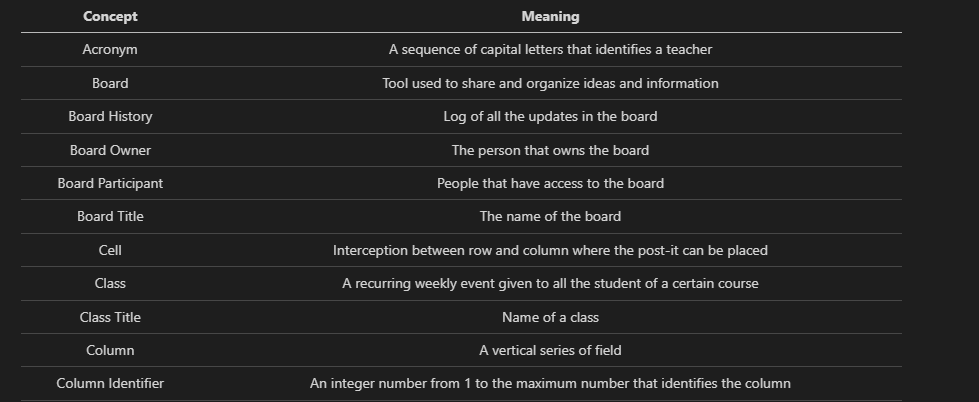

# US G001 - As Project Manager, I want the team to follow the technical constraints and concerns of the project

## 1. Context

As a team, we need to follow the constraints and concerns of the project so that we can achieve its goals.

## 2. Requirements

The solution should be implemented using Java as the main language. Other languages can be used in accordance with more specific requirements.
Project documentation should be always available on the project repository ("docs" folder, markdown format) and, when applicable, in accordance with the UML notation. The development process of every US (e.g.: analysis, design, testing, etc.) must be reported (as part of the documentation).
The team should develop a relevant set of automated tests for every US / Class / Method. The team should aim to adopt a test-driven development approach.

## 3. Analysis

After analyzing the constraints of the projects we've concluded that we will need to follow the DDD rules and have proper documentation for the User Stories. Implementation wise we need to use Java and create tests for all the functionalities of our program

## 4. Design

### 4.1. Realization

Examples of documentation:

## 5. Implementation

N/A

## 6. Integration/Demonstration

N/A

## 7. Observations

N/A