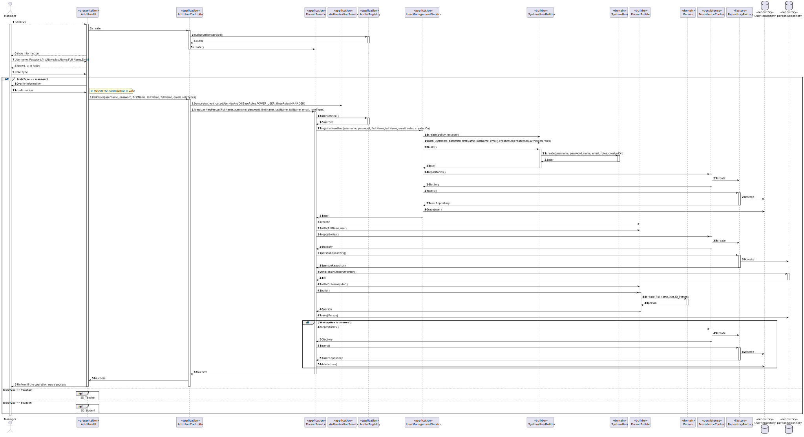
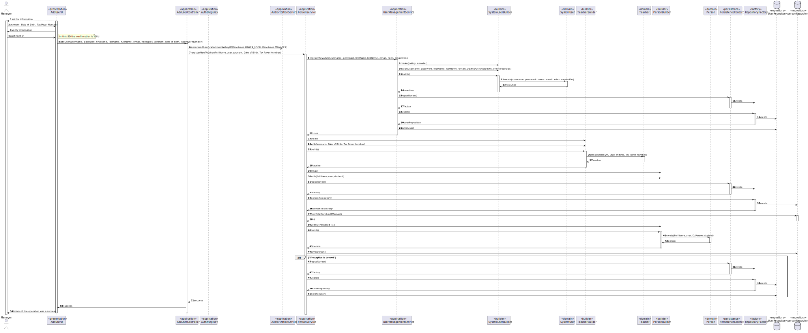
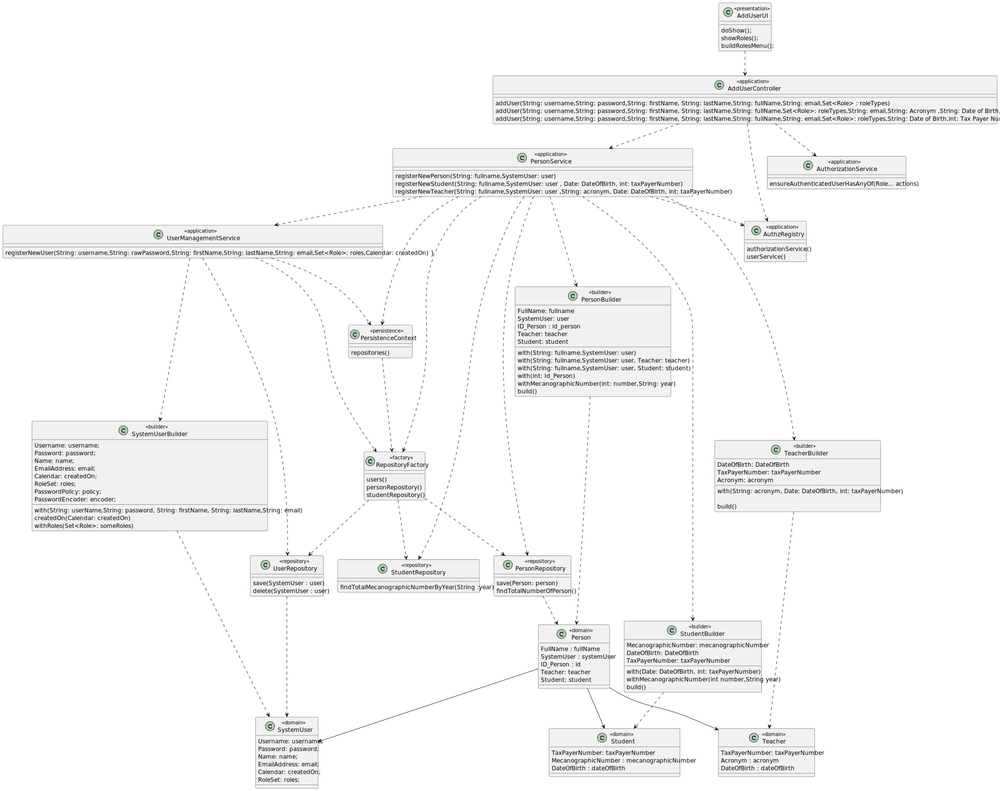
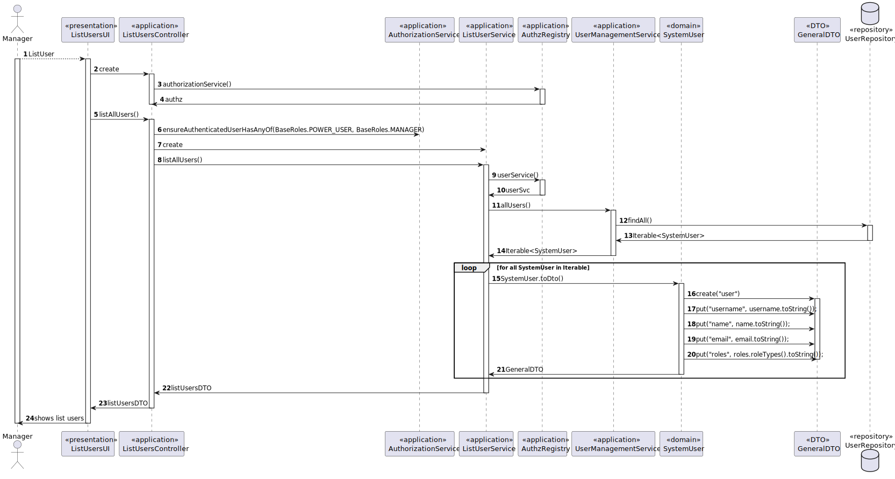
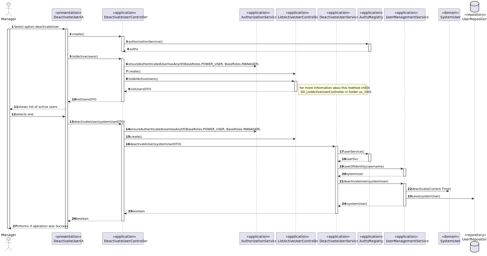
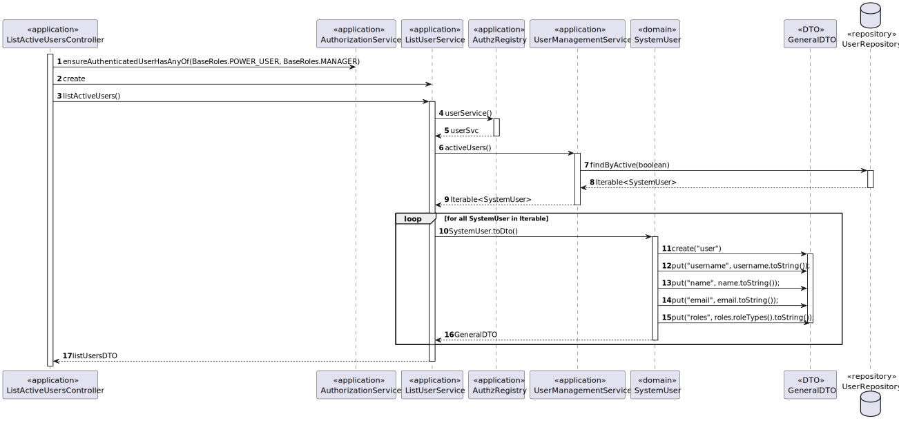

# US 1001 -  As Manager, I want to be able to register, disable/enable, and list users of the system (Teachers and Students, as well as Managers)

## 1. Context

In this US the manager wants to be able to register, disable/enable, and list users of the system
## 2. Requirements

**Main actor**

* Manager

**Requirement**
FRU01 - Management of Users Create, disable/enable, and list users of the system
(Teachers and Students, as well as Managers)


## 3. Analysis

### 3.1 Register users
We will start to see how its created an user in the Base app given by eapli.
Afterwards we will adapt it to be able to respond to your necessities for that we will also need to create the classes Teacher and Student as well as Person

**Main scenario**
1. Manager selects option to register a user
2. System asks for the base information (Username, Password,firstName,lastName,Full Name,Email)
3. Manager inserts the data
4. System shows list of roles
5. Manager selects roles
6. System if the role is student or teacher ask for more information
7. Manager introduces
8. System ask if the information is correct
9. Manager validates
10. System creates User
11. System display if the user was created with success

**Other scenarios**

**4.a.** The system can´t create the user 
1. The system notifies that this problem has occurred

**5.a.** The Manager doesn´t validate information
1. The use case terminates

### Client Question 
#### Question
Good afternoon,
Is there any format rule regarding the acronym for the teacher length-wise or which characters should or should not be used? Also, should this acronym be unique for each teacher?
Regards,
Group 13.
#### Solution
Hello.
I think a sequence of capitalised words should be used for the teacher acronym. Maybe the length could be a configuration setting of the application.
I think it would be wise to enforce that acronyms be unique.
Regards.

### 3.1 List users
We will start to see how the users are listed in the Base app given by eapli.
Afterwards we will change it in accord to your needs.

**Main scenario**
1. Manager selects option to list all user
2. System shows list users


### 3.3 Enable/Disable users
We will start to see how its disable an user in the Base app given by eapli.
Afterwards we will adapt it to be able to respond to your necessities.

**Main scenario**
1. Manager Select option deactivate User
2. System shows list of active users
3. Manager selects one
4. System informs if the operation was a success


## 4. Design

### 4.1 Register User

### 4.1.1 Rational


|                Main Scenario                 |                    Question: Which class...                     |                            Answer                             |                                                              Pattern                                                               |
|:--------------------------------------------:|:---------------------------------------------------------------:|:-------------------------------------------------------------:|:----------------------------------------------------------------------------------------------------------------------------------:|
| 1. Manager selects option to register a user |                   ...interacts with the user                    |                           AddUserUI                           |                                                          Pure Fabrication                                                          |
|                                              |                   ...coordinates the use case                   |                       AddUserController                       |                                                             Controller                                                             |
|                                              |               ...interacts with the domain layer                |              UserManagementService\PersonService              |             Controller-service - hides the complexity of the use case from the controller class, lowering its coupling             |
|  2. System asks for the User creation data   |                                                                 |                                                               |                                                                                                                                    |
|         3. Manager inserts the data          |                   ...stores the inserted data                   |                   SystemUser\Person\Teacher                   |                                         Information Expert - the class knows its own data                                          |
|                                              |                     ... creates the object                      | SystemUserBuilder\PersonBuilder\TeacherBuilder\StudentBuilder |                            Builder - Interface that allows the creation of an instance of a given class                            |
|     4. System persists the created User      | ...creates the instance responsible for persisting Person\Users |                       RepositoryFactory                       | Abstract Factory - Interface responsible for creating a Factory of related Objects without explicitly specifying the intend Class; |
|                                              |                 ...persists the created object                  |                UserRepository\PersonRepository                |            Repository -  hide the details of persisting and reconstructing an object while keeping the domain language             |

### 4.1.2 Sequence Diagram





### 4.1.3 Class Diagram




### 4.2 Register User

### 4.2.1 Rational


|                  Main Scenario                  |      Question: Which class...      |       Answer        |                                                  Pattern                                                   |
|:-----------------------------------------------:|:----------------------------------:|:-------------------:|:----------------------------------------------------------------------------------------------------------:|
| 1. Manager selects option to register all users |     ...interacts with the user     |     ListUsersUI     |                                              Pure Fabrication                                              |
|                                                 |    ...coordinates the use case     | ListUsersController |                                                 Controller                                                 |
|                                                 | ...interacts with the domain layer |  ListUsersService   | Controller-service - hides the complexity of the use case from the controller class, lowering its coupling |
|              2. System find users               |         ...find all Users          |   UserRepository    |   Repository -  hide the details of finding an object in the database while keeping the domain language    |
|          3. System show list of Users           |     ...interacts with the user     |     ListUsersUI     |                                              Pure Fabrication                                              |

### 4.2.2 Sequence Diagram



### 4.3 Disable/Enable User

### 4.3.1 Rational


|                  Main Scenario                   |                Question: Which class...                 |                   Answer                    |                                                              Pattern                                                               |
|:------------------------------------------------:|:-------------------------------------------------------:|:-------------------------------------------:|:----------------------------------------------------------------------------------------------------------------------------------:|
|     1. Manager Select option deactivate User     |               ...interacts with the user                |              DeactivateUserUI               |                                                          Pure Fabrication                                                          |
|                                                  |               ...coordinates the use case               |          DeactivateUserController           |                                                             Controller                                                             |
|                                                  |           ...interacts with the domain layer            | UserManagementService\DeactivateUserService |             Controller-service - hides the complexity of the use case from the controller class, lowering its coupling             |
|       2.System shows list of active users        |                    ...find all Users                    |               UserRepository                |               Repository -  hide the details of finding an object in the database while keeping the domain language                |
|              3. Manager select one               |               ...stores the inserted data               |                 SystemUser                  |                                         Information Expert - the class knows its own data                                          |
|                                                  | ...creates the instance responsible for persisting user |              RepositoryFactory              | Abstract Factory - Interface responsible for creating a Factory of related Objects without explicitly specifying the intend Class; |
|                                                  |             ...persists the created object              |               UserRepository                |            Repository -  hide the details of persisting and reconstructing an object while keeping the domain language             |
| 4. System informs if the operation was a success |                                                         |                                             |                                                                                                                                    |

### 4.3.2 Sequence Diagram




### 4.3 Tests

**Test 1:** *Verifies that it is not possible to create an instance of the Person class with null values.*

```
@Test(expected = IllegalArgumentException.class)
public void ensureNullIsNotAllowed() {
	Person person = new Person(null, null);
}
```

**Test 2:** *Verifies that it is not possible to create a TaxPayerNumber with a number that doesn't have the lenght of 9 digits.*

```
@Test(expected = IllegalArgumentException.class)
public void ensureTaxPayerNumberIsValid() {
	TaxPayerNumber numb = new TaxPayerNumber(12345678);
}
```

**Test 3:** *Verifies that it is not possible to create a DateOfBirth with a date from the Future.*

```
@Test(expected = IllegalArgumentException.class)
        public void ensureDateOfBirthCanNotBeInTheFuture() {
        DateOfBirth test =  new DateOfBirth(new Date(1000,10,2));
}
```

## 5. Implementation

### 5.1 Register User

1. Method registerNewPerson() from PersonService
```
public String registerNewPerson(String fullname,  String username,  String password,  String firstName,
                                     String lastName,
                                     String email,  Set<Role> roles) {

        UserManagementService userSvc = AuthzRegistry.userService();
        SystemUser user = null;
        try {
            user = userSvc.registerNewUser(username, password, firstName, lastName, email, roles, CurrentTimeCalendars.now());
            PersonBuilder personBuilder = new PersonBuilder();
            personBuilder.with(fullname, user);
            PersonRepository personRepository = PersistenceContext.repositories().personRepository();
            personBuilder.withID(personRepository.findTotalNumberOfPerson() + 1);
            Person per = personBuilder.build();
            personRepository.save(per);
        } catch (Exception e) {
            PersistenceContext.repositories().users().delete(user);
            return "Error: " + e.getMessage();
        }
        return "Success";
    }
```
2. Method registerNewTeacher() from PersonService
```
 public String registerNewTeacher(String username,  String password,  String firstName,
                                     String lastName,String fullName ,
                                     String email,  Set<Role> roles,String acronym, Date dateOfBirth, int taxPayerNumber){

        UserManagementService userSvc = AuthzRegistry.userService();
        SystemUser user = null;
        try {
            user = userSvc.registerNewUser(username, password, firstName, lastName, email, roles, CurrentTimeCalendars.now());
            TeacherBuilder teacherBuilder = new TeacherBuilder();
            teacherBuilder.with(acronym,dateOfBirth,taxPayerNumber);
            Teacher teacher = teacherBuilder.build();

            PersonBuilder personBuilder = new PersonBuilder();
            personBuilder.with(fullName, user,teacher);
            PersonRepository personRepository = PersistenceContext.repositories().personRepository();
            personBuilder.withID(personRepository.findTotalNumberOfPerson() + 1);
            Person per = personBuilder.build();
            personRepository.save(per);


            //personRepository.save(teacher);
        } catch (Exception e) {
            PersistenceContext.repositories().users().delete(user);
            return "Error: " + e.getMessage();
        }
        return "Success";
    }
```
3. Method registerNewStudent() from PersonService
```
 public String registerNewTeacher(String username,  String password,  String firstName,
                                     String lastName,String fullName ,
                                     String email,  Set<Role> roles,String acronym, Date dateOfBirth, int taxPayerNumber){

        UserManagementService userSvc = AuthzRegistry.userService();
        SystemUser user = null;
        try {
            user = userSvc.registerNewUser(username, password, firstName, lastName, email, roles, CurrentTimeCalendars.now());
            TeacherBuilder teacherBuilder = new TeacherBuilder();
            teacherBuilder.with(acronym,dateOfBirth,taxPayerNumber);
            Teacher teacher = teacherBuilder.build();

            PersonBuilder personBuilder = new PersonBuilder();
            personBuilder.with(fullName, user,teacher);
            PersonRepository personRepository = PersistenceContext.repositories().personRepository();
            personBuilder.withID(personRepository.findTotalNumberOfPerson() + 1);
            Person per = personBuilder.build();
            personRepository.save(per);


            //personRepository.save(teacher);
        } catch (Exception e) {
            PersistenceContext.repositories().users().delete(user);
            return "Error: " + e.getMessage();
        }
        return "Success";
    }
```
### 5.2 List users

1. Method listAllUsers() from ListUsersService
```
public Iterable<GeneralDTO> listAllUsers() {

        UserManagementService userSvc = AuthzRegistry.userService();
        Iterable<SystemUser> users = userSvc.allUsers();
        List<GeneralDTO> listUsersDTO = new ArrayList<>();
        for (SystemUser user : users) {
            listUsersDTO.add(user.toDTO());
        }
        return listUsersDTO;
    }
```

### 5.3 Disable/Enable User

1. Method listActiveUsers() from ListUsersService
```
public Iterable<GeneralDTO> listActiveUsers() {

        UserManagementService userSvc = AuthzRegistry.userService();
        Iterable<SystemUser> users = userSvc.activeUsers();
        List<GeneralDTO> listUsersDTO = new ArrayList<>();
        for (SystemUser user : users) {
            listUsersDTO.add(user.toDTO());
        }
        return listUsersDTO;
    }
```

1. Method deactivateUser() from DeactivateUserService
```
public boolean deactivateUser(GeneralDTO systemUserDTO){
UserManagementService userSvc = AuthzRegistry.userService();
SystemUser systemUser;
systemUser = userSvc.userOfIdentity(Username.valueOf((String) systemUserDTO.get("username"))).get();
userSvc.deactivateUser(systemUser);
return true;
}
```
## 6. Integration/Demonstration

N/A

## 7. Observations

N/A

