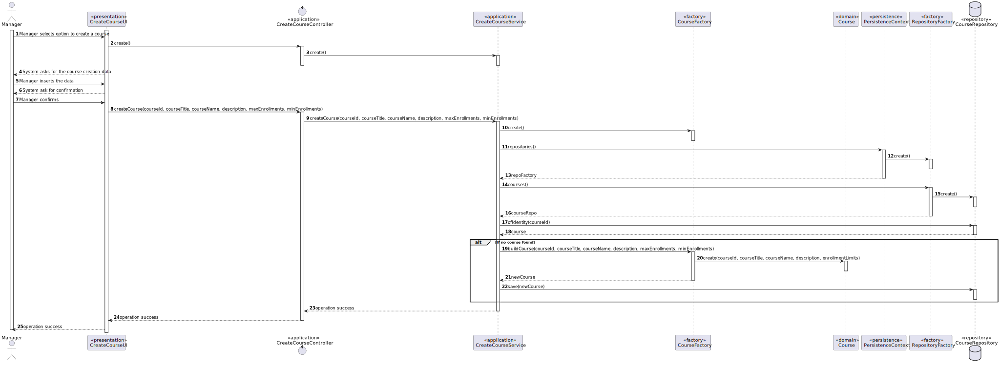
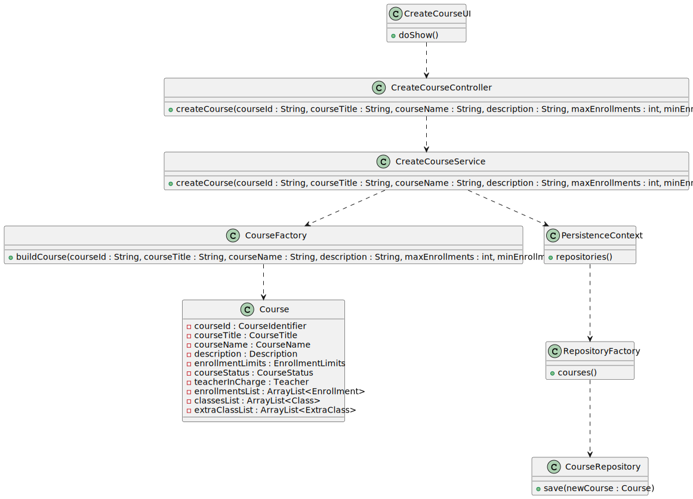

# US 1002 - As Manager, I want to create courses


## 1. Context

It is the first time the task is assigned to be developed.
This User story will allow us to create courses which will let us do many other US's as a lot of them are related to courses.

## 2. Requirements

**Main actor**

* Manager

**Interested actors (and why)**

* Manager : wants to create, change status, bulk enroll students, set teachers of a specific course
* Student : wants to request enrollment in a course
* Teacher : wants to schedule classes/extra-classes and create exams for a specific course 

**Pre conditions**

* N/A

**Post conditions**

* The created course should be registered and persisted in the system

**Main scenario**
1. Manager selects option to create a course
2. System asks for the course creation data (name, title, description, identifier and enrollment limits)
3. Manager inserts the data
4. System ask for confirmation
5. Manager confirms
6. System informs operation success


**Other scenarios**

**5.a.** The system verifies that a course with the inserted identifier already exists in the system  
1. The system notifies that this problem has occurred
2. The use case terminates

**5.b.** Manager doesn´t confirm
1. The use case terminates

**Special requirements**

N/A

## 3. Analysis

Relevant DM excerpt


## 4. Design

### 4.1. Rational

|                                                 Main Scenario                                                 |                 Question: Which class...                  |         Answer         |                                                              Pattern                                                               |
|:-------------------------------------------------------------------------------------------------------------:|:---------------------------------------------------------:|:----------------------:|:----------------------------------------------------------------------------------------------------------------------------------:|
|                                 1. Manager selects option to create a course                                  |                ...interacts with the user                 |     CreateCourseUI     |                                                          Pure Fabrication                                                          |
|                                                                                                               |                ...coordinates the use case                | CreateCourseController |                                                             Controller                                                             |
|                                                                                                               |            ...interacts with the domain layer             |  CreateCourseService   |             Controller-service - hides the complexity of the use case from the controller class, lowering its coupling             |
| 2. System asks for the course creation data <br/>(name, title, description, identifier and enrollment limits) |                                                           |                        |                                                                                                                                    |
|                                          3. Manager inserts the data                                          |                                                           |                        |                                                                                                                                    |
|                                        4. System ask for confirmation                                         |                                                           |                        |                                                                                                                                    |
|                                              5. Manager confirms                                              |                ...stores the inserted data                |         Course         |                                         Information Expert - the class knows its own data                                          |
|                                                                                                               |                  ... creates the object                   |     CourseFactory      |                            Factory - Interface that allows the creation of an instance of a given class                            |
|                                                                                                               |                   ...validates the data                   |         Course         |                                       Information Expert - the class knows its domain rules                                        |
|                                                                                                               | ...creates the instance responsible for persisting Course |   RepositoryFactory    | Abstract Factory - Interface responsible for creating a Factory of related Objects without explicitly specifying the intend Class; |
|                                                                                                               |              ...persists the created object               |    CourseRepository    |            Repository -  hide the details of persisting and reconstructing an object while keeping the domain language             |
|                                      6. System informs operation success                                      |                                                           |                        |                                                                                                                                    |

Summary of needed classes :
* CreateCourseUI
* CreateCourseController
* CreateCourseService
* CourseFactory
* Course
* RepositoryFactory
* CourseRepository

### 4.2 Sequence Diagram


### 4.3. Class Diagram  




### 4.4. Tests

**Test 1:** *Verifies that it is not possible to create an instance of the Course class with null values.*

```
@Test(expected = IllegalArgumentException.class)
public void ensureNullIsNotAllowed() {
	Course instance = new Course(null, null, null, null, null);
}
```

**Test 2:** *Verifies that it is not possible to create an instance of the EnrollmentLimits class with minLimit as a negative value.*
```
@Test(expected = IllegalArgumentException.class)
public void ensureNegativeLimitIsNotAllowed() {
	EnrollmentLimits instance = new EnrollmentLimits(-1,10);
}
```

**Test 3:** *Verifies that it is not possible to create an instance of the EnrollmentLimits class with minLimit as 0.*
```
@Test(expected = IllegalArgumentException.class)
public void ensureZeroLimitNullIsNotAllowed() {
	EnrollmentLimits instance = new EnrollmentLimits(0,10);
}
```

**Test 4:** *Verifies that it is not possible to create an instance of the EnrollmentLimits class with maxLimit less than minLimit.*
```
@Test(expected = IllegalArgumentException.class)
public void ensureMaxLimitGreaterOrEqualThanMinLimit() {
	EnrollmentLimits instance = new EnrollmentLimits(10,9);
}
```
**Test 5:** *Verifies that, right after creation, courseStatus is set as closed*
```
@Test
public void ensureCourseStatusIsClosed() {
	CourseFactory fac = new CourseFactory()
	Course instance = fac.buildCourse(...);
	assertTrue(instance.isClosed());
}
```

**Test 6:** *Verifies that, right after creation, there is no teacher in charge associated*
```
@Test
public void ensureNoTeacherInCharge() {
    CourseFactory fac = new CourseFactory()
	Course instance = fac.buildCourse(...);
	assertFalse(instance.hasTeacherInCharge());
}
```

## 5. Implementation
Here are some samples of the implementation:

1. Method buildCourse() from CourseFactory
```
    public Course buildCourse(String courseId, String courseTitle, String courseName, String description, int maxEnrollments, int minEnrollments){
        CourseIdentifier id = new CourseIdentifier(courseId);
        CourseTitle title = new CourseTitle(courseTitle);
        CourseName name = new CourseName(courseName);
        Description desc = new Description(description);
        EnrollmentLimits limits = new EnrollmentLimits(minEnrollments,maxEnrollments);
        CourseStatus status = new CourseStatus("CLOSE");

        return new Course(id,title,name,desc,limits,status,null);
    }
```

## 6. Observations
N/A