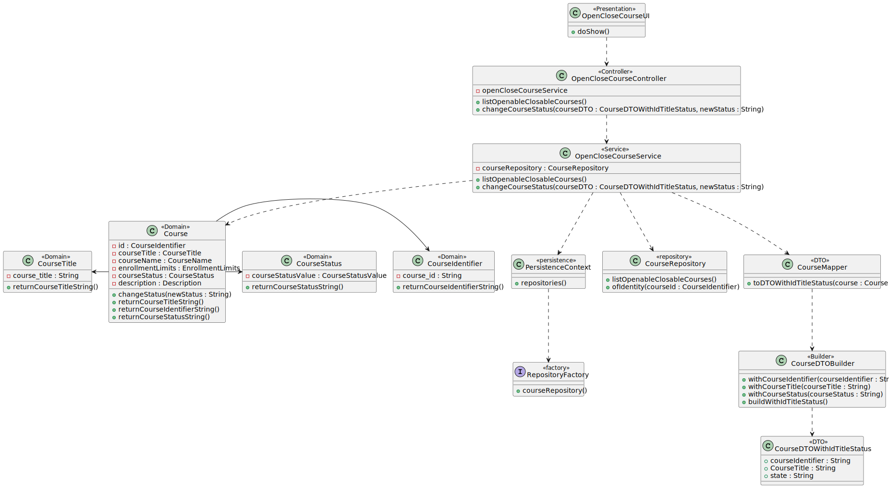
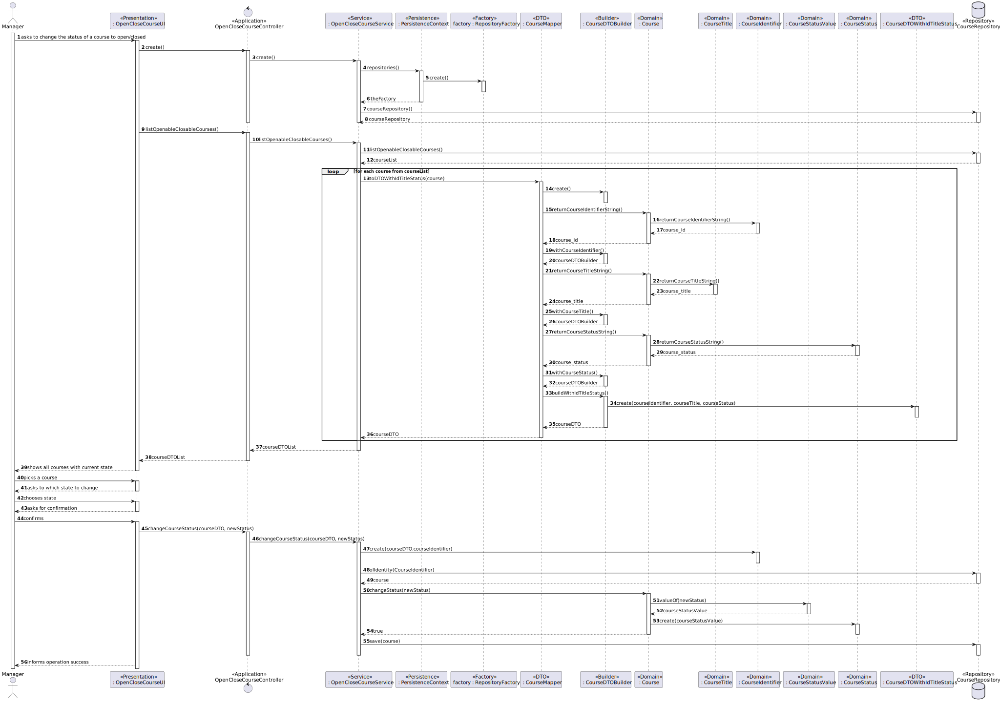

# US 1004 - As Manager, I want to open and close courses

## 1. Context

It is the first time the task is assigned to be developed.
This US will allow us to change the status of the courses to open or closed.

## 2. Requirements

The flow of the status of course needs to follow this sequence :
event create (-> state close) -> event open (->state open) -> event open enrollments (-> state
enroll) -> event close enrollments (-> state in progress) -> event close (-> state closed)

**Main actor**

* Manager

**Interested actors (and why)**

* Manager: wants to open/close courses

**Preconditions**

* There needs to be at least one course in the system
* The status of the course needs to be closed or enrollments closed

**Postconditions**

* The status of the course needs to be persisted in the system

**Main scenario**
1. Manager asks to change the status of a course to open/closed
2. System shows all courses that can be opened/closed with its current state
3. Manger picks a course
4. System shows its state
5. Manager chooses state
6. System asks for confirmation
7. Manger confirms
8. System persists the new status of course and informs to Manager that the operation was completed with success

**Other scenarios**

**a.** The system doesn't have any possible courses that can be opened/closed
1. Manager asks to change the status of a course to open/closed
2. System informs that there are no courses available to open or close

**b.** The Manager doesn't confirm the operation
1. Manager asks to change the status of a course to open/closed
2. System shows all courses that can be opened/closed with its current state
3. Manger picks course
4. System shows its state
5. Manager chooses state
6. System asks for confirmation
7. Manager doesn't confirm
8. System informs that the operation was aborted


## 3. Analysis

Relevant DM excerpt


## 4. Design
### 4.1 Rationale

|                                                  Main Scenario                                                   |                                                                                                                                                                          Question: which class...                                                                                                                                                                           |                                                                                                Answer                                                                                                 |                                                                                                                                                                                                                                                                                                              Pattern (with justification)                                                                                                                                                                                                                                                                                                              |
|:----------------------------------------------------------------------------------------------------------------:|:---------------------------------------------------------------------------------------------------------------------------------------------------------------------------------------------------------------------------------------------------------------------------------------------------------------------------------------------------------------------------:|:-----------------------------------------------------------------------------------------------------------------------------------------------------------------------------------------------------:|:------------------------------------------------------------------------------------------------------------------------------------------------------------------------------------------------------------------------------------------------------------------------------------------------------------------------------------------------------------------------------------------------------------------------------------------------------------------------------------------------------------------------------------------------------------------------------------------------------------------------------------------------------:|
|                         1. Manager asks to change the status of a course to open/closed                          |                                                                                                                     <p>A. Interacts with the Manager?</p><p>B. Coordinates the Use Case?</p> <p>C. Interacts with the Domain and Persistence Layer</p>                                                                                                                      |                                                   <p> A. OpenCloseCourseUI</p><p> B. OpenCloseCourseController</p><p>C. OpenCloseCourseService </p>                                                   |                                                                                                                                                            <p> A. Pure Fabrication - Class that doesn't exist in the domain but is necessary for the functionality of the system </p> <p> B. Controller - Responsible for handling system events  </p><p> C. Service - Class responsible for handling the domain layer and the persistence layer according with the controller requests</p>                                                                                                                                                            |
|                   2. System shows all courses that can be opened/closed and its current state                    | <p>A. Knows which courses can be closed/opened? </p>  <p> B. Has all the courses persisted? </p> <p> C. Creates an instance of the repository? </p> <p> D. Creates an instance of the factory? </p> <p> E. Contains the data of a course so it can be moved between layers?</p> <p> F. Transforms a Course into DTO and vice-versa</p> <p> G. Creates the necessary DTO</p> | <p> A. Course </p> <p> B. CourseRepository </p><p> C. RepositoryFactory</p> <p> D. PersistenceContext</p>  <p> E. CourseDTOWithIdTitleStatus </p> <p> F. CourseMapper </p> <p> G.CourseDTOBuilder</p> | <p> A. Information Expert - Class has the necessary information to know its own state</p> <p> B. Repository - Has all the information of all courses persisted</p> <p> C. Factory - Responsible for the creation of the repository</p>  <p> D. Pure Fabrication - Class that doesn't exist in the domain but is necessary for the functionality of the system </p> <p> E. DTO - Class that transports the necessary data between layers</p> <p> F. Mapper-DTO - Class responsible for transforming Domain Entities into DTOs and vice-versa</p> <p> G. Builder - Responsible for the creation of every different type of DTO providing flexibility</p> |
|                                             3. Manger picks a course                                             |                                                                                                                                                                                                                                                                                                                                                                             |                                                                                                                                                                                                       |                                                                                                                                                                                                                                                                                                                                                                                                                                                                                                                                                                                                                                                        |
|                                  4. System asks if it still wants to change it                                   |                                                                                                                                                                                                                                                                                                                                                                             |                                                                                                                                                                                                       |                                                                                                                                                                                                                                                                                                                                                                                                                                                                                                                                                                                                                                                        |
|                                                5. Manger confirms                                                |                                                                                                                                                                                                                                                                                                                                                                             |                                                                                                                                                                                                       |                                                                                                                                                                                                                                                                                                                                                                                                                                                                                                                                                                                                                                                        |
| 6. System persists the new status of course and informs to Manager that the operation was completed with success |                                                                                                                                       <p> A. Updates the status of the course? </p> <p> B. Updates the Course in the repository? </p>                                                                                                                                       |                                                                            <p> A. Course </p> <p> B. CourseRepository </p>                                                                            |                                                                                                                                                                                                                                   <p> A. Information Expert - Has the necessary information  to change the state of an instance of itself</p> <p> B. Repository - Can persist the updated version of the Course </p>                                                                                                                                                                                                                                   |    

### 4.2. Class Diagram



### 4.3. Sequence Diagram

### 4.4. Tests

**Test 1:** *Verifies that the status cannot be changed to a wrong state.*

```
@Test(expected = IllegalArgumentException.class)
    public void ensureThatCourseStatusCannotChangeToAWrongState(){
        Course course = new Course(new CourseIdentifier("Id1"), new CourseTitle("Title1"), new CourseName("Name1"), new Description("Desciption1"), new EnrollmentLimits(1,5), new CourseStatus(CourseStatusValue.CLOSE), new Teacher());
        course.changeStatus("CLOSED");
    }
````
**Test 2:** *Verifies that the status cannot be changed to the next state.*
```
    @Test
    public void ensureThatCourseStatusCanChangeToNextState(){
        Course course = new Course(new CourseIdentifier("Id1"), new CourseTitle("Title1"), new CourseName("Name1"), new Description("Desciption1"), new EnrollmentLimits(1,5), new CourseStatus(CourseStatusValue.CLOSE), new Teacher());
        assertTrue(course.changeStatus("OPEN"));
    }
```


## 5. Implementation
Here are some samples of the implementation:
1. Method listOpenableClosableCourses() from OpenCloseCourseService
```
    public List<CourseDTOWithIdTitleStatus> listOpenableClosableCourses(){
        List<Course> courseList = courseRepository.listOpenableClosableCourses();
        List<CourseDTOWithIdTitleStatus> courseDTOList = new ArrayList<>();
        for(Course course : courseList) {
            courseDTOList.add(CourseMapper.toDTOWithIdTitleStatus(course));
        }
        return courseDTOList;
    }
````
2. Methods changeCourseStatus() from OpenCloseCourseService
```
    public void changeCourseStatus(CourseDTOWithIdTitleStatus courseDTO, String newStatus){
        Course course = courseRepository.ofIdentity(new CourseIdentifier(courseDTO.courseIdentifier)).get();
        course.changeStatus(newStatus);
        courseRepository.save(course);
    }
```
A resume of the commits for the implementation :
- [US_1004][DTO] Development of StatusCourseDTO
- [US_1004][Domain] Added methods changeStatus to Course and changed the enum in CourseStatus
- [US_1004][Persistence] Added the methods listOpenableClosable course in JPA and in memory
- [US_1004][Test] Added some tests to the methods changeStatus() of class Course
- [US_1004][Application] Implementation of the Service and the Controller
- [US_1004][Presentation] Created a UI to the US and added it to the course menu in the manager application

## 6. Observations

It is important to note that some parts of the code used in this implementation were developed by other team members :
- Domain classes and Repositories used - Creation of the classes made by Ezequiel Estima - 1211417 (Note : It is important to note that most methods used by me in the domain classes and repositories were created by me Marco Andrade - 1211469)
- Mapper and DTOBuilder - Creation of the classes and the methods within made by Diogo Araújo - 1200967

