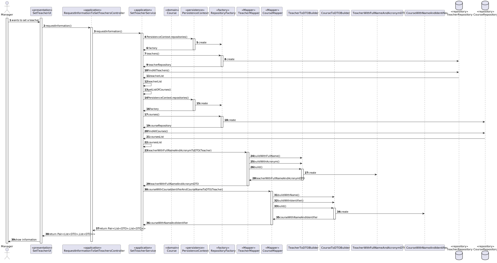
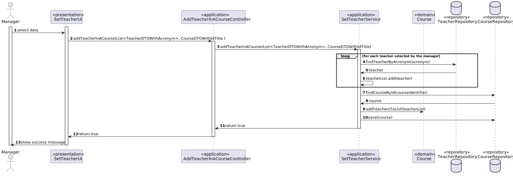
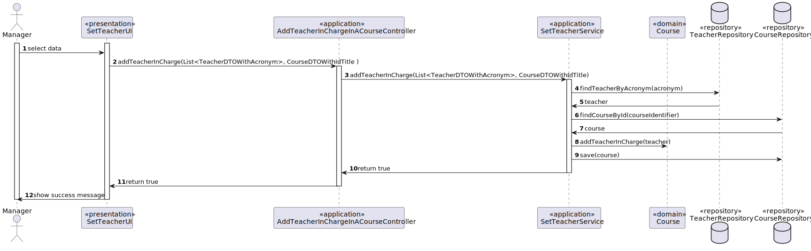

# US 1005 - As Manager, I want to set the teachers of a course 


## 1. Context

A manager is responsible for overseeing the system of the eCourse. In this context, he needs to assign or set the teachers who will be in the course and lectures class and extra-classes for the students enrolled in the course

## 2. Requirements

*FRC01* Set the teachers of a course

Acceptance Criteria:

- 1005.1. The system must allow a manager to set the teachers of a course by choosing the teachers from a list of teachers and choose the course in a list of courses. 

*FRC02* Set the teacher in charge of a course

- 1005.2. The system must allow a manager to set the teacher in charge of a course by choosing the teachers from a list of teachers and choose the course in a list of courses.


## 3. Analysis

To implement this User Story, we need to implement the setter features of our Domain Model in the system with the following functionalities:

* A function where the manager can choose a course and the teachers to set.
* A function to set the teachers of a course.
* A function that checks if the teachers are available to be set.

## 4. Design

### 4.1. Realization







## 5. Tests

```
    @Test
    public void ensureAdditionTeacherInCharge(){
        Course course = new Course(new CourseIdentifier("Id1"), new CourseTitle("Title1"),
                new CourseName("Name1"), new Description("Desciption1"), new EnrollmentLimits(1,5),
                new CourseStatus(CourseStatusValue.CLOSE), new Teacher(new Acronym("LOL"),new DateOfBirth(new Date()),new TaxPayerNumber(100002000)));
        Teacher teacher = new Teacher(new Acronym("WOW"),new DateOfBirth(new Date()),new TaxPayerNumber(100002200));
        course.addTeacherInCharge(teacher);
        assertTrue(course.hasThisTeacherInCharge(teacher));
    }
```

```
    @Test
    public void ensureNotAdditionOfTeacherInACourse() {
        Course course = new Course(new CourseIdentifier("Id1"), new CourseTitle("Title1"),
                new CourseName("Name1"), new Description("Desciption1"), new EnrollmentLimits(1,5),
                new CourseStatus(CourseStatusValue.CLOSE), new Teacher(new Acronym("LOL"),new DateOfBirth(new Date()),new TaxPayerNumber(100002000)));
        List<Teacher> teacherList = new ArrayList<>();
        teacherList.add(new Teacher(new Acronym("LOL"),new DateOfBirth(new Date()),new TaxPayerNumber(100002000)));
        teacherList.add(new Teacher(new Acronym("WOW"),new DateOfBirth(new Date()),new TaxPayerNumber(100002200)));
        course.addTeachersToList(teacherList);
        teacherList.add(new Teacher(new Acronym("GEN"),new DateOfBirth(new Date()),new TaxPayerNumber(100002300)));
        assertFalse(course.hasTeacherInList(teacherList));
    }
```


## 6. Implementation

### 

```
 public Pair<List<TeacherDTOWithAcronym>, List<CourseDTOWithIdTitle>> requestInformation() {

        Iterable<Teacher> teachers = teacherRepository.findAllTeachers();
        List<Course> courses = courseRepository.listAllAvailableCourses();

        List<TeacherDTOWithAcronym> teachersDTO = new ArrayList<>();
        List<CourseDTOWithIdTitle> coursesDTO = new ArrayList<>();

        for (Teacher teacher : teachers) {
            teachersDTO.add(TeacherMapper.toDTOWithAcronym(teacher));
        }
        for (Course course : courses) {
            coursesDTO.add(CourseMapper.toDTOWithIdTitle(course));
        }
        return Pair.of(teachersDTO, coursesDTO);
    }
```
### 

```
    public boolean addTeacher(List<TeacherDTOWithAcronym> teacherDTO, CourseDTOWithIdTitle courseDTO) {
        List<Teacher> teachers = new ArrayList<>();
        for (TeacherDTOWithAcronym teacher : teacherDTO) {
            teachers.add(teacherRepository.findTeacherByAcronym(teacher.acronym));
        }
        Course course = courseRepository.findCourseById(courseDTO.courseIdentifier);

        if (course.addTeachersToList(teachers)) {
            return courseRepository.save(course) != null;
        }
        else {
            return false;
        }
    }
```

## 7. Integration/Demonstration

N/A

## 9. Observations

N/A

