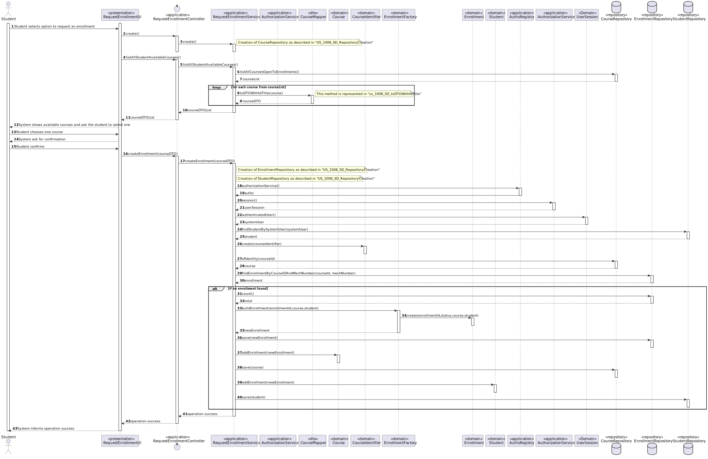
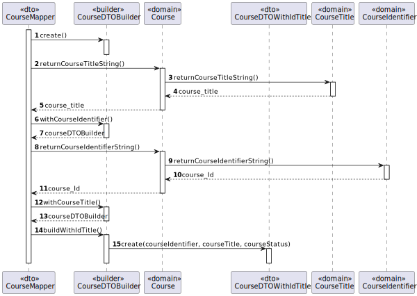
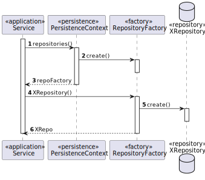

# US 1008 - As Student, I want to request my enrollment in a course


## 1. Context

It is the first time the task is assigned to be developed.
This User story will allow us to create enrollments that, after approved by a manager, will tell us if a student is participating in a specific course

## 2. Requirements

**Main actor**

* Student

**Interested actors (and why)**

* Manager : wants to approve/reject enrollments in Course
* Student : wants to request enrollment in a course

**Pre conditions**

* There must be a Course available for the student to request an enrollment (course in open enrollments)

**Post conditions**

* The created enrollment should be registered and persisted in the system

**Main scenario**
1. Student selects option to request an enrollment
2. System shows available courses and ask the student to select one
3. Student chooses one course
4. System ask for confirmation
5. Student confirms
6. System informs operation success


**Other scenarios**

**2.a.** The system verifies that there are no courses available  
1. The system notifies that this problem has occurred
2. The use case terminates

**5.b.** The system verifies that there already exists a requested enrollment for that student for that course 
1. The system notifies that this problem has occurred
2. The use case terminates

**5.b.** Student doesn't confirm
1. The use case terminates

**Special requirements**

N/A

## 3. Analysis

Relevant DM excerpt


## 4. Design

### 4.1. Rational

|                           Main Scenario                            |                      Question: Which class...                       |           Answer            |                                                              Pattern                                                               |
|:------------------------------------------------------------------:|:-------------------------------------------------------------------:|:---------------------------:|:----------------------------------------------------------------------------------------------------------------------------------:|
|         1. Student selects option to request an enrollment         |                     ...interacts with the user                      |     RequestEnrollmentUI     |                                                          Pure Fabrication                                                          |
|                                                                    |                     ...coordinates the use case                     | RequestEnrollmentController |                                                             Controller                                                             |
|                                                                    |                 ...interacts with the domain layer                  |  RequestEnrollmentService   |             Controller-service - hides the complexity of the use case from the controller class, lowering its coupling             |
| 2.System shows available courses and ask the student to select one |           ...knows which courses are open to enrollments            |           Course            |                                         Information Expert - the class knows its own data                                          |
|                                                                    |                   ...knows all courses persisted                    |      CourseRepository       |                                   Repository - has all the information of all courses persisted                                    |
|                                                                    | ...contains the data of a course so it can be moved between layers? |    CourseDTOWithIdTitle     |                                   DTO - Class that transports the necessary data between layers                                    |
|                                                                    |           ...transforms a Course into DTO and vice-versa            |        CourseMapper         |                      Mapper-DTO - Class responsible for transforming Domain Entities into DTOs and vice-versa                      |
|                                                                    |                    ...creates the necessary DTO                     |      CourseDTOBuilder       |                    Builder - Responsible for the creation of every different type of DTO providing flexibility                     |
|                   3. Student chooses one course                    |                                                                     |                             |                                                                                                                                    |
|                   4. System ask for confirmation                   |                                                                     |                             |                                                                                                                                    |
|                        5. Student confirms                         |                     ...stores the inserted data                     |         Enrollment          |                                         Information Expert - the class knows its own data                                          |
|                                                                    |                       ... creates the object                        |      EnrollmentFactory      |                            Factory - Interface that allows the creation of an instance of a given class                            |
|                                                                    |                        ...validates the data                        |         Enrollment          |                                       Information Expert - the class knows its domain rules                                        |
|                                                                    |    ...creates the instance responsible for persisting Enrollment    |      RepositoryFactory      | Abstract Factory - Interface responsible for creating a Factory of related Objects without explicitly specifying the intend Class; |
|                                                                    |                   ...persists the created object                    |    EnrollmentRepository     |            Repository -  hide the details of persisting and reconstructing an object while keeping the domain language             |
|                6. System informs operation success                 |                                                                     |                             |                                                                                                                                    |

Summary of needed classes :
* RequestEnrollmentUI
* RequestEnrollmentController
* RequestEnrollmentService
* CourseRepository
* Course
* CourseDTO
* CourseMapper
* CourseDTOBuilder
* Enrollment
* EnrollmentFactory
* EnrollmentRepository
* RepositoryFactory


### 4.2 Sequence Diagram







### 4.3. Tests

**Test 1:** *Verifies that enrollmentId cannot be less or equal to 0*
```
@Test(expected = IllegalArgumentException.class)
public void ensureEnrollmentStatusIsPending() {
	EnrollmentID instance = newEnrollmentId();
}
```

**Test 2:** *Verifies that, right after creation, enrollmentStatus is set as pending*
```
@Test
public void ensureEnrollmentStatusIsPending() {
	Enrollment instance = newEnrollment();
	assertTrue(instance.isPending());
}
```

**Test 3:** *Verifies that enrollment was added to enrollment list in Student*
```
@Test
public void ensureEnrollmentIsAddedToStudent() {
	Enrollment instance = newEnrollment();
	Student student = newStudent(...);
	student.addEnrollment(instance);
	assertTrue(student.hasEnrollment(instance));
}
```

**Test 4:** *Verifies that enrollment was added to enrollment list in Course*
```
@Test
public void ensureEnrollmentIsAddedToCourse() {
	Enrollment instance = newEnrollment();
	Course course = new  Course(...);
	course.addEnrollment(instance);
	assertTrue(course.hasEnrollment(instance));
}
```

## 5. Implementation

1. Method buildEnrollment() from EnrollmentFactory
```
public Enrollment buildEnrollment(Long enrollmentId, Course course, Student student){
        EnrollmentId id = new EnrollmentId(enrollmentId);
        EnrollmentStatus status = new EnrollmentStatus(EnrollmentStatusValue.PENDING);
        return new Enrollment(id,status,course,student);
    }
```


2. Method findEnrollmentByCourseIDAndMechNumber() from EnrollmentRepository
```
@Override
    public Optional<Enrollment> findEnrollmentByCourseIDAndMechNumber(CourseIdentifier courseId, MecanographicNumber mechNumber) {
        final Map<String, Object> params = new HashMap<>();
        params.put("courseIdentifier", courseId);
        params.put("mechNumber", mechNumber);
        return matchOne(" e.course.courseId =: courseIdentifier AND e.student.mecanographicNumber =: mechNumber",params);
    }
```

3. Method createEnrollment() from RequestEnrollmentService
```
public boolean createEnrollment(CourseDTOWithIdTitle courseDTO){
        EnrollmentRepository enrollmentRepo = PersistenceContext.repositories().enrollmentRepository();
        StudentRepository studentRepo = PersistenceContext.repositories().studentRepository();

        AuthorizationService authz = AuthzRegistry.authorizationService();
        SystemUser systemUser = authz.session().get().authenticatedUser();

        Student student = studentRepo.findStudentBySystemUser(systemUser);

        CourseIdentifier courseId = new CourseIdentifier(courseDTO.courseIdentifier);
        Course course = courseRepo.ofIdentity(courseId).get();

        if(enrollmentRepo.findEnrollmentByCourseIDAndMechNumber(courseId,student.identity()).isPresent()){
            throw new IllegalArgumentException("Couldn't create enrollment. You already have requested an enrollment for this course");
        }

        long totalEnrollments = enrollmentRepo.count();

        Enrollment newEnrollment = new EnrollmentFactory().buildEnrollment(totalEnrollments+1,course,student);

        enrollmentRepo.save(newEnrollment);

        course.addEnrollment(newEnrollment);
        courseRepo.save(course);

        student.addEnrollment(newEnrollment);
        studentRepo.save(student);

        return true;
    }
```


## 6. Observations

N/A