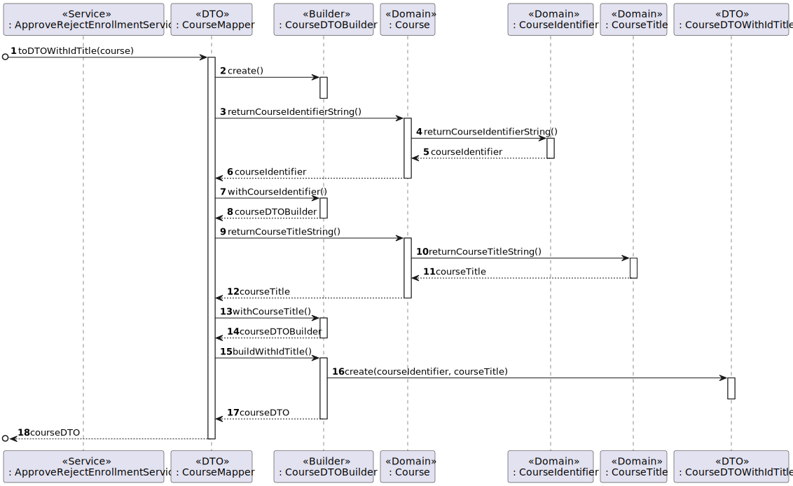
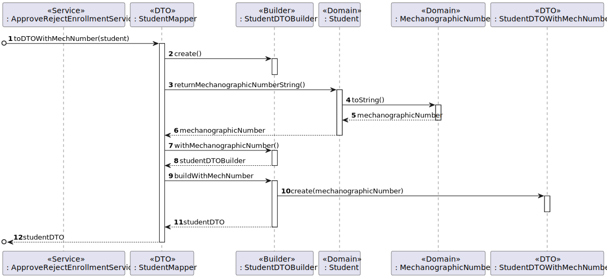

# US 1009 - As Manager, I want to approve or reject students applications to courses

## 1. Context

It is the first time the task is assigned to be developed.
When a student applies for a course it is given to him an enrollment state of pending. Then this US will allow us to accept or reject students that have applied to a certain course.

## 2. Requirements

**Main actor**

* Manager

**Interested actors (and why)**

* Manager: wants to open/close courses
* Student: wants to know if it's application was accepted/rejected

**Preconditions**

* There needs to be at least one course with enrollments pending
* The course chosen can't have reached the maximum number of students accepted

**Postconditions**

* The new enrollments status needs to be persisted on the system

**Main scenario**
1. Manager asks to accept/reject student's application
2. System shows all courses that have enrollments pending
3. Manger picks a course
4. System shows all the students that have applied and are still pending
5. Manager chooses the student
6. System asks if it wants to accept/reject
7. Manger chooses an option
8. Informs operation success
9. System asks if the manager wants to keep accepting/rejecting student's applications in that course
10. Manager rejects

**Other scenarios**

**a.** There are no courses with applications
1. Manager asks to accept/reject student's application
2. System informs that there are no courses with students with applications pending

**b.** The manager keeps accepting/rejecting students
1. Manager asks to accept/reject student's application
2. System shows all courses that have enrollments pending
3. Manger picks a course
4. System shows all the students that have applied and are still pending
5. Manager chooses the student
6. System asks if it wants to accept/reject
7. Manger chooses an option
8. Informs operation success
9. System asks if the manager wants to keep accepting/rejecting student's applications in that course
10. Manager accepts 
11. System shows all the students that have applied and are still pending
12. Manager chooses the student
13. System asks if it wants to accept/reject
14. Manger chooses an option
15. Informs operation success
16. System asks if the manager wants to keep accepting/rejecting student's applications in that course
...

## 3. Analysis

Relevant DM excerpt


## 4. Design
### 4.1 Rationale

|                                             Main Scenario                                             |                                                                                                                                                                              Question: which class...                                                                                                                                                                              |                                                                                               Answer                                                                                               |                                                                                                                                                                                                                                                                                                         Pattern (with justification)                                                                                                                                                                                                                                                                                                         |
|:-----------------------------------------------------------------------------------------------------:|:----------------------------------------------------------------------------------------------------------------------------------------------------------------------------------------------------------------------------------------------------------------------------------------------------------------------------------------------------------------------------------:|:--------------------------------------------------------------------------------------------------------------------------------------------------------------------------------------------------:|:--------------------------------------------------------------------------------------------------------------------------------------------------------------------------------------------------------------------------------------------------------------------------------------------------------------------------------------------------------------------------------------------------------------------------------------------------------------------------------------------------------------------------------------------------------------------------------------------------------------------------------------------:|
|                        1.  Manager asks to accept/reject student's application                        |                                                                                                                         <p>A. Interacts with the Manager?</p><p>B. Coordinates the Use Case?</p> <p>C. Interacts with the Domain and Persistence Layer</p>                                                                                                                         |                                     <p> A. ApproveRejectEnrollmentUI</p><p> B. ApproveRejectEnrollmentController</p><p>C. ApproveRejectEnrollmentService </p>                                      |                                                                                                                                                       <p> A. Pure Fabrication - Class that doesn't exist in the domain but is necessary for the functionality of the system </p> <p> B. Controller - Responsible for handling system events  </p><p> C. Service - Class responsible for handling the domain layer and the persistence layer according with the controller requests</p>                                                                                                                                                       |
|                       2. System shows all courses that have enrollments pending                       | <p> A. Has all the enrollments persisted and its courses? </p> <p> B. Creates an instance of the repository? </p> <p> C. Creates an instance of the factory? </p> <p> D. Contains the data of a course so it can be moved between layers?</p> <p> E. Transforms a Course into DTO and vice-versa</p> <p>F. Has all information of a course</p><p> G. Creates the necessary DTO</p> | <p> A. EnrollmentRepository </p> <p> B. RepositoryFactory </p><p> C. PersistenceContext</p> <p> D. CourseDTOWithIdTitle</p> <p> E. CourseMapper </p> <p> F. Course </p> <p> G.CourseDTOBuilder</p> | <p> A. Repository - Has all the information of enrollments persisted</p> <p> B. Factory - Responsible for the creation of the repository</p> <p> C. Pure Fabrication - Class that doesn't exist in the domain but is necessary for the functionality of the system</p>  <p> D. DTO - Class that transports the necessary data between layers</p> <p> E. Mapper-DTO - Class responsible for transforming Domain Entities into DTOs and vice-versa</p> <p> F. Information Expert - Class has the necessary information about itself</p> <p> G. Builder - Responsible for the creation of every different type of DTO providing flexibility</p> |
|                                       3. Manger picks a course                                        |                                                                                                                                                                                                                                                                                                                                                                                    |                                                                                                                                                                                                    |                                                                                                                                                                                                                                                                                                                                                                                                                                                                                                                                                                                                                                              |
|                4.System shows all the students that have applied and are still pending                |         <p>A. Has all courses persisted?</p> </p> <p> B. Knows if the enrollments limits will exceed?</p> <p> C. Has all enrollments persisted?</p> <p>D. Contains the data of a student so it can be moved between layers?</p> <p> E. Transforms a Student into DTO and vice-versa?</p> <p>F. Has all information of a student?</p> <p>G. Creates the necessary DTO </p>          |      <p> A. CourseRepository</p> <p> B. Course</p> <p> C. EnrollmentRepository</p> <p> D. StudentDTOWithMechNumber</p> <p> E. StudentMapper</p> <p> F. Student</p> <p> G. StudentBuilder</p>       |                                 <p> A. Repository - Has all the information of courses persisted</p> <p> B. Information Expert - Class has the information of itself</p> <p> C. Repository - Has all the information of enrollments persisted</p> <p> D. DTO - Class that transports the necessary data between layers</p> <p> E. Mapper-DTO - Class responsible for transforming Domain Entities into DTOs and vice-versa </p>  <p> F. Information Expert - Class has the information of itself </p> <p>  Builder - Responsible for the creation of every different type of DTO providing flexibility </p>                                  |
|                                    5. Manager chooses the student                                     |                                                                                                                                                                                                                                                                                                                                                                                    |                                                                                                                                                                                                    |                                                                                                                                                                                                                                                                                                                                                                                                                                                                                                                                                                                                                                              |
|                              6. System asks if it wants to accept/reject                              |                                                                                                                                                                                                                                                                                                                                                                                    |                                                                                                                                                                                                    |                                                                                                                                                                                                                                                                                                                                                                                                                                                                                                                                                                                                                                              |    
|                                       7.Manager chooses option                                        |                                                                                                                                                                                                                                                                                                                                                                                    |                                                                                                                                                                                                    |                                                                                                                                                                                                                                                                                                                                                                                                                                                                                                                                                                                                                                              |
|                                     8. Informs operation success                                      |                                                                                                                                      <p> A. Updates the status of the enrollments? </p> <p> B. Updates the enrollment in the repository? </p>                                                                                                                                      |                                                                       <p> A. Enrollment</p> <p> B. EnrollmentRepository</p>                                                                        |                                                                                                                                                                                                                                              <p> A. Information Expert - Class has the information of itself </p>  <p> <p> C. Repository - Has all the information of enrollments persisted</p>                                                                                                                                                                                                                                              |
| 9. System asks if the manager wants to keep accepting/rejecting student's applications in that course |                                                                                                                                               <p> A. Verifies again if the enrollments limit will exceed for the next enrollment</p>                                                                                                                                               |                                                                                         <p> A. Course</p>                                                                                          |                                                                                                                                                                                                                                                                                      <p> Information Expert - Class has the information of itself </p>                                                                                                                                                                                                                                                                                       |
|                                          10. Manager rejects                                          |                                                                                                                                                                                                                                                                                                                                                                                    |                                                                                                                                                                                                    |                                                                                                                                                                                                                                                                                                                                                                                                                                                                                                                                                                                                                                              |


### 4.2. Sequence Diagram






### 4.3. Tests

**Test 1:** *Verifies that the status changed to the new status.*

```
    @Test
    public void changeToACorrectStatusTest(){
        Enrollment enrollment = new Enrollment(new EnrollmentId(), new EnrollmentStatus(EnrollmentStatusValue.PENDING),new Course(new CourseIdentifier("id"),new CourseTitle("title"), new CourseName("name"), new Description("desc"),new EnrollmentLimits(1,2),new CourseStatus("OPEN"), new Teacher()),new Student());
        assertTrue(enrollment.changeStatus("ACCEPTED"));
    }
```
**Test 2:** * Verifies if it throws an error if it changed to a incorrect status such as pending
````
    @Test(expected = IllegalArgumentException.class)
    public void changeToAIncorrectStatusTest(){
        Enrollment enrollment = new Enrollment(new EnrollmentId(), new EnrollmentStatus(EnrollmentStatusValue.ACCEPTED),new Course(new CourseIdentifier("id"),new CourseTitle("title"), new CourseName("name"), new Description("desc"),new EnrollmentLimits(1,2),new CourseStatus("OPEN"), new Teacher()),new Student());
        enrollment.changeStatus("PENDING");
    }
````
**Test 3:** * Verifies if it throws an error if it changes to the same status
````
    @Test(expected = IllegalArgumentException.class)
    public void changeToSameStatusTest(){
        Enrollment enrollment = new Enrollment(new EnrollmentId(), new EnrollmentStatus(EnrollmentStatusValue.ACCEPTED),new Course(new CourseIdentifier("id"),new CourseTitle("title"), new CourseName("name"), new Description("desc"),new EnrollmentLimits(1,2),new CourseStatus("OPEN"), new Teacher()),new Student());
        enrollment.changeStatus("ACCEPTED");
    }
````
**Test 4:** * Verifies if it throws an error if there are more enrollments accepted than the max limit

````
    @Test(expected = IllegalStateException.class)
    public void ensureEnrollmentsAboveMaxNotAllowed(){
        Course course = new Course(new CourseIdentifier("Id1"), new CourseTitle("Title1"), new CourseName("Name1"), new Description("Desciption1"), new EnrollmentLimits(1,5), new CourseStatus(CourseStatusValue.CLOSE), new Teacher());
        course.verifyIfWillExceedEnrollmentLimits(7);
    }
````
**Test 5:** * Verifies that returns false if there are fewer enrollments accepted than the max limit

````
    @Test
    public void ensureEnrollmentsBelowMaxAreAllowed(){
        Course course = new Course(new CourseIdentifier("Id1"), new CourseTitle("Title1"), new CourseName("Name1"), new Description("Desciption1"), new EnrollmentLimits(1,5), new CourseStatus(CourseStatusValue.CLOSE), new Teacher());
        assertFalse(course.verifyIfWillExceedEnrollmentLimits(3));
    }
````
**Test 6:** * Verifies if it throws an error if the number of enrollments accepted reached its limit
````
    @Test(expected = IllegalStateException.class)
    public void ensureEnrollmentsAtMaxAreNotwAllowed(){
        Course course = new Course(new CourseIdentifier("Id1"), new CourseTitle("Title1"), new CourseName("Name1"), new Description("Desciption1"), new EnrollmentLimits(1,3), new CourseStatus(CourseStatusValue.CLOSE), new Teacher());
        assertFalse(course.verifyIfWillExceedEnrollmentLimits(3));
    }
````

## 5. Implementation
Here are some samples of the implementation:
````
    public List<CourseDTOWithIdTitle> listCoursesWithEnrollments(){
        List<Course> courseList = enrollmentRepository.listCoursesWithEnrollments();
        List <CourseDTOWithIdTitle> courseDTOList = new ArrayList<>();
        for(Course course : courseList){
            courseDTOList.add(CourseMapper.toDTOWithIdTitle(course));
        }
        return courseDTOList;
    }
````
````
    public List<StudentDTOWithMechNumber>listStudentsPendingInCourse(CourseDTOWithIdTitle courseDTO){
        List<Student> studentList = enrollmentRepository.listStudentsPendingInCourse(new CourseIdentifier(courseDTO.courseIdentifier));
        List<StudentDTOWithMechNumber> studentDtoList = new ArrayList<>();
        for(Student student : studentList){
            studentDtoList.add(StudentMapper.toDTOWithMechNumber(student));
        }
        return studentDtoList;
    }
````
````
    public void changeEnrollmentStatus(CourseDTOWithIdTitle courseDTO, StudentDTOWithMechNumber studentDTO, String newStatus){
        Enrollment enrollment = enrollmentRepository.findEnrollmentByCourseIDAndMechNumber(new CourseIdentifier(courseDTO.courseIdentifier), new MecanographicNumber(studentDTO.mechanographicNumber));
        enrollment.changeStatus(newStatus);
        enrollmentRepository.save(enrollment);
    }
````
A resume of the commits for the implementation :
- [US_1009][DTO] - Created Student Mapper, Builder, DTOWithMechNumber
- [US_1009][Persistence] - Added methods to EnrollmentRepository and it's JPA and inMemory
- [US_1009][Test] - Added some tests to the changeStatus method in Enrollment
- [US_1009][Application] - Implemented Controller and ApproveRejectEnrollmentService
- [US_1009][Presentation] - Implemented the UI and added to the Manager menu
## 6. Observations
It is important to note that some parts of the code used in this implementation were developed by other team members :
- Domain classes and Repositories used - Creation of the classes made by Ezequiel Estima - 1211417 (Note : It is important to note that most methods used by me in the domain classes and repositories were created by me Marco Andrade - 1211469)
