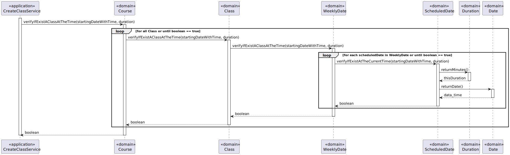

# US 1010 - As Teacher, I want to schedule a class


## 1. Context

It is the first time the task is assigned to be developed.
This User story will allow us to create classes in a course

## 2. Requirements

FRC09 - Schedule of Class A teacher schedule a class (always a recurring class, happens every week). System must check if the Teacher is available for the class period

Section 5.1.2 <br>
* Teachers are responsible for scheduling classes for their courses. <br>
* A class is always a recurring weekly event. A class must have a unique title, a date and a duration. <br>
* It should be impossible to schedule classes that are coincident with other classes of the same course. <br>
* The system should also warn if one of the participants in the class (either a teacher or a student) has other classes at the same time. <br>

## 3. Analysis

**Main actor**

* Teacher

**Interested actors (and why)**

* Teacher : wants to create a class

**Main scenario**
1. Teacher selects option to create a class
2. System shows list of courses the teacher teaches
3. Teacher selects a course
4. System ask for class title, the starting date, starting time, number of classes and duration
5. Teacher inserts the information required
6. System show information inserted and ask for confirmation
7. Teacher validate the information
8. System informs if the operation was a success 

**Other scenarios**

**8.a.** Exist a class at that time 
1. The system informs the Teacher
2. Teacher gives permission to continue the creation


### Client Question
#### Question
Good morning!<br>
We have a question about a class scheduling. When a teacher wants to schedule a class, do they introduce start date/time and end date/time, or start date/time and duration of the class? And in general, how often will the client want to consult the duration of the classes?
<br>Regards,<br>
Group 33

#### Answer

Hi. <br>
For the class the teacher should entre the start date/time and duration (see Section 5.1.2). <br>
The duration of the class is important when scheduling "events" (such a classes and meetings) because the system must comply with some scheduling rules, for instance, to avoid scheduling classes that are coincident with other classes of the same course (see Section 5.1.2).
<br> Regards.


## 4. Design

### 4.1. Rational


|                                          Main Scenario                                          |                      Question: Which class...                       |                Answer                |                                                              Pattern                                                               |
|:-----------------------------------------------------------------------------------------------:|:-------------------------------------------------------------------:|:------------------------------------:|:----------------------------------------------------------------------------------------------------------------------------------:|
|                           1. Teacher selects option to create a class                           |                     ...interacts with the user                      |            CreateClassUI             |                                                          Pure Fabrication                                                          |
|                                                                                                 |                     ...coordinates the use case                     |        CreateClassController         |                                                             Controller                                                             |
|                                                                                                 |                 ...interacts with the domain layer                  | CreateClassService/ListCourseService |             Controller-service - hides the complexity of the use case from the controller class, lowering its coupling             |
|                       2. System shows list of courses the teacher teaches                       |         ...knows what teacher are attributed to each Course         |                Course                |                                       Information Expert - Course knows its own information                                        |
|                                                                                                 |                   ...knows all courses persisted                    |           CourseRepository           |                                   Repository - has all the information of all courses persisted                                    |
|                                                                                                 | ...contains the data of a course so it can be moved between layers? |         CourseDTOWithIdTitle         |                                   DTO - Class that transports the necessary data between layers                                    |
|                                                                                                 |           ...transforms a Course into DTO and vice-versa            |             CourseMapper             |                      Mapper-DTO - Class responsible for transforming Domain Entities into DTOs and vice-versa                      |
|                                                                                                 |                    ...creates the necessary DTO                     |           CourseDTOBuilder           |                    Builder - Responsible for the creation of every different type of DTO providing flexibility                     |
|                                   3. Teacher selects a course                                   |                                                                     |                                      |                                                                                                                                    |
| 4. System ask for class title, the starting date, starting time, number of classes and duration |                                                                     |                                      |                                                                                                                                    |
|                           5. Teacher inserts the information required                           |                                                                     |                                      |                                                                                                                                    |
|                  6. System show information inserted and ask for confirmation                   |                                                                     |                                      |                                                                                                                                    |
|                               7. Teacher validate the information                               |                     ...stores the inserted data                     |                Class                 |                                         Information Expert - the class knows its own data                                          |
|                                                                                                 |                       ... creates the object                        |             ClassBuilder             |                            Factory - Interface that allows the creation of an instance of a given class                            |
|                                                                                                 |                        ...validates the data                        |                Class                 |                                       Information Expert - the class knows its domain rules                                        |
|                                                                                                 |      ...creates the instance responsible for persisting Course      |          RepositoryFactory           | Abstract Factory - Interface responsible for creating a Factory of related Objects without explicitly specifying the intend Class; |
|                                                                                                 |                   ...persists the created object                    |           ClassRepository            |            Repository -  hide the details of persisting and reconstructing an object while keeping the domain language             |
|                        8. System informs if the operation was a success                         |                                                                     |                                      |                                                                                                                                    |


### 4.2 Sequence Diagram




### 4.3. Tests

Test 1: Verifies that Duration needs to be greater than 0

```
@Test(expected = IllegalArgumentException.class)
   public void ensureThatDurationWithNegativeNumberWillFail() {
        Duration test= new Duration(-3);
   }
}
```

Test 2: Verifies that Date needs to be in the future
```
@Test(expected = IllegalArgumentException.class)
    public void ensureDateCannotBeInThePast() {
        Date test =  new Date(new java.util.Date(0,10,2));
    }

```

Test 3: Verifies that ClassTitle cannot be empty
```
@Test(expected = IllegalArgumentException.class)
    public void ensureClassTitleCannotBeEmpty() {
        ClassTitle test =  new ClassTitle("");
    }

```

Test 4: Verifies that ClassTitle cannot be null
```
@Test(expected = IllegalArgumentException.class)
    public void ensureClassTitleCannotBeNull() {
        ClassTitle test =  new ClassTitle(null);
    }

```


## 5. Implementation

1. Method createClass() from CreateClassService
```
public boolean createClass(String title, Date startingDateWithTime, int numberOfRecurrence, int duration, CourseDTOWithIdTitle courseDTO){

        Course course = courseRepository.ofIdentity(new CourseIdentifier(courseDTO.courseIdentifier)).get();

        Long numberOfClasses = classRepository.count();
        AuthorizationService authz = AuthzRegistry.authorizationService();
        SystemUser systemUser = authz.session().get().authenticatedUser();
        Teacher teacher = teacherRepository.findTeacherBySystemUser(systemUser);
        ClassBuilder builder= new ClassBuilder();
        builder.withTitleDateWithTimeNumberOfClassDurationID(title,startingDateWithTime,numberOfRecurrence,duration,numberOfClasses+1,teacher);
        Class courseClass = builder.build();
        classRepository.save(courseClass);
        course.addClass(courseClass);
        courseRepository.save(course);
        return true;
    }
```

2. Method createClass() from CreateClassService
```
public boolean createClass(String title, Date startingDateWithTime, int numberOfRecurrence, int duration, CourseDTOWithIdTitle courseDTO){

        Course course = courseRepository.ofIdentity(new CourseIdentifier(courseDTO.courseIdentifier)).get();

        Long numberOfClasses = classRepository.count();
        AuthorizationService authz = AuthzRegistry.authorizationService();
        SystemUser systemUser = authz.session().get().authenticatedUser();
        Teacher teacher = teacherRepository.findTeacherBySystemUser(systemUser);
        ClassBuilder builder= new ClassBuilder();
        builder.withTitleDateWithTimeNumberOfClassDurationID(title,startingDateWithTime,numberOfRecurrence,duration,numberOfClasses+1,teacher);
        Class courseClass = builder.build();
        classRepository.save(courseClass);
        course.addClass(courseClass);
        courseRepository.save(course);
        return true;
    }
```
2. Method verifyIfExistAClassAtTheTime() from VerifyIfExistAClassControllerForCourseService
```
public boolean verifyIfExistAClassAtTheTime(Date startingDateWithTime, int duration, CourseDTOWithIdTitle courseDTO) {

        CourseRepository courseRepository = PersistenceContext.repositories().courseRepository();

        Course course = courseRepository.ofIdentity(new CourseIdentifier(courseDTO.courseIdentifier)).get();
        if (course.verifyIfExistAClassAtTheTime(startingDateWithTime,duration)){
            throw new IllegalArgumentException("Exist already a class during that time in this Course");
        }
        if (course.verifyIfExistAnExtraClassAtTheTime(startingDateWithTime,duration)){
            throw new IllegalArgumentException("Exist already an extra class during that time in this Course");
        }

        TeacherRepository teacherRepository = PersistenceContext.repositories().teacherRepository();

        AuthorizationService authz = AuthzRegistry.authorizationService();
        SystemUser systemUser = authz.session().get().authenticatedUser();
        Teacher teacher = teacherRepository.findTeacherBySystemUser(systemUser);


        List<Teacher> listTeacher = new ArrayList<>();
        listTeacher.add(teacher);
        List<Student> listStudent = PersistenceContext.repositories().studentRepository().findStudentsInACourse(course);

        List<Course> listCourse;
        listCourse = courseRepository.findAllCourseRelatedWithTheMembersOfAGivenCourse(listStudent,listTeacher);
        for (Course c: listCourse) {
            if (c.verifyIfExistAClassAtTheTime(startingDateWithTime,duration)){
                return true;
            }
            if (c.verifyIfExistAnExtraClassAtTheTime(startingDateWithTime,duration)){
                return true;
            }
        }
        return false;
    }
```

2. Method findAllCourseRelatedWithTheMembersOfAGivenCourse() from JpaCourseRepository
```
public List<Course> findAllCourseRelatedWithTheMembersOfAGivenCourse(List<Student> students, List<Teacher> teachers) {
        TypedQuery<Course> query;
        if (students.isEmpty() && !teachers.isEmpty()) {
             query = createQuery(
                    "SELECT DISTINCT c FROM Course c "
                            + "WHERE (:teachers IN (SELECT t FROM c.teachersList e JOIN Teacher t ON t = e)) OR (c.teacherInCharge IN (:teachers))",
                    Course.class);
            query.setParameter("teachers", teachers);
            return query.getResultList();
        }else{
            query = createQuery(
                    "SELECT DISTINCT c FROM Course c " +
                            "LEFT JOIN c.enrollmentsList e On e.course = c "
                            + "WHERE (:teachers IN (SELECT t FROM c.teachersList e JOIN Teacher t ON t = e)) OR (c.teacherInCharge IN (:teachers))"
                            + "OR (:students IN (e.student) and e.enrollmentStatus.enrollmentStatusValue = 'ACCEPTED')",
                    Course.class);
            query.setParameter("students", students);
            query.setParameter("teachers", teachers);
        }

        return query.getResultList();
    }
```
## 6. Integration/Demonstration

N/A

## 7. Observations

N/A

