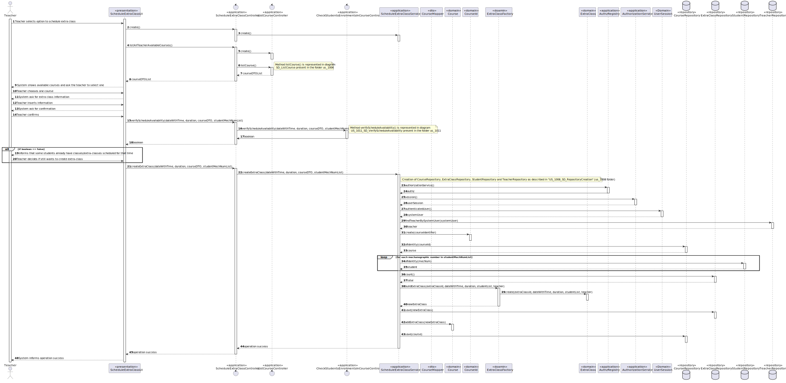
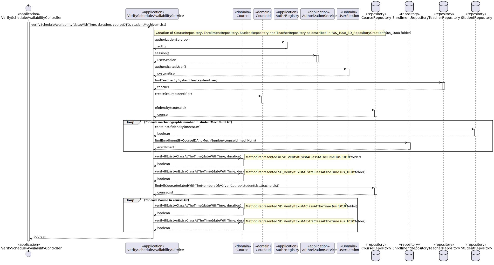

# US 1011 - As Teacher, I want to schedule an extraordinary class

## 1. Context

It is the first time the task is assigned to be developed.
This User story will allow us to create extraordinary classes

## 2. Requirements

**Main actor**

* Teacher

**Interested actors (and why)**

* Teacher : wants to schedule Extra Class

**Pre conditions**

* Teacher must be assigned to a course

**Post conditions**

* The created extra class should be registered and persisted in the system

**Main scenario**
1. Teacher selects option to schedule extra class
2. System shows available courses and ask the teacher to select one
3. Teacher chooses one course
4. System ask for extra class information
5. Teacher inserts information
6. System ask for confirmation
7. Teacher confirms
8. System informs operation success


**Other scenarios**

**2.a.** The system verifies that there are no courses available  
1. The system notifies that this problem has occurred
2. The use case terminates

**7.a.** Teacher doesn't confirm
1. The use case terminates

**7.b.** It already exists an extra-class/ class in that course for that period
1. The system notifies that this problem has occurred
2. The use case terminates

**7.c.** Some students have extra-classes/classes from other courses already scheduled for that period
1. The system notifies which students are occupied in that period and asks if teacher still wants to schedule for that period
2. The teacher confirms/denies

**Special requirements**

N/A

## 3. Analysis

Relevant DM excerpt


## 4. Design

### 4.1. Rational

|                            Main Scenario                            |                      Question: Which class...                       |            Answer            |                                                              Pattern                                                               |
|:-------------------------------------------------------------------:|:-------------------------------------------------------------------:|:----------------------------:|:----------------------------------------------------------------------------------------------------------------------------------:|
|          1. Teacher selects option to schedule extra class          |                     ...interacts with the user                      |     ScheduleExtraClassUI     |                                                          Pure Fabrication                                                          |
|                                                                     |                     ...coordinates the use case                     | ScheduleExtraClassController |                                                             Controller                                                             |
|                                                                     |                 ...interacts with the domain layer                  |  ScheduleExtraClassService   |             Controller-service - hides the complexity of the use case from the controller class, lowering its coupling             |
| 2. System shows available courses and ask the teacher to select one |         ...knows what teacher are attributed to each Course         |            Course            |                                       Information Expert - Course knows its own information                                        |
|                                                                     |                   ...knows all courses persisted                    |       CourseRepository       |                                   Repository - has all the information of all courses persisted                                    |
|                                                                     | ...contains the data of a course so it can be moved between layers? |     CourseDTOWithIdTitle     |                                   DTO - Class that transports the necessary data between layers                                    |
|                                                                     |           ...transforms a Course into DTO and vice-versa            |         CourseMapper         |                      Mapper-DTO - Class responsible for transforming Domain Entities into DTOs and vice-versa                      |
|                                                                     |                    ...creates the necessary DTO                     |       CourseDTOBuilder       |                    Builder - Responsible for the creation of every different type of DTO providing flexibility                     |
|                    3. Teacher chooses one course                    |                                                                     |                              |                                                                                                                                    |
|              4. System ask for extra class information              |                                                                     |                              |                                                                                                                                    |
|                   5. Teacher inserts information                    |                                                                     |                              |                                                                                                                                    |
|                   6. System ask for confirmation                    |                                                                     |                              |                                                                                                                                    |
|                         7. Teacher confirms                         |                     ...stores the inserted data                     |          ExtraClass          |                                         Information Expert - the class knows its own data                                          |
|                                                                     |                       ... creates the object                        |      ExtraClassFactory       |                            Factory - Interface that allows the creation of an instance of a given class                            |
|                                                                     |                        ...validates the data                        |          ExtraClass          |                                       Information Expert - the class knows its domain rules                                        |
|                                                                     |      ...creates the instance responsible for persisting Course      |      RepositoryFactory       | Abstract Factory - Interface responsible for creating a Factory of related Objects without explicitly specifying the intend Class; |
|                                                                     |                   ...persists the created object                    |     ExtraClassRepository     |            Repository -  hide the details of persisting and reconstructing an object while keeping the domain language             |
|                 8. System informs operation success                 |                                                                     |                              |                                                                                                                                    |

Summary of needed classes:
* ScheduleExtraClassUI
* ScheduleExtraClassController
* ScheduleExtraClassService
* Course
* CourseRepository
* CourseDTOWithIdTitle
* CourseMapper
* CourseDTOBuilder
* ExtraClass
* ExtraClassFactory
* RepositoryFactory
* ExtraClassRepository


### 4.2 Sequence Diagram


### 4.3. Tests
Test 1: Verifies that Duration needs to be greater than 0

```
@Test(expected = IllegalArgumentException.class)
   public void ensureThatDurationMustBeGreaterThanZero() {
        Duration instance = new Duration(-3);
   }
}
```

Test 2: Verifies that Date needs to be in the future
```
@Test(expected = IllegalArgumentException.class)
    public void ensureDateIsInTheFuture() {
        Date instance =  new Date(new Date(0,10,2));
    }
}
```

Test 3: Verifies that ExtraClassId needs to be greater than 0
```
@Test(expected = IllegalArgumentException.class)
    public void ensureIdIsGreaterThanZero() {
        ExtraClassId instance =  new ExtraClassId(-1);
    }
}
```

Test 4: Verifies that method that tells that 2 scheduled classes/extra-classes occur at the same time is correct
```
@Test()
    public void ensureEqualScheduledDatesOccurAtTheSameTime() {
        ScheduledDate instance1 =  new ScheduledDate(new Date(new java.util.Date(2024,1,1)),new Duration(60));
        ScheduledDate instance2 =  new ScheduledDate(new Date(new java.util.Date(2024,1,1)),new Duration(60));
        assertTrue(instance1.occursAtTheSameTime(instance2));
    }
}
```

## 5. Implementation
Here are some samples of the implementation:

1. Method buildExtraClass() from ExtraClassFactory
```
    public ExtraClass buildExtraClass(Long extraClassId, java.util.Date dateWithTime, int duration, List<Student> studentList, Teacher teacher) {
        ExtraClassId id = new ExtraClassId(extraClassId);
        ScheduledDate scheduledDate = new ScheduledDate(new Duration(duration),new Date(dateWithTime));
        return new ExtraClass(id, scheduledDate, studentList, teacher);
    }
```


2. Method createExtraClass() from ScheduleExtraClassService
```
    public boolean createExtraClass(java.util.Date dateWithTime, int duration ,CourseDTOWithIdTitle courseDTO, List<String> studentMechNumList){
        CourseRepository courseRepo = PersistenceContext.repositories().courseRepository();
        StudentRepository studentRepo = PersistenceContext.repositories().studentRepository();
        ExtraClassRepository extraClassRepo = PersistenceContext.repositories().extraClassRepository();
        TeacherRepository teacherRepo = PersistenceContext.repositories().teacherRepository();
        Teacher teacher = teacherRepo.findTeacherBySystemUser(AuthzRegistry.authorizationService().session().get().authenticatedUser());


        List<Student> studentList = new ArrayList<>();

        for (String mecNumString : studentMechNumList){
            studentList.add(studentRepo.ofIdentity(new MecanographicNumber(mecNumString)).get());
        }

        ExtraClass newExtraClass = new ExtraClassFactory().buildExtraClass(extraClassRepo.count()+1,dateWithTime,duration,studentList,teacher);

        CourseIdentifier courseId = new CourseIdentifier(courseDTO.courseIdentifier);
        Course course = courseRepo.ofIdentity(courseId).get();
        course.addExtraClass(newExtraClass);
        courseRepo.save(course);
        return true;
    }
```

## 6. Observations
N/A