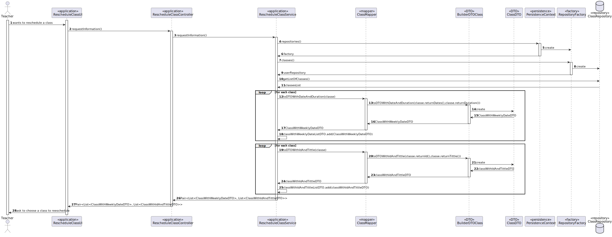
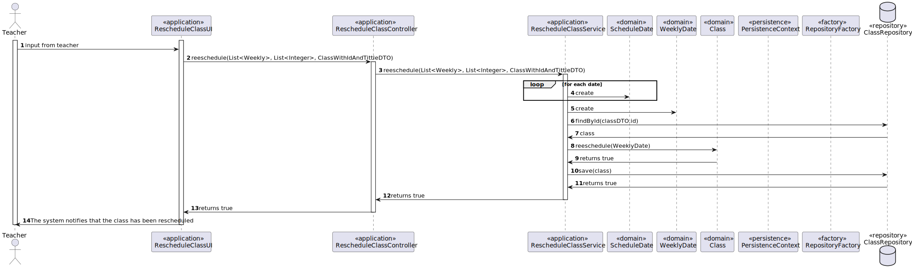

# US 1012 - As Teacher, I want to update the schedule of a class
## 1. Context

 A teacher lectures a class. After scheduling a class, the teacher can update the schedule of a specific date of the class. 

## 2. Requirements

*FRC01* Reschedule a class to the system's calendar

Acceptance Criteria:

- 1012.2. The system must allow a teacher to change the date of an existence date for a class.
- 1012.2. The system must checks if the rescheduling date is available to be rescheduled
  - 1012.2.1 If the course have another class with a sheduled date that conflicts with the rescheduling date, the system must notify the teacher of the conflicting schedules and ask the teacher if he wants to continue or reschedule the class. 

*FRC02* Cancel a class 

Acceptance Criteria:

- 1012.3. The system must remove the class from the system's calendar.

## 3. Analysis

To implement this User Story, we need to implement the scheduling features of our Domain Model in the system with the following functionalities:

* A function where the teacher can choose a class and the date to reschedule.
* A function where the teacher can input the rescheduling class date.
* A function to reschedule a class and add it to the system's calendar.
* A function that checks if the rescheduling date is available to be rescheduled.
  * If the course have another class with a sheduled date that conflicts with the rescheduling date, the system should notify the teacher of the conflicting schedules and ask the teacher if he wants to continue or reschedule the class.

## 4. Design




## 5. Tests

```
    @Test
    public void verifyIfWeeklyDateWasUpdated(){
        Teacher aTeacher = new TeacherBuilder().withAcronym("BCC")
                .withDateOfBirth(new Date(100,10,2)).withTaxPayerNumber(111111111).build();
        Class courseClass = new ClassBuilder().withTitleDateWithTimeNumberOfClassDurationID("title",
                new java.util.Date(1000,10,2,10,0,0),3,30,1L,aTeacher).build();

        ScheduledDate scheduledDate1 = new ScheduledDate(new Duration(60),new eapli.base.courseclasses.domain.Date(new java.util.Date(1100,10,2,10,0,0)));
        ScheduledDate scheduledDate2 = new ScheduledDate(new Duration(60),new eapli.base.courseclasses.domain.Date(new java.util.Date(1200,10,9,10,0,0)));
        List<ScheduledDate> list = new ArrayList<>();
        list.add(scheduledDate1);
        list.add(scheduledDate2);
        WeeklyDate weeklyDate = new WeeklyDate(list,false);
        courseClass.reschedule(weeklyDate);
        assertTrue(courseClass.verifyIfWeeklyDateIsTheSame(weeklyDate));
    }
```

## 6. Implementation

```
    public Pair<List<ClassWithWeeklyDateDTO>, List<ClassWithIdAndTittleDTO>> requestInformation() {
        AuthorizationService authz = AuthzRegistry.authorizationService();
        SystemUser user = authz.session().get().authenticatedUser();
        Teacher teacher = teacherRepository.findTeacherBySystemUser(user);
        Iterable<Class> classes = classRepository.findAll(teacher);
        if (classes==null||!classes.iterator().hasNext()){
            throw new IllegalArgumentException("There is no classes to reschedule");
        }
        List<ClassWithWeeklyDateDTO> listDTO = new ArrayList<>();
        List<ClassWithIdAndTittleDTO> listDTO2 = new ArrayList<>();
        for (Class c : classes) {
            listDTO.add(classMapper.toDTOWithDateAndDuration(c));
        }
        for (Class c : classes) {
            listDTO2.add(classMapper.toDTOWithIdAndTittle(c));
        }
        return Pair.of(listDTO,listDTO2);
    }
``` 

```
    public boolean rescheduleClass(List<Date> dates, List<Integer> durations, ClassWithIdAndTittleDTO selectedClass) {
        List<ScheduledDate> scheduledDateList = new ArrayList<>();
        for (int i = 0; i<dates.size(); i++){
            scheduledDateList.add(new ScheduledDate(new Duration(durations.get(i)),new eapli.base.courseclasses.domain.Date(dates.get(i))));
        }
        WeeklyDate weeklyDate = new WeeklyDate(scheduledDateList,false);
        Class c = classRepository.findById(selectedClass.id);
        boolean flag = c.reschedule(weeklyDate);
        if (flag) {
            classRepository.save(c);
            return true;
        }
        return false;
    }
```

## 7. Integration/Demonstration

N/A

## 8. Observations

N/A
