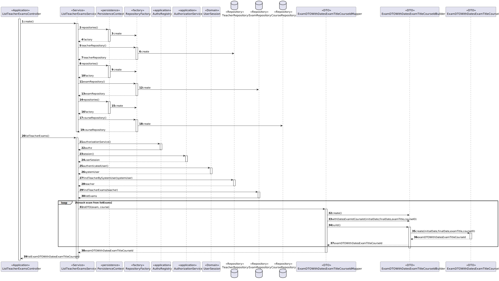

# US 1010 - As Teacher, I want to create/update an exam


## 1. Context

It is the first time the task is assigned to be developed.
This User story will allow us to create exams/update in a course

## 2. Requirements

FRE01 - Create Exam A Teacher creates a new exam. This includes the specification
of the exam (i.e., its structure, in accordance with a grammar for exams that is used to
validate the specification of the exam)

• NFR09 - Exam Language The support for exams (its design, feedback and grading)
must follow specific technical requirements, specified in LPROG. The ANTLR tool should
be used (https://www.antlr.org/)


**Each exam specification must include a set of components or sections:**<br>
* Title - The title of the exam specification.<br>
*  Header - This component must include global settings, such as the type of feedback
(none, on-submission, after-closing) and the type of grade (none, on-submission, afterclosing). It may also contain a textual description to appear at the beginning of the
exam.<br>
* Sequence of Sections - After the header, the exam is composed of sequence of one or
more sections. Each section is a group of questions. Each section may contain a textual
description to appear at the beginning of the group of questions. The type of questions
that can be used in the sections is described next<br>

## 3. Analysis

This US can be divided in the two use cases one to create exam and other to update exam

### UC - Create Exam
**Main actor**
* Teacher

**Interested actors (and why)**
* Teacher : wants to create an exam

**Main scenario**
1. Teacher select option to create an exam
2. System shows list of courses the teacher teaches
3. Teacher selects a course 
4. System asks for the path to exam file, and the initial and final date 
5. Teacher inserts data 
6. System informs operation was a success

### UC - Update Exam 

**Main actor**
* Teacher

**Interested actors (and why)**
* Teacher : wants to create an exam

**Main scenario**
1. Teacher select option to update an exam
2. System shows list of exams the teacher created
3. Teacher select one exam
4. System what do you which to update, and for the specific information
5. Teacher inserts information
6. System informs operation success


## 4. Design

### 4.1. UC - Create Exam
#### 4.1.1. Rational


|                              Main Scenario                              |                      Question: Which class...                       |           Answer           |                                                              Pattern                                                               |
|:-----------------------------------------------------------------------:|:-------------------------------------------------------------------:|:--------------------------:|:----------------------------------------------------------------------------------------------------------------------------------:|
|               1. Teacher selects option to create an exam               |                     ...interacts with the user                      |        CreateExamUI        |                                                          Pure Fabrication                                                          |
|                                                                         |                     ...coordinates the use case                     | CreateUpdateExamController |                                                             Controller                                                             |
|                                                                         |                 ...interacts with the domain layer                  |     CreateExamService      |             Controller-service - hides the complexity of the use case from the controller class, lowering its coupling             |
|           2. System shows list of courses the teacher teaches           |         ...knows what teacher are attributed to each Course         |           Course           |                                       Information Expert - Course knows its own information                                        |
|                                                                         |                   ...knows all courses persisted                    |      CourseRepository      |                                   Repository - has all the information of all courses persisted                                    |
|                                                                         | ...contains the data of a course so it can be moved between layers? |    CourseDTOWithIdTitle    |                                   DTO - Class that transports the necessary data between layers                                    |
|                                                                         |           ...transforms a Course into DTO and vice-versa            |        CourseMapper        |                      Mapper-DTO - Class responsible for transforming Domain Entities into DTOs and vice-versa                      |
|                                                                         |                    ...creates the necessary DTO                     |      CourseDTOBuilder      |                    Builder - Responsible for the creation of every different type of DTO providing flexibility                     |
|                       3. Teacher selects a course                       |                                                                     |                            |                                                                                                                                    |
| 4. System ask for the path to exam file, and the initial and final date |                                                                     |                            |                                                                                                                                    |
|                         5. Teacher inserts data                         |                     ...stores the inserted data                     |            Exam            |                                         Information Expert - the class knows its own data                                          |
|                                                                         |                       ... creates the object                        |        ExamBuilder         |                            Factory - Interface that allows the creation of an instance of a given class                            |
|                                                                         |                        ...validates the data                        |            Exam            |                                       Information Expert - the class knows its domain rules                                        |
|                                                                         |      ...creates the instance responsible for persisting Course      |     RepositoryFactory      | Abstract Factory - Interface responsible for creating a Factory of related Objects without explicitly specifying the intend Class; |
|                                                                         |                   ...persists the created object                    |       ExamRepository       |            Repository -  hide the details of persisting and reconstructing an object while keeping the domain language             |
|            6. System informs if the operation was a success             |                                                                     |                            |                                                                                                                                    |


#### 4.1.2. Sequence Diagram

#### 4.1.3. Tests

Test 1: Verifies that DateInterval cannot be created with null values

```
@Test(expected = IllegalArgumentException.class)
   public void ensureThatDateIntervalCannotBeCreateWithNullValues() {
        DateInterval test= new DateInterval(null,null);
   }
```

Test 2: Verifies that DateInterval cannot be created with initial date Bigger Than final date
```
@Test(expected = IllegalArgumentException.class)
   public void ensureThatDateIntervalCannotBeCreateWithInitialDateBiggerThanFinalDate() {
        DateInterval test= new DateInterval(new Date (100,1,10),new Date (100,1,9));
   }
```
Test 3: Verifies that ExamTitle cannot be created with null values
```
 @Test(expected = IllegalArgumentException.class)
    public void ensureThatExamTitleCannotBeCreateWithNullValues() {
        ExamTitle test= new ExamTitle(null);
    }
```

Test 4: Verifies that ExamSpecification cannot be created with an empty String
```
@Test(expected = IllegalArgumentException.class)
   public void ensureThatExamSpecificationCannotBeCreateWithEmptyString() {
        ExamSpecification test= new ExamSpecification("");
   }
```

Test 5: Verifies that ExamSpecification cannot be created with Null Values
```
@Test(expected = IllegalArgumentException.class)
   public void ensureThatExamSpecificationCannotBeCreateWithNullValues() {
        ExamSpecification test= new ExamSpecification(null);
   }
```

Test 6: Verifies that Exam cannot be created with nullParams
```
@Test(expected = IllegalArgumentException.class)
   public void ensureThatExamSpecificationCannotBeCreateWithNullValues() {
        Exam test= new ExamBuilder().build();
   }
```
### 4.2. UC - Update Exam


|                              Main Scenario                              |                     Question: Which class...                      |                  Answer                  |                                                              Pattern                                                               |
|:-----------------------------------------------------------------------:|:-----------------------------------------------------------------:|:----------------------------------------:|:----------------------------------------------------------------------------------------------------------------------------------:|
|               1. Teacher selects option to update an exam               |                    ...interacts with the user                     |               UpdateExamUI               |                                                          Pure Fabrication                                                          |
|                                                                         |                    ...coordinates the use case                    |           UpdateExamController           |                                                             Controller                                                             |
|                                                                         |                ...interacts with the domain layer                 |         CreateUpdateExamService          |             Controller-service - hides the complexity of the use case from the controller class, lowering its coupling             |
|            2. System shows list of exams the teacher created            |              ...knows what teacher created each Exam              |                   Exam                   |                                       Information Expert - Course knows its own information                                        |
|                                                                         |                   ...knows all Exams persisted                    |              ExamRepository              |                                   Repository - has all the information of all courses persisted                                    |
|                                                                         | ...contains the data of a Exam so it can be moved between layers? |    ExamDTOWithDatesExamTitleCourseId     |                                   DTO - Class that transports the necessary data between layers                                    |
|                                                                         |           ...transforms a Exam into DTO and vice-versa            | ExamDTOWithDatesExamTitleCourseIdMapper  |                      Mapper-DTO - Class responsible for transforming Domain Entities into DTOs and vice-versa                      |
|                                                                         |                   ...creates the necessary DTO                    | ExamDTOWithDatesExamTitleCourseIdBuilder |                    Builder - Responsible for the creation of every different type of DTO providing flexibility                     |
|                       3. Teacher select one exam                        |                                                                   |                                          |                                                                                                                                    |
| 4. System what do you which to update, and for the specific information |                                                                   |                                          |                                                                                                                                    |
|                     5. Teacher inserts information                      |                    ...stores the inserted data                    |                   Exam                   |                                         Information Expert - the class knows its own data                                          |
|                                                                         |                       ...validates the data                       |                   Exam                   |                                       Information Expert - the class knows its domain rules                                        |
|                                                                         |     ...creates the instance responsible for persisting Course     |            RepositoryFactory             | Abstract Factory - Interface responsible for creating a Factory of related Objects without explicitly specifying the intend Class; |
|                                                                         |                  ...persists the created object                   |              ExamRepository              |            Repository -  hide the details of persisting and reconstructing an object while keeping the domain language             |
|            6. System informs if the operation was a success             |                                                                   |                                          |                                                                                                                                    |


#### 4.1. Sequence Diagram



## 5. Implementation

### 5.1 Create Exam

1. Method createExam() from CreateUpdateExamService
```
    public boolean createExam(String structure, CourseDTOWithIdTitle courseDto, Date initialDate, Date finalDate){

        AuthorizationService authz = AuthzRegistry.authorizationService();
        SystemUser systemUser = authz.session().get().authenticatedUser();
        Teacher teacher = teacherRepository.findTeacherBySystemUser(systemUser);

        ExamBuilder examBuilder = new ExamBuilder();
        Exam exam = examBuilder.withExamSpecification(structure).withDateInterval(initialDate,finalDate).withTeacher(teacher).build();
        Course course = courseRepository.ofIdentity(new CourseIdentifier(courseDto.courseIdentifier)).get();

        course.addExam(exam);
        Exam examVerification = examRepository.ofIdentity(new ExamTitle(exam.returnExamTitleString())).get();
        if (examVerification != null) throw new IllegalArgumentException("An exam with this title already exists");
        examRepository.save(exam);
        courseRepository.save(course);

        return true;
    }
```
2. Method verifyExamSpecification() from VerifyExamSpecificationService
```
public boolean verifyExamSpecification(String questionString){
        ExamGrammarLexer lexer;
        lexer = new ExamGrammarLexer(CharStreams.fromString(questionString));
        CommonTokenStream tokens = new CommonTokenStream(lexer);
        ExamGrammarParser parser = new ExamGrammarParser(tokens);
        ParseTree parseTree = parser.prog();
        if(parser.getNumberOfSyntaxErrors() == 0){
            return true;
        }else{
            throw new IllegalArgumentException("The specification of exam is incorrect");
        }
    }
```

### 5.1 Update Exam

1. Method updateExam() from CreateUpdateExamService
```
  public boolean updateExam(String structure, Date initialDate, Date finalDate, ExamDTOWithDatesExamTitleCourseId examDTO){
        Exam exam = examRepository.ofIdentity(new ExamTitle(examDTO.examTitle)).get();
        if (structure!= null){
            ExamSpecification specification = new ExamSpecification(structure);
            new VerifyExamSpecificationService().verifyExamSpecification(structure);
            exam.updateExamSpecification(specification);
        }else if (initialDate != null && finalDate != null){
            DateInterval dateInterval = new DateInterval(initialDate,finalDate);
            exam.updateDateInterval(dateInterval);
        }
        examRepository.save(exam);
        return true;
    }
```

2. Method listTeacherExam() from ListTeacherExamsService
```
public List<ExamDTOWithDatesExamIdCourseId> listTeacherExam(){

        AuthorizationService authz = AuthzRegistry.authorizationService();
        SystemUser systemUser = authz.session().get().authenticatedUser();
        Teacher teacher = teacherRepository.findTeacherBySystemUser(systemUser);
        List<Exam> listExam = examRepository.findTeacherExams(teacher);
        List<ExamDTOWithDatesExamIdCourseId> listExamDTOWithDatesExamTitleCourseId = new ArrayList<>();
        for (Exam exam: listExam) {
            Course course = courseRepository.findCourseByExam(exam);
            listExamDTOWithDatesExamTitleCourseId.add(ExamDTOWithDatesExamIdCourseIdMapper.toDto(exam,course));
        }
        return listExamDTOWithDatesExamTitleCourseId;
    }
```
## 6. Integration/Demonstration

N/A

## 7. Observations

N/A