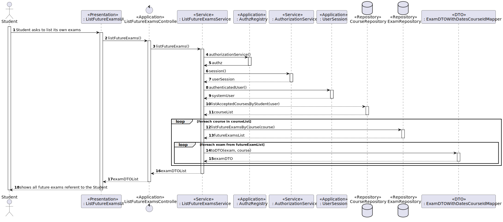
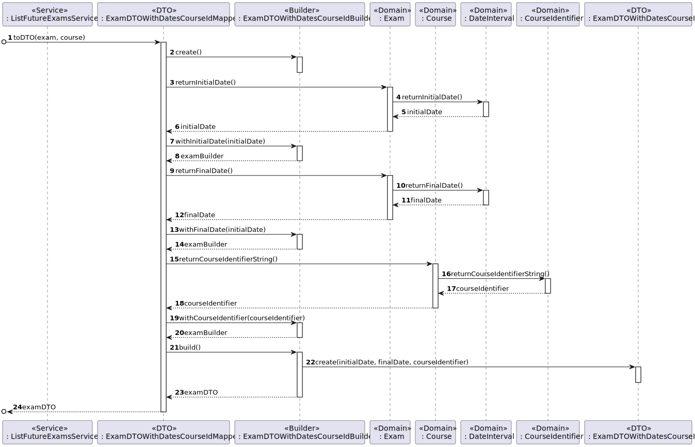

# US 2002 - As Student, I want to view a list of my future exams

## 1. Context

It is the first time the task is assigned to be developed.
This US allows every user to view all of he's future exams

## 2. Analysis

**Main actor**

* Student

**Interested actors (and why)**

* Student: wants to list its own future exams

**Preconditions**

* There needs to be future exams referent to the Student

**Postconditions**

* All future exams of the Student need to be listed

**Main scenario**
1. Student asks to list its own exams
2. System shows all exams referent to the Student

**Other scenarios**

**a.** The system doesn't have any future exams for the student to be listed
1. Student asks to list its own exams
2. System shows informs that there are no future exams to be listed


Relevant DM excerpt


## 3. Design
### 3.1 Rationale

|                                                  Main Scenario                                                   |                                                                                                                                                                                           Question: which class...                                                                                                                                                                                           |                                                                                                                                    Answer                                                                                                                                    |                                                                                                                                                                                                                                                                                                                                                      Pattern (with justification)                                                                                                                                                                                                                                                                                                                                                      |
|:----------------------------------------------------------------------------------------------------------------:|:------------------------------------------------------------------------------------------------------------------------------------------------------------------------------------------------------------------------------------------------------------------------------------------------------------------------------------------------------------------------------------------------------------:|:----------------------------------------------------------------------------------------------------------------------------------------------------------------------------------------------------------------------------------------------------------------------------:|:--------------------------------------------------------------------------------------------------------------------------------------------------------------------------------------------------------------------------------------------------------------------------------------------------------------------------------------------------------------------------------------------------------------------------------------------------------------------------------------------------------------------------------------------------------------------------------------------------------------------------------------------------------------------------------------------------------------------------------------:|
|                                      1. Student asks to list its own exams                                       |                                                                                                                                      <p>A. Interacts with the Manager?</p><p>B. Coordinates the Use Case?</p> <p>C. Interacts with the Domain and Persistence Layer</p>                                                                                                                                      |                                                                                      <p> A. ListFutureExamsUI</p><p> B. ListFutureExamsController</p><p>C. ListFutureExamsService </p>                                                                                       |                                                                                                                                                                                                    <p> A. Pure Fabrication - Class that doesn't exist in the domain but is necessary for the functionality of the system </p> <p> B. Controller - Responsible for handling system events  </p><p> C. Service - Class responsible for handling the domain layer and the persistence layer according with the controller requests</p>                                                                                                                                                                                                    |
|                                2. System shows all exams referent to the Student                                 | <p>A. Knows which user is requesting the event? </p>  <p> B. Has all exams persisted? </p> <p> C. Has all courses persisted? </p> <p> D. Creates an instance of the repository? </p> <p> E. Creates an instance of the factory? </p> <p> F. Contains the data of an exam so it can be moved between layers?</p> <p> G. Transforms an Exam into DTO and vice-versa?</p> <p> H. Creates the necessary DTO?</p> | <p> A. AuthorizationService </p> <p> B. ExamRepository </p><p> C. CourseRepository</p> <p> D. RepositoryFactory</p>  <p> E. PersistenceContext</p> <p> F. ExamDTOWithDatesCourseId </p> <p> G. ExamDTOWithDatesCourseIdMapper</p> <p> H.ExamDTOWithDatesCourseIdBuilder </p> | <p> A. Information Expert - Class has the necessary information to know its own state</p> <p> B. Repository - Has all the information of all exams persisted</p> <p> C. Repository - Has all the information of all enrollments persisted</p>  <p> <p> D. Factory - Responsible for the creation of the repositories</p> <p> E. Pure Fabrication - Class that doesn't exist in the domain but is necessary for the functionality of the system</p> <p> F. DTO - Class that transports the necessary data between layers</p> <p> G. Mapper-DTO - Class responsible for transforming Domain Entities into DTOs and vice-versa</p> <p> H. Builder - Responsible for the creation of every different type of DTO providing flexibility</p> |

### 3.2 Sequence Diagram




### 3.3. Tests

* There are no tests that could be done to the domain 

## 4. Implementation
Here's a sample of the implementation:
````
public List<ExamDTOWithDatesCourseId> listFutureExams(){
        CourseRepository courseRepository = PersistenceContext.repositories().courseRepository();
        ExamRepository examRepository = PersistenceContext.repositories().examRepository();
        SystemUser user = AuthzRegistry.authorizationService().session().get().authenticatedUser();
        List<Course> courseList = courseRepository.listAcceptedCoursesByStudent(user);
        Date date = new Date();
        List<Exam> examList;
        List<ExamDTOWithDatesCourseId> examDTOList = new ArrayList<>();
        for(Course course : courseList){
            examList = examRepository.listFutureExamsByCourse(course,date);
            for(Exam exam : examList){
                examDTOList.add(ExamDTOWithDatesCourseIdMapper.toDTO(exam, course));
            }
        }
        return examDTOList;
    }
````
A resume of the commits for the implementation :
- [US_2002][Domain] - Added methods return initial and final date in String format
- [US_2002][DTO] - Created ExamDTOWIthDatesCourseId and its mapper and builder
- [US_2002][Persistence] - Added the necessary persistence for the US
- [US_2002][Application] - Created ListFutureExams Controller and Service
- [US_2002][Presentation] - Created the UI
## 5. Observations
N/A