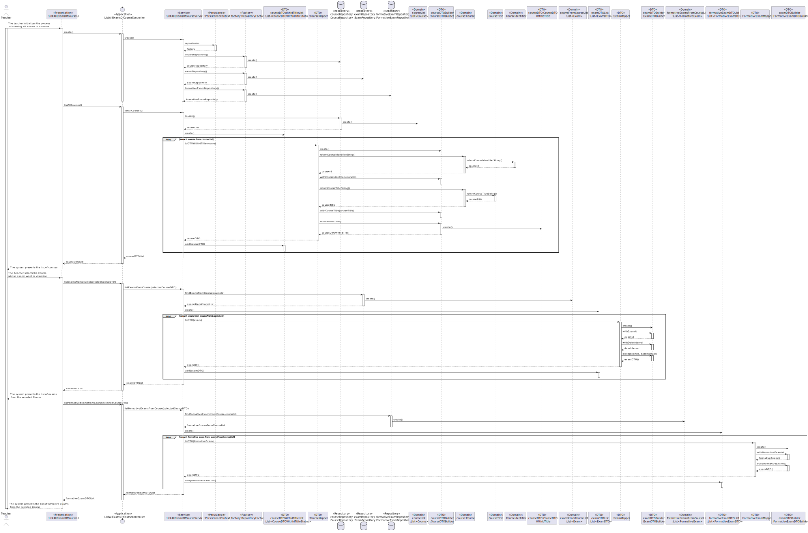

US2003: As Teacher, I want to view a list of all exams in a course
=======================================

# 1. Context #
**US2003**: In this US the list of exams of a given course will be displayed.

# 2. Requirements #
**1. Acceptance Criteria**
- The exams shown must be from the course selected.

**2. Pre conditions**
- There must be created courses.
- There must be exams of that course created.

**3.Main scenario**
1. Teacher selects the option to view a list of all exams in a course.
2. System shows the available courses.
3. Manager selects the course that he wants to view all exams.
4. System displays all exams from that course.

# 3. Analysis #
**1. Actor:** Teacher.

**2.Client Clarifications**
- No clarification were given regarding this US so far.

**Interested actors**
- Teacher : wants view all exams of a course.

**Related US**
- US1002: There must be courses created.
- US2001: There must be exams created.

**3.Relevant business aspects**
* Exams are associated with courses.

# 4. Design

## 3.1. System Diagram

# 5. Tests
N/A
