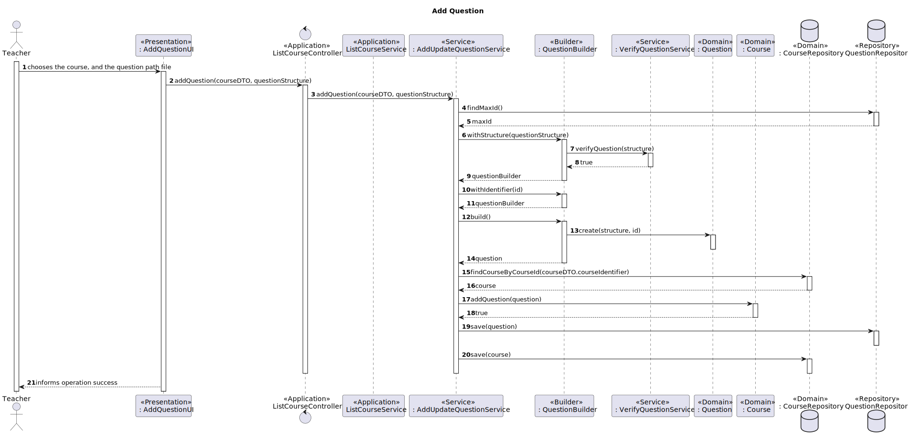

# US2007 - As Teacher I want to add/update exam questions to a repository of exam questions to be used in automatic formative exams

## 1. Context

It is the first time the task is assigned to be developed.
In this US it will be created an option to a teacher to add or update exam questions onto a repository to be used in formative exam.

Every different type needs to be recognized by the system and in case it doesn't it shows an error to the user.
## 2. Analysis

**Main actor**

* Teacher

**Interested actors (and why)**

* Teacher: wants to add/update exam questions to a formative exam

**Preconditions**

* There needs to be a course relative to the question

**Postconditions**

* The new question needs to be added to the question repository

In this User Story we can identify two use cases being one add exam questions and the other is
to update existing questions.
Those scenarios follow this:

**Add scenario**
1. Teacher inserts the course and question path
2. System informs operation success

**Update scenario**
1. Teacher inserts the old question and question path
2. System informs operation success

**Other scenarios**

**a.** There are no questions for that course in the system
1. Teacher inserts the course and question path
2. System informs the question was not accepted because didn't follow any type of question
**Relevant DM excerpt**


## 3. Design
### 3.1 Rationale

|                  Add Scenario                   |                                                                                                                                                                     Question: which class...                                                                                                                                                                      |                                                                                             Answer                                                                                             |                                                                                                                                                                                                                                                                                                       Pattern (with justification)                                                                                                                                                                                                                                                                                                       |
|:-----------------------------------------------:|:-----------------------------------------------------------------------------------------------------------------------------------------------------------------------------------------------------------------------------------------------------------------------------------------------------------------------------------------------------------------:|:----------------------------------------------------------------------------------------------------------------------------------------------------------------------------------------------:|:----------------------------------------------------------------------------------------------------------------------------------------------------------------------------------------------------------------------------------------------------------------------------------------------------------------------------------------------------------------------------------------------------------------------------------------------------------------------------------------------------------------------------------------------------------------------------------------------------------------------------------------:|
| 1. Teacher inserts the course and question path |                                                                                                                                                                                                                                                                                                                                                                   |                                                                                                                                                                                                |                                                                                                                                                                                                                                                                                                                                                                                                                                                                                                                                                                                                                                          |
|       2. System informs operation success       |                                                                <p> A. Will persist the new question?</p> <p> B. Creates the object question</p> <p> C. Has all information of a question</p> <p> <p> D. Verifies if the information the structure is correct and identifies the question type</p>                                                                 |                               <p> A. QuestionRepository and CourseRepository</p> <p> B. QuestionBuilder</p> <p> C. Question</p> <p> D. VerifyQuestionService</p>                               |                                                                                                                                                                     <p> A. Repository - Has all the information of questions persisted </p>  <p> B. Builder - Interface that allows the creation of an instance of a given class <p> C. Information Expert - Class has the necessary information about itself</p> <p> D. Service - Coordinates domain activities</p>                                                                                                                                                                     |


|                    Update Scenario                    |                                                                                                                                                                       Question: which class...                                                                                                                                                                       |                                                                                             Answer                                                                                             |                                                                                                                                                                                                                                                                                                       Pattern (with justification)                                                                                                                                                                                                                                                                                                       |
|:-----------------------------------------------------:|:--------------------------------------------------------------------------------------------------------------------------------------------------------------------------------------------------------------------------------------------------------------------------------------------------------------------------------------------------------------------:|:----------------------------------------------------------------------------------------------------------------------------------------------------------------------------------------------:|:----------------------------------------------------------------------------------------------------------------------------------------------------------------------------------------------------------------------------------------------------------------------------------------------------------------------------------------------------------------------------------------------------------------------------------------------------------------------------------------------------------------------------------------------------------------------------------------------------------------------------------------:|
| 1. Teacher inserts the old question and question path |                                                                                                                                                                                                                                                                                                                                                                      |                                                                                                                                                                                                |                                                                                                                                                                                                                                                                                                                                                                                                                                                                                                                                                                                                                                          |
|          2. System informs operation success          |                                                                                                  <p> A. Will persist the updated question? </p> <p> B. Has all information of a question? </p> <p> C. Verifies if the information of the structure is correct? </p>                                                                                                  |                                                      <p> A. QuestionRepository </p> <p> B. Question</p> <p> C. VerifyQuestionService</p>                                                       |                                                                                                                                                                                                               <p> A. Repository - Has all the information of questions persisted </p> <p> B. Information Expert - Class has the necessary information about itself</p> <p> C. Service - Coordinates domain activities </p>                                                                                                                                                                                                               |


### 3.2. Sequence Diagram





### 3.3. Tests

**Test 1:** *Verifies that a question is not recognized if it doesn't have the right structure.*
````
    @Test(expected = IllegalArgumentException.class)
    public void verifyMultipleChoiceQuestionWrongTest() throws IOException {
    VerifyQuestionService service = new VerifyQuestionService();
    Path path = Paths.get("files/testfiles/US2007/wrongQuestion.txt");
    byte[] fileBytes = Files.readAllBytes(path);
    service.verifyQuestion(new String(fileBytes));
    }
````
**Test 2:** *Verifies that a multiple choice question is recognized if it has the right structure.*
````
    @Test
    public void verifyAcceptsMultipleChoiceQuestionTest() throws IOException {
    VerifyQuestionService service = new VerifyQuestionService();
    Path path = Paths.get("files/testfiles/US2007/multipleChoiceQuestionCorrect.txt");
    byte[] fileBytes = Files.readAllBytes(path);
    assertTrue(service.verifyQuestion(new String(fileBytes)));
    }
````
**Test 3:** *Verifies that a matchingType question is recognized if it has the right structure.*
````
    @Test
    public void verifyAcceptsTypeQuestionTest() throws IOException {
    VerifyQuestionService service = new VerifyQuestionService();
    Path path = Paths.get("files/testfiles/US2007/matchingTypeQuestionCorrect.txt");
    byte[] fileBytes = Files.readAllBytes(path);
    assertTrue(service.verifyQuestion(new String(fileBytes)));
    }
````
**Test 4:** *Verifies that a short answer question is recognized if it has the right structure.*

````
    @Test
    public void verifyAcceptsShortAnswerTest() throws IOException{
        VerifyQuestionService service = new VerifyQuestionService();
        Path path = Paths.get("files/testfiles/US2007/matchingShortAnswerQuestionCorrect.txt");
        byte[] fileBytes = Files.readAllBytes(path);
        assertTrue(service.verifyQuestion(new String(fileBytes)));
    }
````
**Test 5:** *Verifies that a numerical question is recognized if it has the right structure.*
````
    @Test
    public void verifyAcceptsNumericalQuestionTest() throws IOException{
        VerifyQuestionService service = new VerifyQuestionService();
        Path path = Paths.get("files/testfiles/US2007/matchingNumericalQuestionCorrect.txt");
        byte[] fileBytes = Files.readAllBytes(path);
        assertTrue(service.verifyQuestion(new String(fileBytes)));
    }
````
**Test 6:** *Verifies that a true false question is recognized if it has the right structure.*
````
    @Test
    public void verifyAcceptsTrueFalseQuestionTest() throws IOException{
        VerifyQuestionService service = new VerifyQuestionService();
        Path path = Paths.get("files/testfiles/US2007/matchingTrueFalseQuestionCorrect.txt");
        byte[] fileBytes = Files.readAllBytes(path);
        assertTrue(service.verifyQuestion(new String(fileBytes)));
    }
````
**Test 7:** *Verifies that a true false question is recognized if it has the right structure.*
````
    @Test
    public void verifyAcceptsMissingWordsQuestionTest() throws IOException{
        VerifyQuestionService service = new VerifyQuestionService();
        Path path = Paths.get("files/testfiles/US2007/matchingSelectMissingWordsQuestionCorrect.txt");
        byte[] fileBytes = Files.readAllBytes(path);
        assertTrue(service.verifyQuestion(new String(fileBytes)));
    }
````

## 4. Implementation
Here are some samples of the implementation:
````
    public void addQuestion(CourseDTOWithIdTitle courseDTO, String structure){
        long numberOfQuestions = questionRepository.count();
        QuestionBuilder builder = new QuestionBuilder();
        Question question = builder.withStructure(structure).withIdentifier(numberOfQuestions + 1).build();
        Course course = courseRepository.findCourseById(courseDTO.courseIdentifier);
        course.addQuestion(question);
        questionRepository.save(question);
        courseRepository.save(course);
    }
````
````
    public void updateQuestion(QuestionDTOWithId questionDTO, String updatedQuestion){
        VerifyQuestionService verifyQuestionService = new VerifyQuestionService();
        Question question = questionRepository.ofIdentity(new QuestionIdentifier(questionDTO.questionIdentifier)).get();
        verifyQuestionService.verifyQuestion(updatedQuestion);
        question.changeQuestion(new Structure(updatedQuestion));
        questionRepository.save(question);
    }
````
A resume of the commits for the implementation :
- [US_2007][Domain] - Added methods changeQuestion to Question
- [US_2007][DTO] - Created the necessary DTO to the use case ListCourseQuestions
- [US_2007][Persistence] - Added the necessary persistence for listCourseQuestions
- [US_2007][Application] - Created Add and Update Controllers and Service
- [US_2007][Presentation] - Created a presentation for the updateQuestion
## 5. Observations
N/A