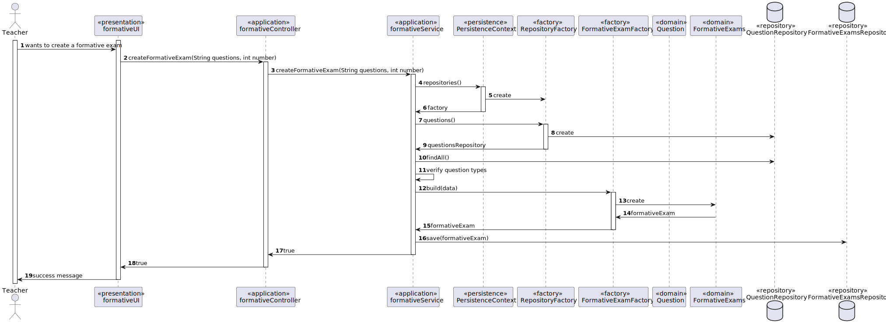

# US 2008 - As Teacher, I want to create/update automatic formative exams

## 1. Context

 This User Story describes the process of generating formative exams by teachers designed to randomly create questions based on teachers specifications, with no repetition on a given exam. These types of exams are used to provide students with feedback on their understanding of a subject and to help them prepare for future exams.

## 2. Requirements

*FRC01* Create automatic formative exams

Acceptance Criteria:

- 2008.1. The system allow teachers to specify the type of questions to be inserted in formative exams.
- 2008.2. The system support the design, feedback, and grading of exams according to specific technical requirements specified
- 2008.3. The system generates automatic formative exams randomly, without repetition of questions.

*FRC02* Update automatic formative exams

Acceptance Criteria:

- 2008.4. The system allow teachers to change the type of questions to be inserted in a specific formative exams.

## 3. Analysis

To implement this User Story, we need to implement the ANTLR features for our domain model in the system with the following functionalities:

* A function where the teacher can specify the type of questions to be inserted in formative exams.
* A function where the teacher can change the type of questions to be inserted in a specific formative exams.
* A function where the teacher can generate automatic formative exams randomly, without repetition of questions.

## 4. Design



## 5. Tests

```
    @Test
    public void verifySameAs_WithEqualId() {

        FormativeExam formativeExam = new FormativeExam(new FormativeStructure("FormativeStructure"), new FormativeExamID(1));
        FormativeExam formativeExam2 = new FormativeExam(new FormativeStructure("??"), new FormativeExamID(1));

        assertTrue(formativeExam.sameAs(formativeExam2));
    }
```

## 6. Implementation

```
    public boolean verifyGrammar(String questions){
        eapli.base.grammarutils.FormativeExamGrammarLexer lexer;
        lexer = new eapli.base.grammarutils.FormativeExamGrammarLexer(CharStreams.fromString(questions));
        CommonTokenStream tokens = new CommonTokenStream(lexer);
        eapli.base.grammarutils.FormativeExamGrammarParser parser = new eapli.base.grammarutils.FormativeExamGrammarParser(tokens);
        ParseTree parseTree = parser.prog();
        if(parser.getNumberOfSyntaxErrors() == 0){
            return true;
        }else{
            throw new IllegalArgumentException("The question you have submitted doesn't follow any type of question.");
        }
    }
```


## 7. Integration

N/A

## 8. Observations

N/A

