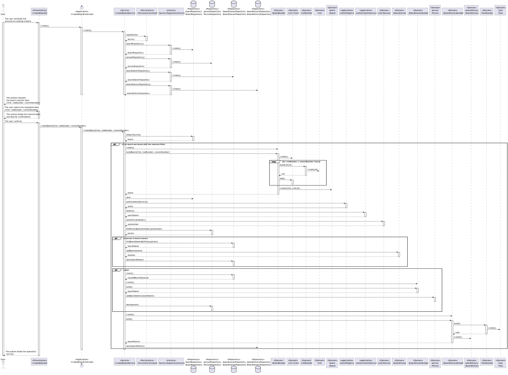

US3002: As User, I want to create a board.
=======================================

# 1. Context #
**US3002**: In this US the board will be created that will be relevant to future RCOMP USs since some of the interactions with the server will be actions performed in the board.

# 2 - Requirements #
**1. Acceptance Criteria**
- The created board must be persisted.

**2. Pre conditions**
- N/A

**3.Main scenario**
1. User selects the option to create a board.
2. System asks for board relevant data.
3. User introduces the data.
4. System ask for confirmation.
5. User confirms.
6. Informs the operation result.

# 2 - Analysis #
**1. Actor:** User.

**3.Client Clarifications**
- No clarification were given regarding this US so far.

**Interested actors**
- Every actor because any of them can be a participant or an owner of a board.

**Related US**
- US3001: The server will work with requests that possibly will affect the board.

**4.Relevant business aspects**
- The board can be utilized by any user.
- The board has an owner.
- The board will allow users to interact with each other.

# 3. Design

## 3.1. System Diagram



# 4. Tests

**Test 1:** **
```
@Test
public void test() {
	
}
```

**Test 2:** **

```
@Test
public void test() {

}
```
