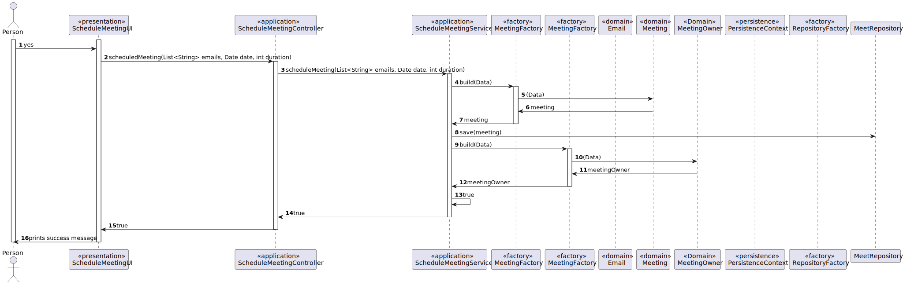
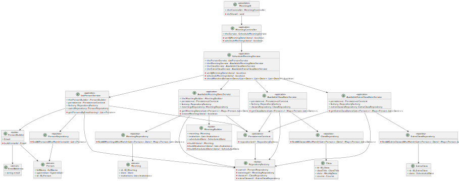

# US 4001 - As User, I want to schedule a meeting
## 1. Context

All users can create and use meetings. When a user schedules a meeting, the system should check the availability of all participants before scheduling the meeting. If all participants are available, the system must send invitations to them. If one or more participants are not available, the system must notify the user.

## 2. Requirements

*FRM01* Schedule a meeting

Acceptance Criteria:

- 4001.1. The system must allow a user to create a meeting.
- 4001.2. The system must check the availability of all participants before scheduling the meeting.
- 4001.3. If all participants are available, the system must send invitations to them.
- 4001.4. If one or more participants are not available, the system must notify the user.

## 3. Analysis

To implement this User Story, we need to implement the scheduling features of our Domain Model in the system with the following functionalities:

* A function where the user can input the meeting details such as date, duration, and participants.
* A function to check the availability of all participants during the scheduled time. This can be done by querying the system's calendar to see if any of the participants have any conflicting events during the scheduled meeting time.
  * If all participants are available, the system should send invitations to them via notification.
  * If one or more participants are not available, the system should notify the user of the conflicting schedules and ask the user if he wants to continue or reschedule the meeting.
* A function to create the meeting and add it to the system's calendar.
  
## 4. Design

### 4.1. Realization

####  4.1.1. Sequence Diagram




####  4.1.2. Class Diagram



## 5. Tests

```
    @Test
    public void verifyIfIsTheMeetingDateFalse() {
        Person diamond = new PersonBuilder().withID(1)
                .withSystemUser(getNewDummyUser()).withfullName("Viper").build();

        List<Invitation> invitationA = new ArrayList<>();
        invitationA.add(new Invitation(new InvitationIdentifier(1), new ResponseStatus(false), diamond));

        java.util.Date date = new java.util.Date(1000,10,9,10,10,10);

        Meeting meeting = new Meeting(new MeetingIdentifier(777),
                new ScheduledDate(new Duration(10), new Date(date)), invitationA);
        boolean b = meeting.verifyIfIsTheMeetingDate(new java.util.Date(1001,10,9,10,10,10), 10);
        assertFalse(b);
    }
```

## 6. Implementation


```
    public boolean scheduledMeeting(List<String> emails, Date date, int duration) {
        // TODO

        MeetingFactory meetingFactory = new MeetingFactory();
        long idMeeting = meetingRepository.count()+1;
        List<Long> idInvitations = new ArrayList<>();
        List<Person> people = getPersonsByEmail(emails);
        for (Person person: people) {
            idInvitations.add(invitationRepository.count()+1);
        }
        Meeting meeting = meetingFactory.build(idMeeting, idInvitations, 30, date,people);
        AuthorizationService authz = AuthzRegistry.authorizationService();
        SystemUser user = authz.session().get().authenticatedUser();
        List<EmailAddress> emailAddresses = new ArrayList<>();
        emailAddresses.add(user.email());
        List<Person> meetingOwnerPerson = personRepository.findAllPersonsWhoMatch(emailAddresses);
        List<MeetingOwner> meetingOwner = meetingRepository.findIfPersonIsAMeetingOwner(meetingOwnerPerson.get(0));

        if (!meetingOwner.isEmpty()){
            meetingOwner.get(0).addMeeting(meeting);
            meetingRepository.save(meeting);
            return true;
        }
        else {
            List<Meeting> meetings = new ArrayList<>();
            meetings.add(meeting);
            MeetingOwnerFactory meetingOwnerFactory = new MeetingOwnerFactory();
            MeetingOwner owner = meetingOwnerFactory.build(meetingRepository.countNumberOfOwners()+1,meetings,meetingOwnerPerson.get(0));
            meetingRepository.save(meeting);
            return true;
        }
    }
```

## 7. Integration/Demonstration

N/A

## 8. Observations

N/A