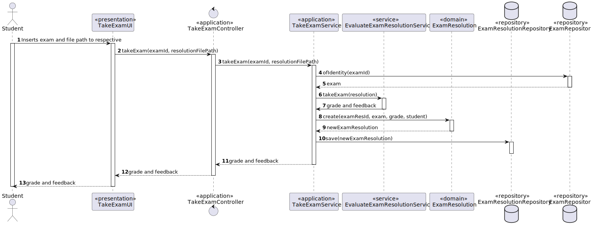

# US 2004 - As Student, I want to take an exam

## 1. Context

It is the first time the task is assigned to be developed.
This User story will allow students to take an exam and receive feedback and the result.

## 2. Requirements

**Main actor**

* Student

**Interested actors (and why)**

* Student - wants to take exam, see list of grades
* Teacher - wants to see list of grades from their courses

**Pre conditions**
* The student must be enrolled in a course where there is an exam available to take

**Post conditions**

* Result and feedback should both be printed on the screen and only the result should be persisted 

**Main scenario**

1. Student selects option to take an exam
2. System shows available exams for student to take
3. Student chooses exam
4. System shows exam specification and asks for txt file with the resolution
5. Student inserts file path
6. System asks for confirmation
7. Student confirms
8. System informs operation success

**Other scenarios**

**2.a.** The system verifies that there are no exams available
1. The system notifies that this problem has occurred
2. The use case terminates

**7.a.** The student doesn't confirm
1. The system requests a new file path
2. The use case returns to 5.

**8.a.** The system verifies that the resolution isn't in the required format
1. The system notifies that this problem has occurred
2. The use case terminates

**Special requirements**
The feedback and grade of the exam should be automatically calculated by a parser based on the grammar defined for exams structure.

## 3. Analysis

Relevant DM excerpt


**Client clarification:** </br>

> **Question:** </br>
Dear client,</br>
(...) Second we would like for you to clarify the expected flow of both feedback and grade types.</br>
Best regards,</br>
Group 4</br></br></br>
**Answer:** </br>
Hello</br>
(...) Regarding the second question, the idea is to have something very similar to the Moodle platform. According to the specification "The system must also support the automatic production of feedback and grading for the answers given by students when they take the exam. Usually this is done at the end of the exam." So, the grade and the feedback should be provided only and the end of the exam. At the end of the exam, the system should display to the student the resulting grade of the exam as well as the grade and feedback for each question/answer.</br>
You may find a simple workflow on how to create moodle tests(quiz) in https://youtu.be/dCDPS7ufGuQ </br>
Regarding grades, each question will have points when the answer is correct. If you sum all the points form all the answers you will have the grade of the exam.</br>
Please consider only the question types that are presented in the specification document. For each question type you will find further details on the specifics of the grading logic.</br>
Regards.</br>

> **Question:** </br>
Good afternoon,</br>
Our group has a following question: when a student finished taking exam, will he want at some point review the exam and see his answers? Do we need to save the exam with the answers of a certain student to be able to show it later (if needed), or should we just calculate the final grade and show feedback for each question (if applicable)?</br>
Another question is about types of feedback: on-submission means on submission of a question or the whole exam?</br>
Best regards,</br>
Group 33</br></br></br>
**Answer:** </br>
Hello.</br>
_When a student finished taking exam, will he want at some point review the exam and see his answers?_</br>
This is not required.</br>
_Do we need to save the exam with the answers of a certain student to be able to show it later (if needed), or should we just calculate the final grade and show feedback for each question (if applicable)?_</br>
Just calculate the final grade and show feedback for each question. Unless saving of the answers is required as a technical solution for some other aspect of your solution you do not need to save the answers.</br>
_Another question is about types of feedback: on-submission means on submission of a question or the whole exam?_</br>
On submission of the whole exam.</br>
Regards.</br>


## 4. Design

### 4.1. Rational


|                                Main Scenario                                 |                       Question: Which class...                        |            Answer             |                                                              Pattern                                                               |
|:----------------------------------------------------------------------------:|:---------------------------------------------------------------------:|:-----------------------------:|:----------------------------------------------------------------------------------------------------------------------------------:|
|                  1. Student selects option to take an exam                   |                      ...interacts with the user                       |          TakeExamUI           |                                                          Pure Fabrication                                                          |
|                                                                              |                      ...coordinates the use case                      |      TakeExamController       |                                                             Controller                                                             |
|                                                                              |                  ...interacts with the domain layer                   |        TakeExamService        |             Controller-service - hides the complexity of the use case from the controller class, lowering its coupling             |
|                                    (...)                                     |                                                                       |                               |                                                                                                                                    |
| 4. System shows exam specification and asks for txt file with the resolution |                                                                       |                               |                                                                                                                                    |
|                         5. Student inserts file path                         |                                                                       |                               |                                                                                                                                    |
|                       6. System asks for confirmation                        |                                                                       |                               |                                                                                                                                    |
|                             7. Student confirms                              | ...validates the exam resolution, calculates grade and gives feedback | EvaluateExamResolutionService |                                              Service - Coordinates domain activities                                               |
|                                                                              |                      ...stores the inserted data                      |        ExamResolution         |                                         Information Expert - the class knows its own data                                          |
|                                                                              |     ...creates the instance responsible for persisting Enrollment     |       RepositoryFactory       | Abstract Factory - Interface responsible for creating a Factory of related Objects without explicitly specifying the intend Class; |
|                                                                              |                    ...persists the created object                     |   ExamResolutionRepository    |            Repository -  hide the details of persisting and reconstructing an object while keeping the domain language             |
|                     8. System informs operation success                      |                                                                       |                               |                                                                                                                                    |

Summary of needed classes :
* TakeExamUI
* TakeExamController
* TakeExamService
* EvaluateExamResolutionService
* ExamResolution
* ExamResolutionRepository

### 4.2 Sequence Diagram


### 4.3. Tests

**Test 1:** *Verifies that grade cannot be negative*
```
@Test(expected = ParameterNullBlankExeption.class)
public void ensureGradeCannotBeNegative() {
    Grade instance = new Grade(-2);
}
```
**Test 2:** *Verifies that grade cannot be null*
```
@Test(expected = ParameterNullBlankExeption.class)
public void ensureGradeCannotBeNull() {
    Grade instance = new Grade(null);
}
```
**Test 3:** *Verifies that ExamResolutions creation parameters cannot be null*
(Example)
```
@Test(expected = ParameterNullBlankExeption.class)
public void ensureExamResolutionStudentCannotBeNull() {
    ExamResolution instance = new ExamResolution(id,grade,null,exam)
}
```
## 5. Implementation
Here are some samples of the implementation:

1. Domain service responsible for calculating the grade and getting th feedback

```
public ExamResolutionVisitor takeExam(String resolution){
    ExamGrammarLexer lexer = new ExamGrammarLexer(CharStreams.fromString(resolution));
    CommonTokenStream tokens = new CommonTokenStream(lexer);
    ExamGrammarParser parser = new ExamGrammarParser(tokens);
    ExamResolutionVisitor visitor = new ExamResolutionVisitor();
    ParseTree parseTree = parser.prog();
    visitor.visit(parseTree);
    return visitor;
}
```
2. Exam resolution class fields and main constructor

```
@Entity
public class ExamResolution implements AggregateRoot<ExamResolutionId> {

    @EmbeddedId
    private ExamResolutionId examResolution_Id;

    private Grade grade;

    @ManyToOne
    @JoinColumn
    private Student student;
    @ManyToOne
    @JoinColumn
    private Exam exam;

    public ExamResolution(long id, double grade, Student student, Exam exam) throws InvalidIdException, NegativeParameterException, ParameterNullBlankException {
        if (ensureStudentIsNotNull(student) && ensureExamIsNotNull(exam)){
            this.examResolution_Id = new ExamResolutionId(id);
            this.grade = new Grade(grade);
            this.student = student;
            this.exam = exam;
        }
    }
    
    (...)

```

## 6. Observations
N/A