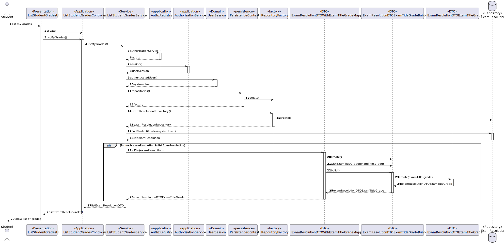

# US 2005 - As Student, I want to view a list of my grades

## 1. Context

It is the first time the task is assigned to be developed.
This User story will allow students to view a list their grades.

## 2. Requirements

FRE05 - List Grades The system displays to a students his/her grades

## 3. Analysis

**Main actor**

* Student

**Main scenario**

1. Student select list grades
2. System shows list of grades

## 4. Design

### 4.1. Rational


|         Main Scenario          |                          Question: Which class...                           |                  Answer                   |                                                    Pattern                                                     |
|:------------------------------:|:---------------------------------------------------------------------------:|:-----------------------------------------:|:--------------------------------------------------------------------------------------------------------------:|
| 1. Student select list grades  |                         ...interacts with the user                          |            ListStudentGradesUI            | Pure Fabrication - Class that doesn't exist in the domain but is necessary for the functionality of the system |
|                                |                         ...coordinates the use case                         |        ListStudentGradesController        |                              Controller - Responsible for handling system events                               |
|                                |                     ...interacts with the domain layer                      |         ListStudentGradesService          |   Controller-service - hides the complexity of the use case from the controller class, lowering its coupling   |
| 2. System shows list of grades |                      ...has all the grades persisted?                       |         ExamResolutionRepository          |     Repository -  hide the details of finding an object in the database while keeping the domain language      |
|                                |                  ...creates an instance of the repository?                  |             RepositoryFactory             |                            Factory - Responsible for the creation of the repository                            |
|                                |                   ...creates an instance of the factory?                    |            PersistenceContext             | Pure Fabrication - Class that doesn't exist in the domain but is necessary for the functionality of the system |
|                                | ...contains the data of a ExamResolution so it can be moved between layers? |      ExamResolutionDTOExamTitleGrade      |                         DTO - Class that transports the necessary data between layers                          |
|                                |           ...transforms a ExamResolution into DTO and vice-versa?           | ExamResolutionDTOWithExamTitleGradeMapper |            Mapper-DTO - Class responsible for transforming Domain Entities into DTOs and vice-versa            |
|                                |                  ...creates the necessary DTO?      <br/>                   |  ExamResolutionDTOExamTitleGradeBuilder   |          Builder - Responsible for the creation of every different type of DTO providing flexibility           |


### 4.2 Sequence Diagram


## 5. Implementation

1. Method listMyGrades() from ListStudentGradesService

```
 public List<ExamResolutionDTOExamTitleGrade> listMyGrades(){
        SystemUser systemUser = AuthzRegistry.authorizationService().session().get().authenticatedUser();
        ExamResolutionRepository examResolutionRepository = PersistenceContext.repositories().examResolutionRepository();
        List<ExamResolution> listExamResolution = examResolutionRepository.findStudentGrades(systemUser);
        List<ExamResolutionDTOExamTitleGrade> listExamResolutionDTO = new ArrayList<>();
        for (ExamResolution exam: listExamResolution) {
            listExamResolutionDTO.add(ExamResolutionDTOWithExamTitleGradeMapper.toDto(exam));
        }
        return listExamResolutionDTO;
    }

```

2. Method findStudentGrades(SystemUser systemUser) in JpaExamResolutionRepository

```
@Override
    public List<ExamResolution> findStudentGrades(SystemUser systemUser) {
        return  createQuery("SELECT e from ExamResolution e  " +
                        "WHERE e.student IN (Select Distinct p.student from Person p WHERE p.systemUser = :systemUser)"
                , ExamResolution.class).setParameter("systemUser", systemUser).getResultList();
    }
```

## 6. Observations

N/A