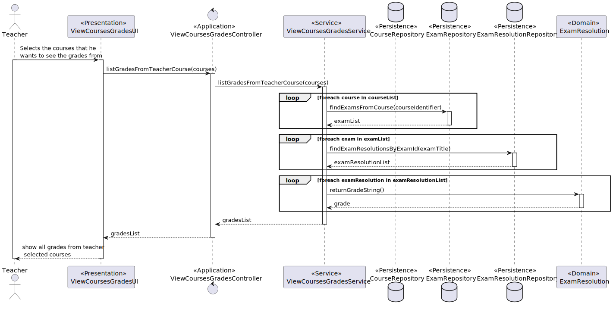

US2006: As Teacher, I want to view a list of the grades of exams of my courses.
=======================================

# 1. Context #
**US2006**: In this US the grades of exam of a teacher courses will be shown to him.

# 2. Requirements #
**1. Acceptance Criteria**
- All the grades of the teacher courses must be displayed on his screen.

**2. Pre conditions**
- There must be exams to be solved.
- The grading process must be implemented.
- The grades need to exist.

**3. Post conditions**
- The grades of the courses selected by the teacher are shown to the user

**3.Main scenario**
1. Teacher selects the option to view a list of the grades of exams of my courses.
2. System shows the grades.

# 3. Analysis #
**1. Actor:** Teacher.

**2.Client Clarifications**

[**Question:**]()
"(...)
Relativamente a esta user story, o ficheiro excel providenciado refere o seguinte:
"As Teacher, I want to view a list of the grades of exams of my courses"

Um professor deve conseguir ver as notas de um curso específico, de todos os seus cursos ao mesmo tempo, ou ambos?
(...)"

 [**Answer:**](https://moodle.isep.ipp.pt/mod/forum/discuss.php?d=23529&parent=29787) 
 "(...)
Penso que seria interessante ter todas as possibilidades que mencionou. Como sugestão, talvez apresentar os cursos do professor e este poder indicar quais os cursos que quer ver ou "todos".
 (...)"

**3.System Specification Document Clarifications**

- *3.1 Functional Requirements*
  - FRE06 - List Course Grades The system displays the grades of a class (to a teacher of
  that course) 
  
- *3.2 Documentation excerpts*
  - N/A

**4.Interested actors**
- Teacher.

**5.Related US**
- US2001: There must be an exam created.
- US2004: The students must be able to take an exam to generate grades.

**6.Relevant business aspects**
* The grades are the only way to evaluate a student.
* The grades are generated after a student takes an exam automatically.

# 4. Design

## 4.1. System Diagram

# 5. Tests
N/A

    

    

    

    
