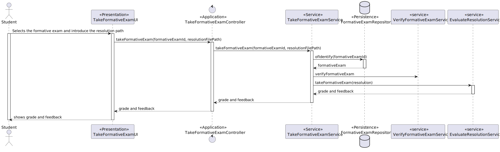

# US 2009 - As Student, I want to take an automatic formative exam.

## 1. Context

**US3009**: In this US a student will be able to take a formative exam.

## 2. Requirements

**Pre conditions**
* The student must be enrolled in a course where there is, at least, a formative exam available.

**Post conditions**
* Result and feedback should both be printed on the screen.

**Main scenario**

1. Student selects option to take a formative exam
2. System shows available formative exams for student to take
3. Student chooses a formative exam
4. System shows formative exam specification and asks for txt file with the resolution
5. Student inserts file path
6. System asks for confirmation
7. Student confirms
8. System informs operation success

**Special requirements**
The feedback and grade of the exam should be automatically calculated by a parser based on the grammar defined for exams structure.

# 3. Analysis #
**1. Actor:** Student.

**2.Client Clarifications**
- No clarification were given regarding this US so far.

**3.System Specification Document Clarifications**

- *3.1 Functional Requirements*
    - N/A

- *3.2 Documentation excerpts*
    - "The
      feedback and grade of the exam should be automatically calculated by a parser based on
      the grammar defined for exams structure."
    - "The system must also support the automatic production
      of feedback and grading for the answers given by students when they take the exam.
      Usually this is done at the end of the exam.
      "
    - "Therefore, you must analyze the problem and
      design a solution that supports the two goals: validate the structure of the exam; evaluate the
      answers of each exam (giving feedback and calculating the grade).
      "

**4.Interested actors**

* Student - wants to take exam, see list of grades
* Teacher - wants to see list of grades from their courses

**5.Related US**
- US2004: The grade generation process is the same in both US.

**6.Relevant business aspects**
* The grades are the only way to evaluate a student.
* The grades are generated after a student takes an exam automatically.
* The formative exam grades are only displayed, there is no need to record this data in the database.

**6. Supplementary Information**
The grading process should use the ANTLR Visitor capabilities.

# 4. Design

## 4.1. System Diagram

# 5. Tests
N/A
