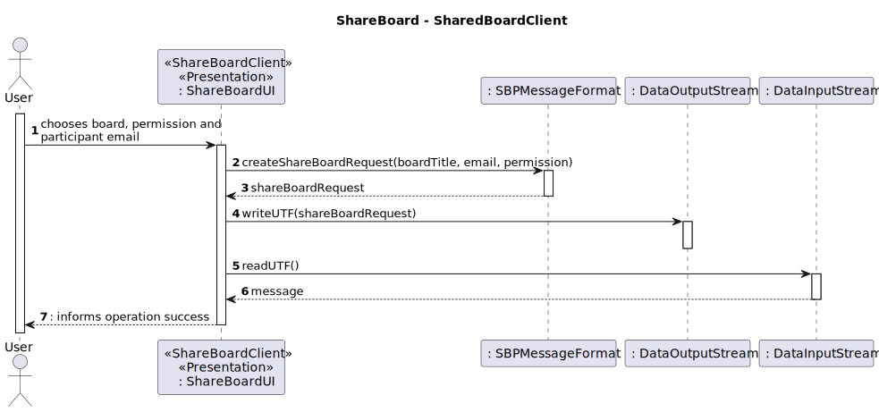
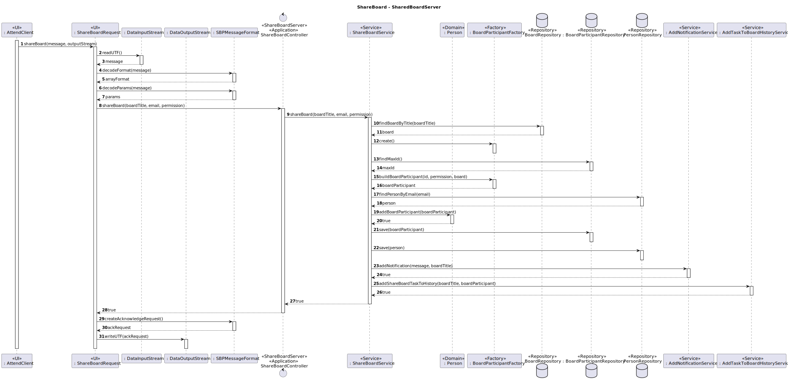

# US3004 - As User, I want to share a board

## 1. Context

It is the first time the task is assigned to be developed.
In this US it will be added in the board client app the option to add participants to your board.

## 2. Requirements
* FRB02 - Share Board A user shares a board it owns with other users
* NFR13 - Design and Implement Shared Board Synchronization This functional
  part of the system has very specific technical requirements, particularly some concerns
  about synchronization problems. In fact, several clients will try to concurrently update
  boards. As such, the solution design and implementation must be based on threads,
  condition variables and mutexes. Specific requirements will be provided in SCOMP

## 2. Analysis

**Main actor**

* Board Owner

**Interested actors (and why)**

* Board Owner: wants to add participant in his/her board
* Board Participant : will have access to a new board

**Preconditions**

* The user needs to own a board

**Postconditions**

* The new participant will be persisted and with the right permissions

**Main Scenario**
1. Board owner chooses the board, inserts the email of the new participant and its permissions
2. System informs operation success

### Relevant questions to the Client

**Question**

Dear client,

As I read all the requirements within this User Story, I have this question:
--Only the owner of a board is able to see its updates.

As I'm sharing the board, I have to do which of these?
--give permissions to the users to Write on it immediately

--only share it with Read permissions and afterwards have the possibility to give the user write permissions

--only share it with Read permissions and lock those permissions as Read

-After sharing the board with someone, should it be considered an update to be listed on User Story 3005?

**Answer**

Hello.

When a user shares a board he/she must specify the users and, for each user, if the access is read or write. I think it makes sense to notify current users of a board when some update is done regarding access to the board.

Regards.


### Relevant Domain Excerpt


## 3. Design

### 3.1. Sequence Diagram



### 3.2. Tests

**Test 1:** ** Verifies that adding the same person twice to a board throws an error
````
    @Test(expected = DuplicateCreationException.class)
    public void ensureAddingTheSamePersonTwiceInBoardDoesntHappen() throws ParameterNullBlankException, DuplicateCreationException {
        Person person = dummyPerson();
        Board board = dummyBoard1();
        BoardParticipant boardParticipant1 = new BoardParticipantFactory().buildBoardParticipant(1L,true, board);
        BoardParticipant boardParticipant2 = new BoardParticipantFactory().buildBoardParticipant(2L,true, board);

        assertTrue(person.addBoardParticipant(boardParticipant1));
        person.addBoardParticipant(boardParticipant2);
    }
````
**Test 2:** ** Verifies that has success adding the same person on different boards

````
    @Test
    public void ensureAddingTheSamePersonInDifferentBoardsSucceeds() throws ParameterNullBlankException, DuplicateCreationException {
        Person person = dummyPerson();
        Board board1 = dummyBoard1();
        Board board2 = dummyBoard2();
        BoardParticipant boardParticipant1 = new BoardParticipantFactory().buildBoardParticipant(1L,true, board1);
        BoardParticipant boardParticipant2 = new BoardParticipantFactory().buildBoardParticipant(2L,true, board2);

        assertTrue(person.addBoardParticipant(boardParticipant1));
        assertTrue(person.addBoardParticipant(boardParticipant2));
    }
````
## 4. Implementation
Here is a sample of the implementation:
````
    public boolean shareBoard(String boardTitle, String email, boolean permission) throws ParameterNullBlankException, DuplicateCreationException {
        Board board = boardRepository.findBoardByTitle(boardTitle);
        BoardParticipantFactory factory = new BoardParticipantFactory();
        BoardParticipant boardParticipant = factory.buildBoardParticipant(boardParticipantRepository.findMaxId() + 1, permission, board);
        Person person = personRepository.findPersonByEmail(email);
        person.addBoardParticipant(boardParticipant);
        boardParticipantRepository.save(boardParticipant);
        personRepository.save(person);

        new AddNotificationService().addNotification("The board " + boardTitle +" was shared with " + person.returnFullNameString(), boardTitle);
        new AddTaskToBoardHistoryService().addShareBoardTaskToHistory(boardTitle, boardParticipant);
        return true;
    }
````
A resume of the commits for the implementation:
- [US_3004][Domain] - Created BoardParticipant and its value objects
- [US_3004][DTO] - Created BoardDTOWithTitle and its builder and mapper
- [US_3004][Persistence] - Created BoardParticipantRepository
- [US_3004][Application] - Added ShareBoard Controller and Service
- [US_3004][Presentation] - Added ShareBoardUI
## 5. Observations
N/A