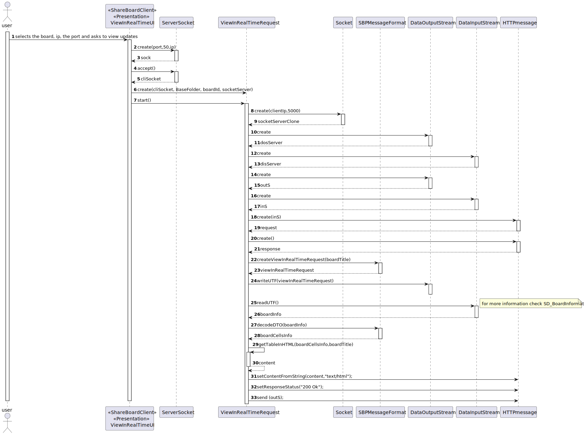
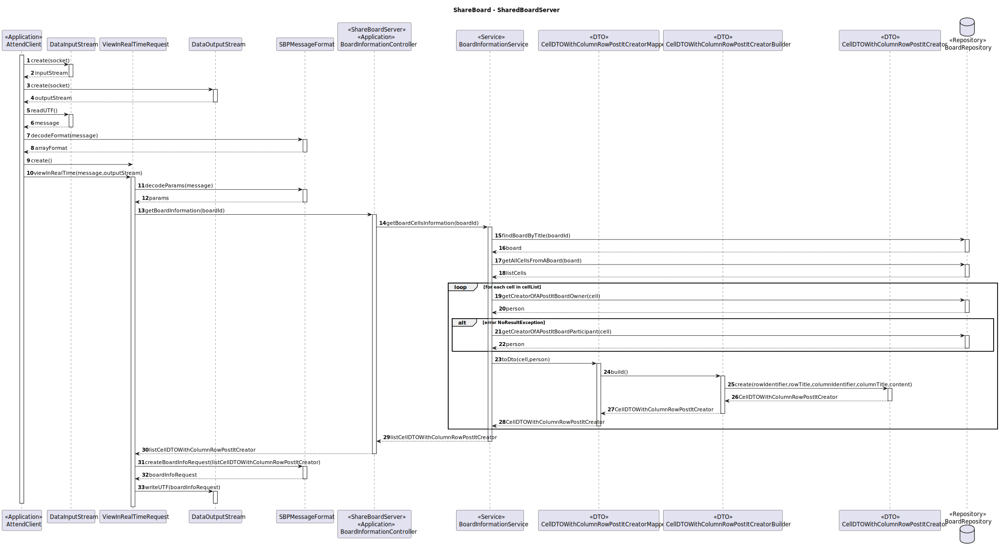

# US 3005 - As User, I want to view, in real-time, the updates in the shared boards

## 1. Context

It is the first time the task is assigned to be developed.
This User story will allow students to view a list their grades.

## 2. Requirements

* FRB03 - The system should display, in "real-time", the shared boards available to the user in a HTML page
* NFR13 - Shared Board Synchronization This functional part of the system 
has very specific technical requirements, particularly some concerns about synchronization
problems. In fact, several clients will try to concurrently update boards. As such, the 
solution design and implementation must be based on threads, condition variables and mutexes. 
Specific requirements will be provided in SCOMP.
* NFR14 - The solution should be deployed using several network nodes. 
It is expected that, at least, the relational database server and the shared board server be
deployed in nodes different from localhost, preferably in the cloud.

* The system should generate "real-time" HTML rendering of the board, presenting all the
actual contents of the board, the row and column titles, the board title, the authors (short
name and email) of the posts and a timestamp of each post. This "real-time" HTML rendering
should be available in the server and in each client

## 3. Analysis

**Main actor**

* User

**Main scenario**

1. User selects the board and asks to view updates
2. System opens a html page

**Preconditions**

* The user must participate in a board

**Postconditions**

* Open a html page to display the board in real-time

### Client Question
#### Question
Boa tarde,<br>
O cliente pretende que seja apenas desenvolvida uma página web para a visualização das boards e autenticação na linha 
de comandos(cli), como demonstrado na página 11 da especificação do projeto, ou então também, aceitaria uma aplicação 
totalmente desenvolvida numa página web (com autenticação executada na mesma)<br>
Atenciosamente <br>
Grupo 09<br>

#### Answer

Boa tarde.<br>
Como cliente, e se percebi bem, a primeira opção será o que eu pretendo. Ou seja, todas as funcionalidades da Shared
Board App são realizadas na aplicação do tipo "consola" em java com a exceção da parte relativa à visualização em
tempo real dos boards.<br>
Notem que esta US tem requisitos não funcionais especificos de RCOMP e devem, em termos de solução técnica, seguir as
orientações dos docentes dessa unidade curricular.<br>
Cumprimentos.<br>

## 4. Design

For this US two new codes to SBP message protocol were added so the client can specify what the server needs to do:

* BOARD_INFO_CODE = 9;
* VIEW_IN_REAL_TIME_CODE = 10;
 
### 4.1 Sequence Diagram



## 5. Implementation

1. Method getBoardCellsInformation() from class BoardInformationService
```
public List<CellDTOWithColumnRowPostItCreator> getBoardCellsInformation(String title){

        BoardRepository boardRepository = PersistenceContext.repositories().boardRepository();
        Board board = boardRepository.findBoardByTitle(title);
        List<Cell> cellsList = boardRepository.getAllCellsFromABoard(board);
        List<CellDTOWithColumnRowPostItCreator> listCellDTO = new ArrayList<>();

        for (Cell cell: cellsList) {
            try{
            Person person = boardRepository.getCreatorOfAPostItBoardOwner(cell);
            listCellDTO.add(CellDTOWithColumnRowPostItCreatorMapper.toDTO(cell,person));
            }catch (NoResultException owner){
                try {
                    Person person = boardRepository.getCreatorOfAPostItBoardParticipant(cell);
                    listCellDTO.add(CellDTOWithColumnRowPostItCreatorMapper.toDTO(cell, person));
                }catch (NoResultException participant){
                    listCellDTO.add(CellDTOWithColumnRowPostItCreatorMapper.toDTO(cell, null));
                }
            }
        }
        return listCellDTO;
    }
```
2. Method getTableInHTML() from class ViewInRealTimeRequest

```
private static synchronized String getTableInHTML(List<List<String>>  boardCellsInfo, String boardTitle) {

        int maxRow = getMaxRowNumber(boardCellsInfo);
        int maxCol = getMaxColumnNumber(boardCellsInfo);
        StringBuilder html = new StringBuilder();
        html.append("<h1>" + boardTitle + "</h1>\n");
        html.append("<table>\n<tr>\n<th></th>\n");
        for (int col = 1; col <= maxCol; col++) {
            String colTitle = getColumnTitle(boardCellsInfo, col);
            html.append("<th>").append(colTitle).append("</th>\n");
        }
        html.append("</tr>\n");

        for (int row = 1; row <= maxRow; row++) {
            String rowTitle = getRowTitle(boardCellsInfo, row);
            html.append("<tr>\n");
            html.append("<th>").append(rowTitle).append("</th>\n");
            for (int col = 1; col <= maxCol; col++) {
                String cellData = getCellData(boardCellsInfo, row, col);
                html.append("<td>").append(cellData).append("</td>\n");
            }
            html.append("</tr>\n");
        }
        html.append("</table>");
        return html.toString();
    }
```

## 6. Observations

N/A