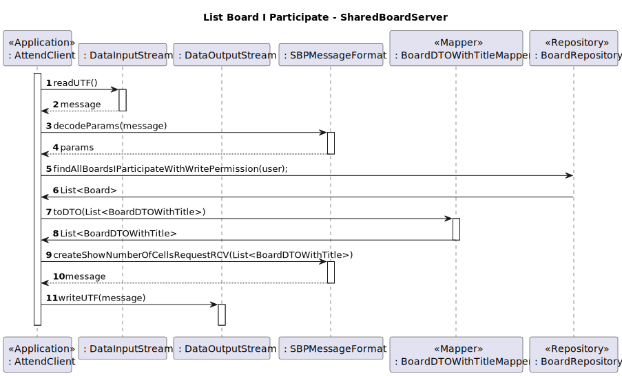
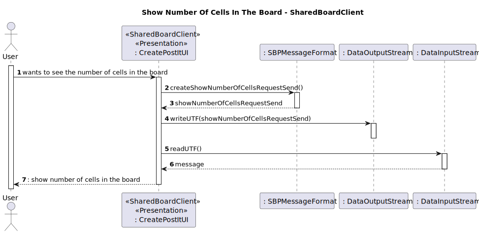
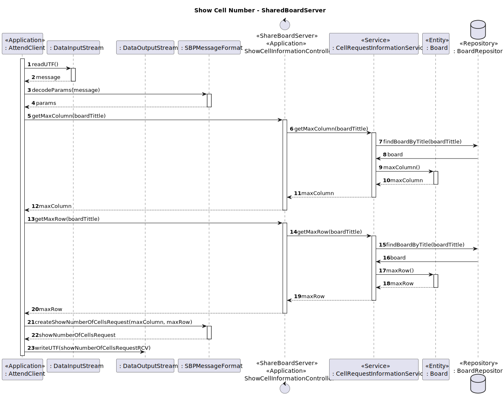
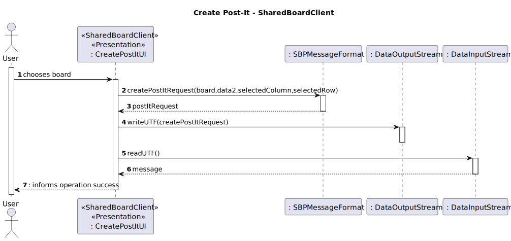
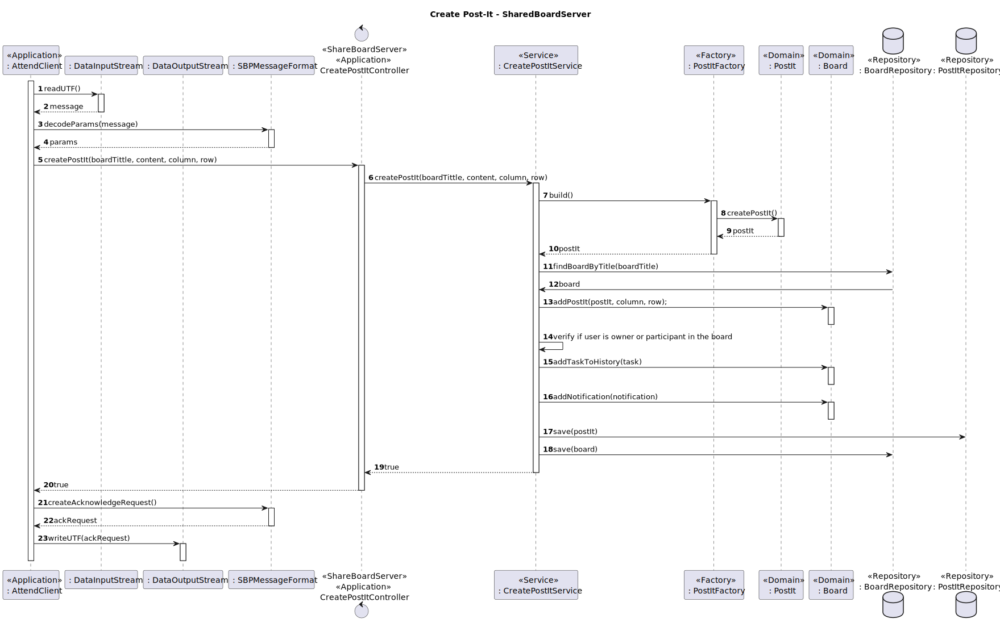

# US 3006 - As User, I want to create a post-it on a board

## 1. Context

This functional part of the system has very specific technical requirements, particularly some concerns about 
synchronization problems.
The system must be able to create a post-it on a board, and the post-it must be visible to all users who have access to 
the board. 

Users with write permission may post content to a cell in the board. The content can be a
text or an image. When the server commits a post it also should notify all clients with access
to the board of the update. The user who created a post in a cell can change that post. It may change its contents or
move the post into a free cell. The user can also undo the last change

## 2. Requirements

*FRB04* Create a post-it on a board

Acceptance Criteria:

- 3006.1. The system must allow a user to create a post-it on a board.
- 3006.2. The system must be able to handle concurrent access to the board.
- 3006.3. The solution design and implementation must be based on threads, condition variables and mutexes.

**Special requirements**

Communication between client and server applications should be done by using a socket, following the SBP message format defined

For this US five new codes to SBP message were added so the client can specify what the server needs to do:
* LIST_BOARD_I_PARTICIPATE_SEND = 11
* NUMBER_OF_CELLS_REQUEST_SEND = 13
* LIST_BOARD_I_PARTICIPATE_RCV = 12
* NUMBER_OF_CELLS_REQUEST_RCV = 14
* POST_IT_REQUEST_SEND = 15

## 3. Analysis

To implement this User Story, we need to implement threads, condition variables and mutexes features in order to grant 
concurrent access and synchronization between clients of a board. The system will have the following functions: 

* A function where the user can input the post-it details such as text, image and position.
* A function to create the post-it and add it to the board.
* A function to handle concurrent access with synchronization between all clients to the board.
    * If all board participants are reading the board, the system should allow a user to create a post-it on the board.
    * If a board participant is writing on the board, the system should not allow a user to create a post-it on the board.
* A function to save the changes made to the board.

## 4. Design

### 4.1. Sequence Diagram








## 5. Tests


### 5.1. Test for Post-It Domain class
```
     @Test
    public void ensurePostItSameAsOtherPostItWithSameIdentity() throws ZeroParameterException, NegativeParameterException,
            ParameterNullBlankException, InvalidContentSizeForAPostItException {
        PostIt postIt = getDummyPostIt(1, "HOLA");
        assertTrue(postIt.sameAs(getDummyPostIt(1, "???")));
    }
    @Test
    public void ensurePostItSameAsOtherObjectFails() throws ZeroParameterException, NegativeParameterException,
            ParameterNullBlankException, InvalidContentSizeForAPostItException {
        PostIt postIt = getDummyPostIt(1, "HOLA");
        assertFalse(postIt.sameAs(Object.class));
    }

    @Test
    public void ensurePostItSameAsOtherPostItWithDifferentIdentityFails() throws ZeroParameterException,
            NegativeParameterException, ParameterNullBlankException, InvalidContentSizeForAPostItException {
        PostIt postIt = getDummyPostIt(1, "HOLA");
        assertFalse(postIt.sameAs(getDummyPostIt(2, "HOLA")));
    }
```

### 5.2 Test for Content Domain class

```
    @Test(expected = ParameterNullBlankException.class)
    public void ensureContentCannotBeNull() throws ZeroParameterException, NegativeParameterException,
            ParameterNullBlankException, InvalidContentSizeForAPostItException {
        PostItFactory factory = new PostItFactory();
        factory.build(null, 1);
    }
    
    @Test(expected = InvalidContentSizeForAPostItException.class)
    public void ensureContentSizeCannotBeBiggerThanSixteen() throws ZeroParameterException, NegativeParameterException,
            ParameterNullBlankException, InvalidContentSizeForAPostItException {
        PostItFactory factory = new PostItFactory();
        factory.build("WOLOLOWOLOLOWOLOLOWOLOLOWOLOLOWOLOLOWOLOLOWOLOLOWOLOLOWOLOLOO", 1);
    }
```

## 6. Implementation


```
    public boolean createPostIt(String boardTittle, String content, int column, int row) throws CellOccupiedException,
            ZeroParameterException, NegativeParameterException, ParameterNullBlankException,
            InvalidContentSizeForAPostItException {

        //create postIt
        PostItFactory postItFactory = new PostItFactory();
        PostIt postIt = postItFactory.build(content,postItRepository.count()+1);

        //get the board and add the postIt to it
        Board board = boardRepository.findBoardByTitle(boardTittle);
        board.addPostIt(postIt, column, row);

        //get person with session
        AuthorizationService authz = AuthzRegistry.authorizationService();
        SystemUser systemUser;
        if (authz.session().isPresent()) {
            systemUser = authz.session().get().authenticatedUser();
        }
        else {
            throw new IllegalStateException("Session must exist to create a board");
        }
        Person person = personRepository.findPersonBySystemUser(systemUser);

        //create task and save it
        TaskBuilder taskBuilder = new TaskBuilder();
        if (person.isBoardOwner(board)) {
            BoardOwner boardOwner = personRepository.findBoardOwnerByPerson(person);
            board.addTaskToHistory(taskBuilder.withBoardOwner(boardOwner).withPostIt(postIt).
                    withTaskId(boardHistoryRepository.getLastTaskId()+1).withOperation(OperationValue.ADD).build());

            board.addNotification(new Notification("A new post it was added in "+board.returnBoardTitleString()
                    +" on column "+column+" and row "+row+ "by "+person.returnFullNameString()));
            postItRepository.save(postIt);
            boardRepository.save(board);
        }
        else if (person.isBoardParticipant(board)) {
            BoardParticipant boardParticipant =boardParticipantRepository.findBoardParticipantByPerson(person);
            board.addTaskToHistory(taskBuilder.withBoardParticipant(boardParticipant).withPostIt(postIt).
                    withTaskId(boardHistoryRepository.getLastTaskId()+1).withOperation(OperationValue.ADD).build());
            board.addNotification(new Notification("A new post it was added in "+board.returnBoardTitleString()
                    +" on column "+column+" and row "+row+ "by "+person.returnFullNameString()));
            postItRepository.save(postIt);
            boardRepository.save(board);
        }

        return true;
    }
    
```