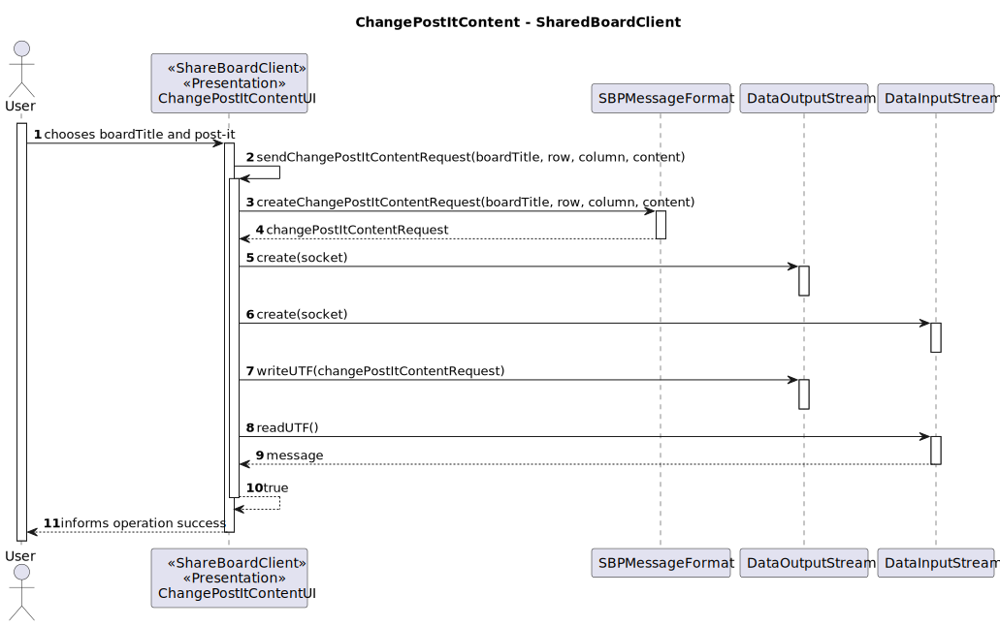

# US 3007 - As User, I want to change a post-it

## 1. Context

It is the first time the task is assigned to be developed.
This User story will allow users to change/update a post-it's content.

## 2. Requirements

**Main actor**

* Board Participant

**Interested actors (and why)**

* Board Participant - wants to update post-it, and view, in real-time, the updates in the shared boards

**Pre conditions**
* The board participant must have read/write permissions in a board and must have created a post-it in that board

**Post conditions**

* Changes should be persisted in the database and be observable in thr real-time board view

**This US can be divided into two Use Cases:**

1. Change post-it content
2. Change post-it position

**Change post-it content main scenario**

1. Board participant selects option to change post-it content
2. System shows available boards for board participant to choose
3. Board participant chooses board
4. System asks for new post-it row, column and content
5. Board participant inserts information
6. System asks for confirmation
7. Board participant confirms
8. System informs operation success

**Change post-it content other scenarios**

**2.a.** The system verifies that there are no boards available
1. The system notifies that this problem has occurred
2. The use case terminates

**7.a.** The Board participant doesn't confirm
1. The use case terminates


**Special requirements**
N/A


**Change post-it position main scenario**

1. Board participant selects option to change post-it position
2. System shows available boards for board participant to choose
3. Board participant chooses board
4. System asks for post-it current row and column and new row and column
5. Board participant inserts information
6. System asks for confirmation
7. Board participant confirms
8. System informs operation success

**Change post-it position other scenarios**

**2.a.** The system verifies that there are no boards available
1. The system notifies that this problem has occurred
2. The use case terminates

**7.a.** The Board participant doesn't confirm
1. The use case terminates


**Special requirements**

Communication between client and server applications should be done by using a socket, following the SBP message format defined

## 3. Analysis

Relevant DM excerpt


**Client clarification:** </br>
No relevant clarifications were found


## 4. Design

For this US two new codes to SBP message were added so the client can specify what the server needs to do: 
* CHANGE_POST_IT_CONTENT = 20
* CHANGE_POST_IT_POSITION = 21


### Change post-it content
### 4.1. Rational
|                         Main Scenario                         |                  Question: Which class...                  |            Answer             |                                                              Pattern                                                               |
|:-------------------------------------------------------------:|:----------------------------------------------------------:|:-----------------------------:|:----------------------------------------------------------------------------------------------------------------------------------:|
| 1. Board participant selects option to change post-it content |                 ...interacts with the user                 |     ChangePostItContentUI     |                                                          Pure Fabrication                                                          |
|                                                               |                ...coordinates the use case                 | ChangePostItContentController |                                                             Controller                                                             |
|                                                               |             ...interacts with the domain layer             |  ChangePostItContentService   |             Controller-service - hides the complexity of the use case from the controller class, lowering its coupling             |
|                             (...)                             |                                                            |                               |                                                                                                                                    |
|    4. System asks for new post-it row, column and content     |                                                            |                               |                                                                                                                                    |
|           5. Board participant inserts information            |                                                            |                               |                                                                                                                                    |
|                6. System asks for confirmation                |                                                            |                               |                                                                                                                                    |
|                 7. Board participant confirms                 |                ...stores the inserted data                 |            PostIt             |                                         Information Expert - the class knows its own data                                          |
|                                                               | ...creates the instance responsible for persisting Post-it |       RepositoryFactory       | Abstract Factory - Interface responsible for creating a Factory of related Objects without explicitly specifying the intend Class; |
|                                                               |               ...persists the created object               |       PostItRepository        |            Repository -  hide the details of persisting and reconstructing an object while keeping the domain language             |
|              8. System informs operation success              |                                                            |                               |                                                                                                                                    |

Summary of needed classes :
* ChangePostItContentUI
* ChangePostItContentController
* ChangePostItContentService
* PostIt
* PostItRepository


### 4.2 Sequence Diagram



### 4.3. Tests
N/A

### Change post-it position
### 4.1. Rational
|                              Main Scenario                               |                 Question: Which class...                 |            Answer             |                                                              Pattern                                                               |
|:------------------------------------------------------------------------:|:--------------------------------------------------------:|:-----------------------------:|:----------------------------------------------------------------------------------------------------------------------------------:|
|      1. Board participant selects option to change post-it position      |                ...interacts with the user                |     ChangePostItContentUI     |                                                          Pure Fabrication                                                          |
|                                                                          |               ...coordinates the use case                | ChangePostItContentController |                                                             Controller                                                             |
|                                                                          |            ...interacts with the domain layer            |  ChangePostItContentService   |             Controller-service - hides the complexity of the use case from the controller class, lowering its coupling             |
|                                  (...)                                   |                                                          |                               |                                                                                                                                    |
| 4. System asks for post-it current row and column and new row and column |                                                          |                               |                                                                                                                                    |
|                 5. Board participant inserts information                 |                                                          |                               |                                                                                                                                    |
|                     6. System asks for confirmation                      |                                                          |                               |                                                                                                                                    |
|                      7. Board participant confirms                       |               ...stores the inserted data                |             Cell              |                                         Information Expert - the class knows its own data                                          |
|                                                                          | ...creates the instance responsible for persisting Board |         BoardFactory          | Abstract Factory - Interface responsible for creating a Factory of related Objects without explicitly specifying the intend Class; |
|                                                                          |             ...persists the modified object              |        BoardRepository        |            Repository -  hide the details of persisting and reconstructing an object while keeping the domain language             |
|                   8. System informs operation success                    |                                                          |                               |                                                                                                                                    |

Summary of needed classes :
* ChangePostItContentUI
* ChangePostItContentController
* ChangePostItContentService
* Cell
* BoardRepository

### 4.2 Sequence Diagram


### 4.3. Tests
N/A

## 5. Implementation
Here are some samples of the implementation:

1. ChangePostItContentRequest class
```
public class ChangePostItContentRequest {
    public void changePostItContent(String message, DataOutputStream outputStream) throws IOException {
        List<String> params = SBPMessageFormat.decodeParam(message.getBytes());
        try {
            new ChangePostItContentController().changePostItContent(params.get(0),Integer.parseInt(params.get(1)), Integer.parseInt(params.get(2)),params.get(3));
            outputStream.writeUTF(new String(SBPMessageFormat.createAcknowledgeRequest()));
        }catch(Exception e){
            outputStream.writeUTF(new String(SBPMessageFormat.creteErrorRequest(e.getMessage())));
        }
    }
}
```

2. ChangePostItContentService class
```
public class ChangePostItContentService {

    public boolean changePostItContent(String boardTitle, Integer row, Integer column, String content) throws ZeroParameterException, ParameterNullBlankException, NegativeParameterException, InvalidContentSizeForAPostItException, CellDoesNotExistException, CellIsEmptyException, UserDidNotCreatePostItException {
        BoardRepository boardRepo = PersistenceContext.repositories().boardRepository();
        PersonRepository personRepo = PersistenceContext.repositories().personRepository();
        PostItRepository postItRepo = PersistenceContext.repositories().postItRepository();

        Board board = boardRepo.findBoardByTitle(boardTitle);

        SystemUser systemUser = AuthzRegistry.authorizationService().session().get().authenticatedUser();
        Person person = personRepo.findPersonBySystemUser(systemUser);

        BoardParticipant boardParticipant = person.boardParticipantOfBoard(board);
        BoardOwner boardOwner = person.boardOwnerOfBoard(board);

        PostIt oldPostIt = board.verifyPostItCanBeUpdated(row, column, boardParticipant, boardOwner);
        long id = oldPostIt.identity().returnPostItIdentifier();
        int ver = oldPostIt.identity().returnPostItVersion();

        PostIt newPostIt = new PostItFactory().buildFromExistingPostIt(content, id, ver);

        postItRepo.save(newPostIt);

        board.updateCell(newPostIt,row,column);
        boardRepo.save(board);

        new AddNotificationService().addNotification("The post-it in row " + row +" and column " + column + " was updated" , boardTitle);
        new AddTaskToBoardHistoryService().addChangePostItContentTaskToHistory(boardTitle,boardParticipant,boardOwner,oldPostIt);

        return false;
    }
}
```


3. ChangePostItPositionRequest class
```
public class ChangePostItPositionRequest {
    public void changePostItPosition(String message, DataOutputStream outputStream) throws IOException {
        List<String> params = SBPMessageFormat.decodeParam(message.getBytes());
        try {
            new ChangePostItPositionController().changePostItPosition(params.get(0),Integer.parseInt(params.get(1)), Integer.parseInt(params.get(2)),Integer.parseInt(params.get(3)), Integer.parseInt(params.get(4)));
            outputStream.writeUTF(new String(SBPMessageFormat.createAcknowledgeRequest()));
        }catch(Exception e){
            outputStream.writeUTF(new String(SBPMessageFormat.creteErrorRequest(e.getMessage())));
        }
    }
}
```

4. ChangePostItPositionService class
```
public class ChangePostItPositionService {
    public boolean changePostItPosition(String boardTitle, Integer oldRow, Integer oldColumn, Integer newRow, Integer newColumn) throws ZeroParameterException, ParameterNullBlankException, NegativeParameterException, InvalidContentSizeForAPostItException, CellDoesNotExistException, CellIsEmptyException, UserDidNotCreatePostItException {
        BoardRepository boardRepo = PersistenceContext.repositories().boardRepository();
        PersonRepository personRepo = PersistenceContext.repositories().personRepository();

        Board board = boardRepo.findBoardByTitle(boardTitle);

        SystemUser systemUser = AuthzRegistry.authorizationService().session().get().authenticatedUser();
        Person person = personRepo.findPersonBySystemUser(systemUser);

        BoardParticipant boardParticipant = person.boardParticipantOfBoard(board);
        BoardOwner boardOwner = person.boardOwnerOfBoard(board);

        PostIt postIt = board.verifyPostItCanBeUpdated(oldRow, oldColumn, boardParticipant, boardOwner);

        if(board.verifyIfCellIsAvailable(newRow,newColumn)){
            board.updateCell(null, oldRow, oldColumn);
            board.updateCell(postIt, newRow, newColumn);

            boardRepo.save(board);

            new AddNotificationService().addNotification("The post-it in row " + oldRow +" and column " + oldColumn + " was moved to row " + newRow + " and column " + newColumn, boardTitle);
            new AddTaskToBoardHistoryService().addChangePostItPositionTaskToHistory(boardTitle,boardParticipant,boardOwner,postIt,oldRow,oldColumn,newRow,newColumn);
        }
        return true;
    }
}

```
## 6. Observations
N/A