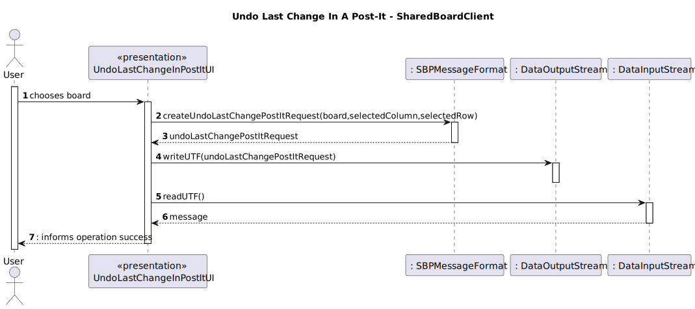

# US 3008 - As User, I want to undo the last change in a post-it

## 1. Context

This functional part of the system has very specific technical requirements, particularly some concerns about
synchronization problems.
The system must be able to undo the last change in a post-it on a board,
and the post-it must be visible to all users who have access to the board.

## 2. Requirements

*FRB06* Undo the last change in a post-it on a board

Acceptance Criteria:

- 3008.1. The system must allow a user to undo the last change in a post-it on a board.
- 3008.2. The system must be able to handle concurrent access to the board.
- 3008.3. The solution design and implementation must be based on threads, condition variables and mutexes.

**Special requirements**

Communication between client and server applications should be done by using a socket, following the SBP message format defined

For this US a new code to SBP message were added so the client can specify what the server needs to do:
* UNDO_LAST_CHANGE_POST_IT_REQUEST = 18;

## 3. Analysis

To implement this User Story, we need to implement threads, condition variables and mutexes features in order to grant
concurrent access and synchronization between clients of a board. The system will have the following functions:

* A function where the user can select the post-it to undo the last change.
* A function to undo the last change in a post-it on a board.
* A function to handle concurrent access with synchronization between all clients to the board.
    * If all board participants are reading the board, the system should allow a user to undo the last change in a post-it on the board.
    * If a board participant is writing on the board, the system should not allow a user to undo the last change in a post-it on the board.
* A function to save the changes made to the board.

## 4. Design

### 4.1. Sequence Diagram

