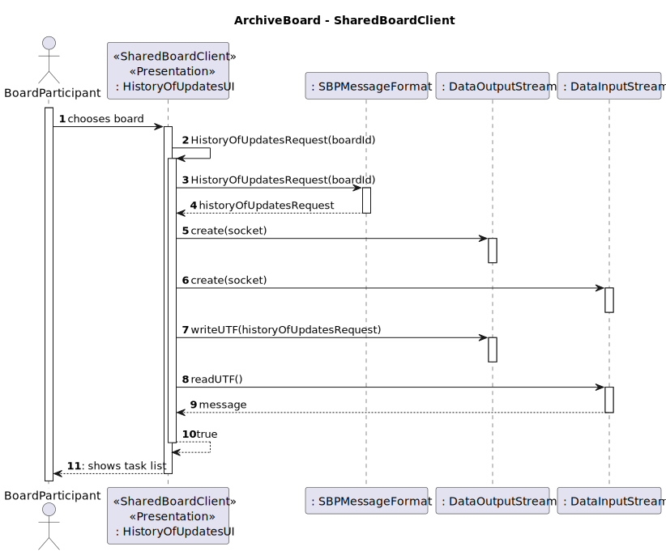
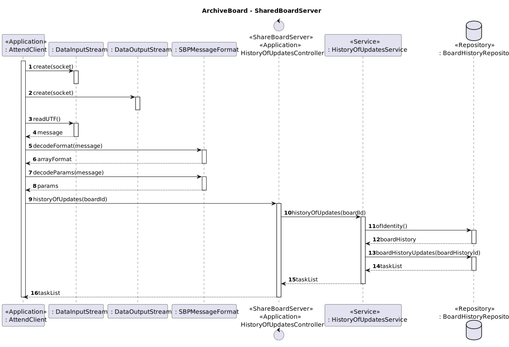

US3009: As User, I want to view the history of updates on a board.
=======================================

# 1. Context #
**US3009**: In this US the updates in a board will be shown to the user.

# 2. Requirements #
**1. Acceptance Criteria**
- The updates of the board must be displayed to the user.

**2. Pre conditions**
- The board must be created.
- The board history needs to exist.
- The board history needs to have done tasks.

**3. Post conditions**
- The history of updates are shown to the user

**4.Main scenario**
1. Manager selects the option to view the history of updates on a board.
2. System shows the history of updates.

# 3. Analysis #
**1. Actor:** Board participant.

**2.Client Clarifications**
- No clarification were given regarding this US so far.

**3.System Specification Document Clarifications**

- *3.1 Functional Requirements*
    - FRB07 - View Board History A user views a history of updates in a board
    - NFR13 - Design and Implement Shared Board Synchronization This functional
      part of the system has very specific technical requirements, particularly some concerns
      about synchronization problems. In fact, several clients will try to concurrently update
      boards. As such, the solution design and implementation must be based on threads,
      condition variables and mutexes. Specific requirements will be provided in SCOMP.

- *3.2 Documentation excerpts*
    - "The system should maintain an history/log of all the updates in the board"
  
**4.Interested actors**
- Any of the board participants.

**5.Related US**
- US3002: There must be a board created.
- US3002: There must be a board history created.
- US3006: Results in board changes that change the board history.

**6.Relevant business aspects**
* The updates in a board result in a task that represents an action the changed the board.
* The board history can be used as a backup tool.

# 4. Design

## 4.1. System Diagram

# 5. Tests
N/A

# 5. Observations
For this US two new codes to SBP message protocol were added so the client can specify what the server needs to do:

* HISTORY_OF_UPDATES_CODE = 17;
* TASK_LIST_CODE = 19;

    

    

    

    
