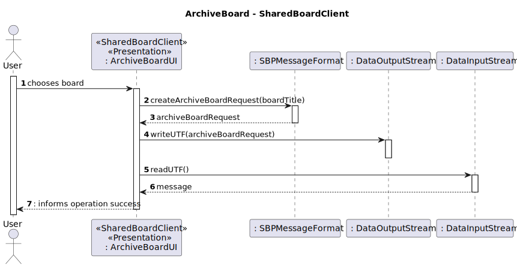
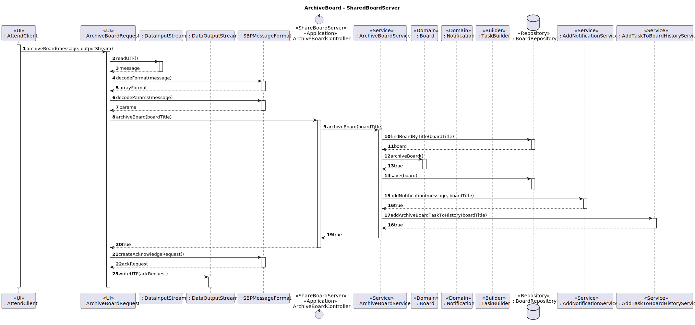

# US3010 - As User, I want to archive a board I own

## 1. Context

It is the first time the task is assigned to be developed.
In this US it will be added in the board client app the option to archive board

## 2. Requirements
* FRB02 - The owner of a board can archive the board
* NFR13 - Design and Implement Shared Board Synchronization This functional
  part of the system has very specific technical requirements, particularly some concerns
  about synchronization problems. In fact, several clients will try to concurrently update
  boards. As such, the solution design and implementation must be based on threads,
  condition variables and mutexes. Specific requirements will be provided in SCOMP

## 2. Analysis

**Main actor**

* Board Owner

**Interested actors (and why)**

* Board Owner: wants to archive board and won't have access anymore to the board
* Board Participant : won't have access anymore to the board

**Preconditions**

* The user needs to own a board

**Postconditions**

* The board will be archived (status of the board will change to archived)

**Main Scenario**
1. Board owner chooses the board
2. System informs operation success

### Relevant questions to the Client

* No questions were found about this US

### Relevant Domain Excerpt


## 3. Design

### 3.1. Sequence Diagram



### 3.2. Tests

**Test 1:** Verifies if it doesn't let you archive a board already archived
````
    @Test(expected = AlreadyDeactivatedException.class)
    public void ensureArchiveAnArchivedBoardFail() throws AlreadyDeactivatedException {
        Board board = dummyBoard();
        board.archiveBoard();
        board.archiveBoard();
    }
````
**Test 2:** Verifies if an active board was archived
````
    @Test
    public void ensureCanArchiveActiveBoard() throws AlreadyDeactivatedException {
        Board board = dummyBoard();
        assertTrue(board.archiveBoard());
    }
````
## 4. Implementation
Here are some samples of the implementation:
````
    public boolean archiveBoard(String boardTitle) throws AlreadyDeactivatedException {
        BoardRepository boardRepository = PersistenceContext.repositories().boardRepository();
        Board board = boardRepository.findBoardByTitle(boardTitle);
        board.archiveBoard();
        boardRepository.save(board);
        return true;
    }
````

````
    public boolean archiveBoard(String boardTitle) throws AlreadyDeactivatedException {
        ArchiveBoardService service = new ArchiveBoardService();
        return service.archiveBoard(boardTitle);
    }
````

A resume of the commits for the implementation:
- [US_3010][Domain] - Created BoardStatus and method archiveBoard()
- [US_3010][Test] - Created tests to methods archiveBoard() in Board
- [US_3010][Persistence] - Created method findBoardByTitle() and changed findAllBoardsIOwn
- [US_3010][Application] - Created ArchiveBoard Controller and Service
- [US_3010][Presentation] - Created UI for ArchiveBoard
## 5. Observations
N/A