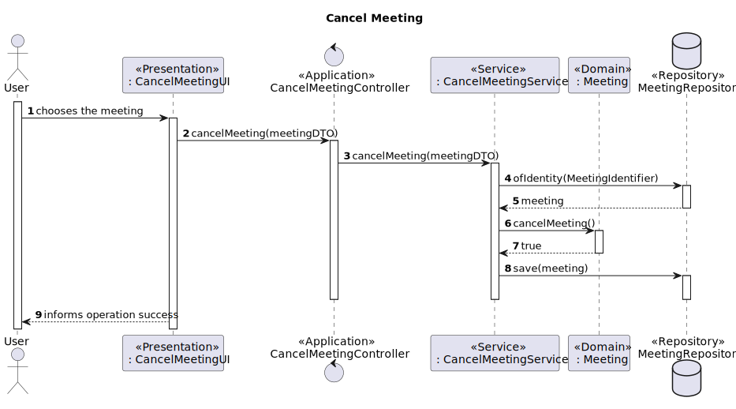

# US4002 - As User, I want to cancel a meeting

## 1. Context

It is the first time the task is assigned to be developed.
In this US a meeting owner should be capable of cancel the meeting he has created

## 2. Requirements
The requirement for this US is:
- FRM02 Cancel Meeting A user cancels a meeting that he owns
## 3. Analysis

**Main actor**

* Meeting Owner

**Interested actors (and why)**

* Every Participant in the meeting

**Preconditions**

* There needs to be a meeting to be canceled

**Postconditions**

* The meetings need to be in a canceled state

### The main scenario of this use case follows this flow:

**Main Scenario**
1. Meeting owner chooses the meeting to be canceled
2. System informs operation success

### Excerpt of Domain Model


## 4. Design
### 4.1 Rationale

|                    Main Scenario                     |                                                         Question: which class...                                                         |                                               Answer                                                |                                                                                                                                                   Pattern (with justification)                                                                                                                                                   |
|:----------------------------------------------------:|:----------------------------------------------------------------------------------------------------------------------------------------:|:---------------------------------------------------------------------------------------------------:|:--------------------------------------------------------------------------------------------------------------------------------------------------------------------------------------------------------------------------------------------------------------------------------------------------------------------------------:|
| 1.  Meeting owner chooses the meeting to be canceled | <p>A. Interacts with the Meeting Owner?</p><p>B. Coordinates the Use Case?</p> <p>C. Interacts with the Domain and Persistence Layer</p> |     <p> A. CancelMeetingUI</p><p> B. CancelMeetingController</p><p>C. CancelMeetingService </p>     | <p> A. Pure Fabrication - Class that doesn't exist in the domain but is necessary for the functionality of the system </p> <p> B. Controller - Responsible for handling system events  </p><p> C. Service - Class responsible for handling the domain layer and the persistence layer according with the controller requests</p> |
|         2. System informs operation success          |                     <p> A. Will persist the meeting with a new state?</p> <p> B.Has all information of meeting?</p>                      |                           <p> A. MeetingRepository</p> <p> B. Meeting</p>                           |                                                                                     <p> A. Repository - Has all the information of meetings persisted </p> <p> B. Information Expert - Class has the necessary information about itself</p>                                                                                      |

### 4.2. Sequence Diagram



### 4.3. Tests

**Test 1:** *Verifies that the meeting was canceled*
````
    @Test
    public void verifyIfWasCanceled(){
        Meeting meeting = getNewDummyMeeting();
        assertTrue(meeting.cancelMeeting());
    }
````
## 5. Implementation
Here is a sample of the implementation:
````
    public void cancelMeeting(MeetingDTOWithIdDate meetingDTO){
        MeetingRepository meetingRepository = PersistenceContext.repositories().meetingRepository();
        Meeting meeting = meetingRepository.ofIdentity(new MeetingIdentifier(meetingDTO.meetingId)).get();
        meeting.cancelMeeting();
        meetingRepository.save(meeting);
    }
````
A resume of the commits for the implementation :
- [US_4002][Domain] - Created meeting state and added methods cancelMeeting()
- [US_4002][DTO] - Created MeetingDTOWithIdDate
- [US_4002][Persistence] - Added method findAllOwnerMeetings() in MeetingRepository
- [US_4002][Application] - Added CancelMeeting Controller and service
- [US_4002][Presentation] - Added a UI and added to Main Menu
## 6. Observations
N/A