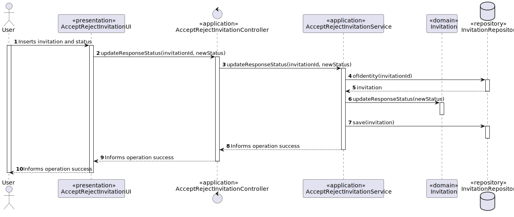

# US 4003 - As User, I want to accept or reject a meeting request

## 1. Context

It is the first time the task is assigned to be developed.
This User story will allow users to accept/reject meeting invitations.

## 2. Requirements

**Main actor**

* User

**Interested actors (and why)**

* User : wants to accept/reject meeting invitations and view a list of participants in his meetings and their status

**Pre conditions**
* The user must be invited to a meeting

**Post conditions**

* Response status must be changed to the selected status 

**Main scenario**

1. User selects option to take accept/reject meeting invitations
2. System shows available invitations
3. User chooses one invitation
4. System asks if user wants to accept/reject
5. User selects option
6. System asks for confirmation
7. User confirms
8. System informs operation success

**Other scenarios**

**2.a.** The system verifies that there are no invitations available
1. The system notifies that this problem has occurred
2. The use case terminates

**7.a.** The user doesn't confirm
1. The system requests a new file path
2. The use case terminates

**Special requirements**
N/A

## 3. Analysis

Relevant DM excerpt


**Client clarification:** 
No relevant clarifications were found

## 4. Design

### 4.1. Rational

|                          Main Scenario                           |                      Question: Which class...                       |                Answer                |                                                              Pattern                                                               |
|:----------------------------------------------------------------:|:-------------------------------------------------------------------:|:------------------------------------:|:----------------------------------------------------------------------------------------------------------------------------------:|
| 1. User selects option to take accept/reject meeting invitations |                     ...interacts with the user                      |       AcceptRejectInvitationUI       |                                                          Pure Fabrication                                                          |
|                                                                  |                     ...coordinates the use case                     |   AcceptRejectInvitationController   |                                                             Controller                                                             |
|                                                                  |                 ...interacts with the domain layer                  |    AcceptRejectInvitationService     |             Controller-service - hides the complexity of the use case from the controller class, lowering its coupling             |
|              2. System shows available invitations               |               ...knows which invitations are pending                |              Invitation              |                                         Information Expert - the class knows its own data                                          |
|                                                                  |                 ...knows all persisted invitations                  |         InvitationRepository         |                                 Repository - has all the information of all invitations persisted                                  |
|                                                                  | ...contains the data of a course so it can be moved between layers? |    InvitationDTOWithIdAndMeeting     |                                   DTO - Class that transports the necessary data between layers                                    |
|                                                                  |           ...transforms a Course into DTO and vice-versa            | InvitationDTOWithIdAndMeetingMapper  |                      Mapper-DTO - Class responsible for transforming Domain Entities into DTOs and vice-versa                      |
|                                                                  |                    ...creates the necessary DTO                     | InvitationDTOWithIdAndMeetingBuilder |                    Builder - Responsible for the creation of every different type of DTO providing flexibility                     |
|                  3. User chooses one invitation                  |                                                                     |                                      |                                                                                                                                    |
|          4. System asks if user wants to accept/reject           |                                                                     |                                      |                                                                                                                                    |
|                      5. User selects option                      |                                                                     |                                      |                                                                                                                                    |
|                 6. System asks for confirmation                  |                                                                     |                                      |                                                                                                                                    |
|                         7. User confirms                         |                     ...stores the inserted data                     |              Invitation              |                                         Information Expert - the class knows its own data                                          |
|                                                                  |    ...creates the instance responsible for persisting Enrollment    |          RepositoryFactory           | Abstract Factory - Interface responsible for creating a Factory of related Objects without explicitly specifying the intend Class; |
|                                                                  |                   ...persists the created object                    |         InvitationRepository         |            Repository -  hide the details of persisting and reconstructing an object while keeping the domain language             |
|               8. System informs operation success                |                                                                     |                                      |                                                                                                                                    |

Summary of needed classes :
* AcceptRejectInvitationUI
* AcceptRejectInvitationController
* AcceptRejectInvitationService
* Invitation
* InvitationRepository
* InvitationDTOWithIdAndMeeting
* InvitationDTOWithIdAndMeetingMapper
* InvitationDTOWithIdAndMeetingBuilder
* RepositoryFactory


### 4.2 Sequence Diagram


### 4.3. Tests

**Test 1:** *Verifies that the response status is correct after update*
```
public void ensureStatusChangesToAccepted() {
	Invitation instance = invFac.build(...);
	instance.updateResponseStatus(ResponseStatusValue.ACCEPTED);
	ResponseStatusValue expected = new ResponseStatusValue(2);
	ResponseStatusValue result = instace.currentStatus();   
}
```
```
public void ensureStatusChangesToRejected() {
	Invitation instance = invFac.build(...);
	instance.updateResponseStatus(ResponseStatusValue.REJECTED);
	ResponseStatusValue expected = new ResponseStatusValue(3);
	ResponseStatusValue result = instace.currentStatus();   
}
```

## 5. Implementation

## 6. Observations
