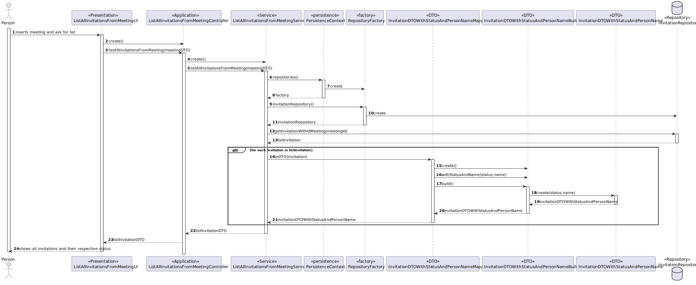

# US 4004 - As User, I want to view a list of participants in my meeting and their status (accept or reject)

## 1. Context

It is the first time the task is assigned to be developed.
This User story will allow me to list of participants in my meeting and their status

## 2. Requirements

FRM04 -  List Participants The system displays the lists of participants in a meeting and
the response status (accept or reject meeting)

## 3. Analysis

**Main actor**

* User

**Main scenario**

1. Student inserts meeting and ask for list
2. System shows all invitations and their respective status

### Client Question
#### Question

Boa tarde,
<br>Relativamente a esta user story, o ficheiro excel providenciado refere o seguinte:
> As User, I want to view a list of participants in my meeting and their status (accept or reject).

Aqui, pelo menos a meu ver, o termo "my meeting" parece sugerir que esta funcionaliade apenas se a aplica a meetings que o utilizador criou (i.e. se um User não for owner de uma meeting não puderá ver os seus participantes).<br>
No entanto, no documento de especificação, o seguinte é dito:

> The system displays the lists of participants in a meeting and the response status (accept or reject meeting).

O que não discrimina se esta funcionalidade deve estar disponível a todos os participantes ou apenas ao criador.
<br> A meu ver, a alternativa que parece fazer mais sentido seria, de facto, qualquer utilizador poder ver a lista de participantes de uma meeting, desde que pertença à mesma; no entanto, faço-lhe esta pergunta para me certificar de que a feature que vai ser implementada realmente corresponde àquilo que o cliente pretende.
<br>Aproveito ainda para lhe perguntar se a data da ocorrência da meeting possui alguma importância no que diz respeito a este caso de uso; isto é, o utilizador deve poder selecionar a meeting que pretende ver os participantes mesmo que esta já tenha ocorrido (e terminado), ou apenas aquelas que estão/irão decorrer é que possuem relevância?
<br>Cumprimentos,
<br>Grupo 9.
#### Answer

Bom dia.
<br>Relativamente à primeira questão faz sentido a sua segunda interpretação, ou seja, o que está no documento de especificação está correto e reflete o que o cliente deseja. Ou seja, deve ser possível qualquer utilizador participante consultar os outros participantes em reuniões na qual ele também é participante.
<br>Relativamente à segunda questão, do ponto de vista do cliente faz sentido também ver reuniões que ocorreram no passado.
<br>Cumprimentos.

## 4. Design

### 4.1. Rational


|                        Main Scenario                        |                        Question: Which class...                         |                   Answer                    |                                                    Pattern                                                     |
|:-----------------------------------------------------------:|:-----------------------------------------------------------------------:|:-------------------------------------------:|:--------------------------------------------------------------------------------------------------------------:|
|          1. User inserts meeting and ask for list           |                       ...interacts with the user                        |       ListAllInvitationsFromMeetingUI       | Pure Fabrication - Class that doesn't exist in the domain but is necessary for the functionality of the system |
|                                                             |                       ...coordinates the use case                       |   ListAllInvitationsFromMeetingController   |                              Controller - Responsible for handling system events                               |
|                                                             |                   ...interacts with the domain layer                    |    ListAllInvitationsFromMeetingService     |   Controller-service - hides the complexity of the use case from the controller class, lowering its coupling   |
| 2. System shows all invitations and their respective status |                  ...has all the invitations persisted?                  |            InvitationRepository             |     Repository -  hide the details of finding an object in the database while keeping the domain language      |
|                                                             |                ...creates an instance of the repository?                |              RepositoryFactory              |                            Factory - Responsible for the creation of the repository                            |
|                                                             |                 ...creates an instance of the factory?                  |             PersistenceContext              | Pure Fabrication - Class that doesn't exist in the domain but is necessary for the functionality of the system |
|                                                             | ...contains the data of a Invitation so it can be moved between layers? |    InvitationDTOWithStatusAndPersonName     |                         DTO - Class that transports the necessary data between layers                          |
|                                                             |           ...transforms a Invitation into DTO and vice-versa?           | InvitationDTOWithStatusAndPersonNameMapper  |            Mapper-DTO - Class responsible for transforming Domain Entities into DTOs and vice-versa            |
|                                                             |                      ...creates the necessary DTO?                      | InvitationDTOWithStatusAndPersonNameBuilder |          Builder - Responsible for the creation of every different type of DTO providing flexibility           |


### 4.2 Sequence Diagram


## 5. Implementation

1. Method ListAllInvitationsFromMeeting() from ListAllInvitationsFromMeetingService

```
public List<InvitationDTOWithStatusAndPersonName> ListAllInvitationsFromMeeting(MeetingDTOWithIdDate meetingDTO){
        
    List<Invitation> listInvitation;
    List<InvitationDTOWithStatusAndPersonName> listInvitationDTO = new ArrayList<>();
    InvitationRepository invitationRepository = PersistenceContext.repositories().invitationRepository();
    listInvitation = invitationRepository.getInvitationWithIdMeeting(meetingDTO.meetingId);
    for (Invitation invitation: listInvitation) {
        listInvitationDTO.add(InvitationDTOWithStatusAndPersonNameMapper.toDTO(invitation));
    }

    return  listInvitationDTO;
   }
```

2. Method getInvitationWithIdMeeting() from InvitationRepository

```

public List<Invitation> getInvitationWithIdMeeting(long meetingId) {
    TypedQuery<Invitation> query = createQuery(
            "SELECT i FROM Meeting m JOIN m.invitation i WHERE m.idMeeting.idMeeting = :meetingId",
            Invitation.class);
    query.setParameter("meetingId", meetingId);
    return query.getResultList();
}
```

## 6. Observations

N/A